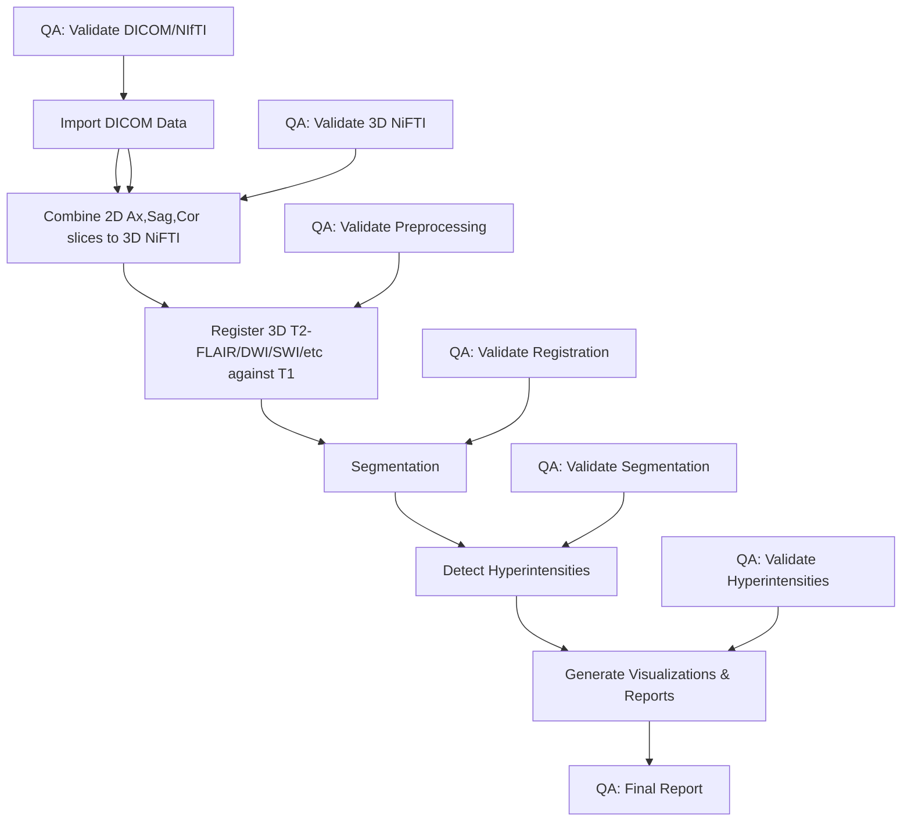

# MRI Intensity Clustering pipeline

End-to-end pipeline for processing MRI images, with a focus on detailed and adaptable segmentation, hyperintensity detection and clustering in soft tissues regions and sub-regions (exemplory implementation is neurological), easily extendable to other region.

Motivation is simply to see AI and computer vision more widely adopted!

## Overview

This pipeline processes T1-weighted/3D MPRAGE and T2-SPACE/FLAIR, T2-DWI, SWI and any other modalities of MRI images to:

1. Extract, perform bias correction (N4) via ANTs, register against T1 and/or standard Atlas space 
2. Segment regions, adapting Atlases and geomorphological based segmentation geometric approaches
3. Detect hyperintensities within those regions using fslstats and cluster
4. Generate comprehensive QA visualizations and reports ensuring pipeline validity

The pipeline uses ANTs (Advanced Normalization Tools) as the primary processing framework, with some additional tools from FSL and Convert3D.


## Features

- DICOM to NIfTI conversion with metadata extraction
- Multi-axial image integration for 2D sequences to NiFTI format
- N4 bias field correction
- Brain extraction using ANTs
- Registration of modalities such as FLAIR/SPACE-FLAIR/DWI/SWI against T1MPRAGE
- For neurology: Brainstem and pons segmentation (atlas based and geometric based for sub-regions of the pons)
- Hyperintensity detection with multiple thresholds
- Comprehensive QA/validation of each step, with automated sanity checks
- HTML report generation

## Workflow Diagram



## Requirements

- ANTs (Advanced Normalization Tools): https://github.com/ANTsX/ANTs/wiki/Installing-ANTs-release-binaries
- FSL (FMRIB Software Library): https://git.fmrib.ox.ac.uk/fsl/conda/installer
- Convert3D (c3d) (SourceForge download link for Apple Silicon: https://sourceforge.net/projects/c3d/files/c3d/Nightly/c3d-nightly-MacOS-x86_64.dmg/download or just use Homebrew)
- dcm2niix (distributed with FreeSurfer): install via homebrew
- FreeSurfer (optional, for 3D visualization): https://surfer.nmr.mgh.harvard.edu/fswiki/rel7downloads
- Python 3 (for metadata extraction): use `conda` or preferably `uv` to manage python versions
- GNU Parallel (via homebrew)
- MacOS or (untested) Linux OS
- Python 3.12 (various libraries are unavailable on 3.13 at the time of writing)
- I reccomend the ITK-SNAP visualisation and manual segmentation tool so that you can compare the autoamted results vs manual segmentation. I also have a separate CNN based segmentation but it doesn't go down to the level that the automated tooling does.

## Installation

1. Clone this repository:
   ```bash
   git clone https://github.com/myztery-neuroimg/intensityclustering
   cd intensityclustering
   ```

2. Ensure all dependencies are installed and in your PATH. The easiest way to do this is either run tests/integration.sh or run_pipeline.sh.

3. Make the pipeline script executable:
   ```bash
   chmod +x pipeline.sh
   chmod +x modules/*.sh
   chmod +x tests/*.sh
   ```

4. Create a python venv and install required packages. I *strongly* recommend to use `uv` instead of `venv` especially to ensure python 3.12
   ```bash
   python -m venv venv .
   source ./bin/activate
   pip install -r requirements.txt
   # alternatively:
   uv init
   uv python pin #version
   uv pip install -r requirements.txt
   uv venv / uv sync
   ```

5. Update the filename pattern and/or other configuration options in the configuration.py file

   ```bash
   # Ensure you already have $FSLDIR and $FREESURFER_HOME configured in your .profile, .bashrc, .zshrc or whatever your shell might be.$
   # The respective "/bin" directories also need to be in your $PATH
   
   export SRC_DIR="../DICOM"          # DICOM input directory
   export DICOM_PRIMARY_PATTERN='Image"*"'   # Filename pattern for your DICOM files, might be .dcm on some scanners, Image- for Siemens
   export PIPELINE_SUCCESS=true       # Track overall pipeline success
   export PIPELINE_ERROR_COUNT=0      # Count of errors in pipeline
   export EXTRACT_DIR="../extracted"  # Where NIfTI files land after dcm2niix

   # Parallelization configuration (defaults, can be overridden by config file)
   # # NOTE: I Suggest NOT to use parallelism with ANTs, its a pain in the backside because of some of its internal logging
   # # and anyway it supports multithreadedness

   export PARALLEL_JOBS=1             # Number of parallel jobs to use
   export MAX_CPU_INTENSIVE_JOBS=1    # Number of jobs for CPU-intensive operations
   export PARALLEL_TIMEOUT=0          # Timeout for parallel operations (0 = no timeout)
   export PARALLEL_HALT_MODE="soon"   # How to handle failed parallel jobs

   export RESULTS_DIR="../mri_results"
   export ANTS_PATH="~/ants"
   ```

## Usage

### Basic Usage

```bash
./pipeline.sh -i /path/to/dicom -o /path/to/output -s subject_id
```

### Options

```
Options:
  -c, --config FILE    Configuration file (default: config/default_config.sh)
  -i, --input DIR      Input directory (default: ../DiCOM)
  -o, --output DIR     Output directory (default: ../mri_results)
  -s, --subject ID     Subject ID (default: derived from input directory)
  -q, --quality LEVEL  Quality preset (LOW, MEDIUM, HIGH) (default: MEDIUM)
  -p, --pipeline TYPE  Pipeline type (BASIC, FULL, CUSTOM) (default: FULL)
  -h, --help           Show this help message and exit
```

### Batch Processing

To process multiple subjects, create a subject list file with the following format:
```
subject_id1 /path/to/flair1.nii.gz /path/to/t1_1.nii.gz
subject_id2 /path/to/flair2.nii.gz /path/to/t1_2.nii.gz
```

Then run:
```bash
./pipeline.sh -p BATCH -i /path/to/base_dir -o /path/to/output_base --subject-list /path/to/subject_list.txt
```

## Pipeline Modules

The pipeline is organized into modular components:

- **environment.sh**: Environment setup, logging, configuration
- **import.sh**: DICOM import, metadata extraction, conversion to NIfTI
- **preprocess.sh**: Multi-axial integration, bias correction, ROI extraction
- **registration.sh**: T1 to FLAIR (or DWI/SWI/etc) registration
- **segmentation.sh**: Segmentation controller (adapt as needed to your use-case)
- **analysis.sh**: Hyperintensity detection and analysis
- **visualization.sh**: QC visualizations, multi-threshold overlays, HTML reports
- **qa.sh**: Quality assurance and validation functions

## Output Structure

```
mri_results/
├── logs/                          # Processing logs
├── metadata/                      # DICOM metadata
├── combined/                      # Multi-axial combined images
├── bias_corrected/                # N4 bias-corrected images
├── extraction/                    # Extracted RoI images
├── standardized/                  # Dimension-standardized images
├── registered/                    # Registration results
├── segmentation/                  # Segmentation results
│   ├── ....
├── hyperintensities/              # Hyperintensity detection results
│   ├── thresholds/                # Multiple threshold results
│   └── clusters/                  # Cluster analysis
├── validation/                    # Validation results
│   ├── registration/              # Registration validation
│   ├── segmentation/              # Segmentation validation
│   └── hyperintensities/          # Hyperintensity validation
├── qc_visualizations/             # QC visualizations
├── reports/                       # HTML reports
└── summary/                       # Summary results
```

## Customization

You can customize the pipeline by:

1. Creating a custom configuration file based on `config/default_config.sh`
2. Passing it to the pipeline with the `-c` option

## License

This project is licensed under the MIT License - see the LICENSE file for details.

## Acknowledgments

- ANTs (Advanced Normalization Tools)
- FSL (FMRIB Software Library)
- Convert3D
- dcm2niix
- FreeSurfer
- GNU Parallel
- Roo Code/Claude 3.7
- ChatGPT
- Gemini 2.0/2.5 Pro + Gemma 3!
- ITK-SNAP (Convert3D)
