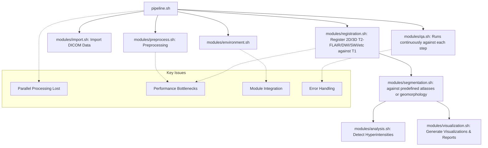

# Brainstem/Pons-specific Neuroradiology multi-modal (T1/T2/FLAIR/SWI/DWI) MRI intensity anomaly and clustering

End-to-end pipeline for processing MRI images, with a focus on detailed and adaptable segmentation, hyperintensity detection and clustering in neurological "difficult to get" spots like the brainstem and pons. 

There are naturally very few specialized pipelines for brainstem subregion analysis with the comprehensiveness I'm providing. 
The few that are available typically:

* Lack the multiple fallback methods for robustness
* Don't include the DICOM backtrace capabilities
* Don't handle multiple modalities as cohesively
* Aren't open source
* Don't use the absolute latest open source generations of ANTs, Freesurfer etc, and don't fully maximise their potential
* Aren't specifically segmenting for brainstem and pontine lesions


## Overview

This pipeline processes T1-weighted/3D MPRAGE and T2-SPACE/FLAIR, T2-DWI, SWI and any other modalities of MRI images to:

1. Extract, perform bias correction (N4) via ANTs, register against T1 and/or standard Atlas space, detecting the best available sequences within your entire DICOM export (ideally you have both T1-MPR 3D and 3D T2-FLAIR (Siemens) or VISTA (Philips) but it's not always done, so the pipeline can actually combine 2D modalities into a 3D approximation whilst processing FLAIR/SWI/DWI etc.. this is a nice feature but of course it's approximate, especially with anything other that 1mm thin slice imaging (you get what you pay for when you do 5mm slice neuroimaging...). N4 bias correction via ANTs is employed,and I've a processing step accomodating for the acquisition plane of the scanner esp. for 3D-FLAIR (e.g., if taken in 3D across sagital acquisitions such as the approach in T2FLAIR-SAG- multi plane 3D approaches (SPACE) there might be a bias towards the right side
2. Segment regions, adapting Atlases like the Harvard/Oxford neurological atlas and ithe Talairach atlas (and space), and also geomorphological approximations of brainstem regions such as dorsal and ventral pons using geometric approaches to segmentation that are approximate but quicker than hand-drawing something manually and hopefully pretty accurate.
3. Detect hyperintensities within those regions using fslstats and cluster - e.g., nth percentil/standard deviations approaches within a segmented region like the brainstem which should be fairly homogenous in signal
4. Generate comprehensive QA visualizations and reports ensuring pipeline validity

The pipeline uses ANTs (Advanced Normalization Tools) as the primary processing framework, with additional functionality via the wonderful tools such as Freesurfer, FSL and Convert3D.

## Features

- DICOM to NIfTI conversion with metadata extraction
- Multi-axial image integration for 2D sequences to NiFTI format
- Extracts and utilises scanner metadata specific to MRI brands and scanners (orientation, slice thickness, modalities, field strength, scanner model, etc..). Anonymises all personal data along the way
- N4 bias field correction
- Multi-axial image integration for 2D sequences to NiFTI format
- Brain extraction using ANTs
- Registration of modalities such as FLAIR/SPACE-FLAIR/DWI/SWI against T1-MPRA
- Orientation distortion correction for preserving anatomical structure during registration
- For neurology: Brainstem and pons segmentation with multiple fallback methods:
  - Harvard-Oxford atlas-based segmentation (with automatic atlas detection)
  - Talairach space-based segmentation
  - ANTs-based segmentation
  - Geometric-based approximation for sub-regions of the pons
- Intelligent atlas detection that adapts to available resources
- Hyperintensity detection with multiple thresholds
- Comprehensive QA/validation of each step, with automated sanity checks
- Quantitative registration validation metrics with CSV output:
  - Dice coefficient between T1 and FLAIR brain masks (good: >0.9)
  - Cross-correlation within WM mask (good: >0.95)
  - Mean displacement from warp field (good: <0.6mm)
  - Jacobian standard deviation (good: <0.07)
- Advanced orientation distortion analysis with visualization and reporting
- HTML report generation with detailed metrics and quality assessments
- Robust error handling and graceful recovery from failures

## Workflow Diagram



## Requirements

- ANTs (Advanced Normalization Tools): https://github.com/ANTsX/ANTs/wiki/Installing-ANTs-release-binaries
- FSL (FMRIB Software Library): https://git.fmrib.ox.ac.uk/fsl/conda/installer
- Convert3D (c3d) (SourceForge download link for Apple Silicon: https://sourceforge.net/projects/c3d/files/c3d/Nightly/c3d-nightly-MacOS-x86_64.dmg/download or just use Homebrew)
- dcm2niix (distributed with FreeSurfer): install via homebrew
- FreeSurfer (optional, for 3D visualization): https://surfer.nmr.mgh.harvard.edu/fswiki/rel7downloads
- Python 3 (for metadata extraction): use `conda` or preferably `uv` to manage python versions
- GNU Parallel (via homebrew)
- MacOS or (untested) Linux OS
- Python 3.12 (various libraries are unavailable on 3.13 at the time of writing)
- I reccomend the ITK-SNAP visualisation and manual segmentation tool so that you can compare the autoamted results vs manual segmentation. I also have a separate CNN based segmentation but it doesn't go down to the level that the automated tooling does.

## Installation

1. Clone this repository:
   ```bash
   git clone https://github.com/myztery-neuroimg/intensityclustering
   cd intensityclustering
   ```

2. Ensure all dependencies are installed and in your PATH. The easiest way to do this is either run tests/integration.sh or run_pipeline.sh.

3. Make the pipeline script executable:
   ```bash
   chmod +x pipeline.sh
   chmod +x modules/*.sh
   chmod +x tests/*.sh
   ```

4. Create a python venv and install required packages. I *strongly* recommend to use `uv` instead of `venv` especially to ensure python 3.12
   ```bash
   python -m venv venv .
   source ./bin/activate
   pip install -r requirements.txt
   # alternatively:
   uv init
   uv python pin #version
   uv pip install -r requirements.txt
   uv venv / uv sync
   ```

5. Update the filename pattern and/or other configuration options in the configuration.py file

   ```bash
   # Ensure you already have $FSLDIR and $FREESURFER_HOME configured in your .profile, .bashrc, .zshrc or whatever your shell might be.$
   # The respective "/bin" directories also need to be in your $PATH
   
   export SRC_DIR="../DICOM"          # DICOM input directory
   export DICOM_PRIMARY_PATTERN='Image"*"'   # Filename pattern for your DICOM files, might be .dcm on some scanners, Image- for Siemens
   export PIPELINE_SUCCESS=true       # Track overall pipeline success
   export PIPELINE_ERROR_COUNT=0      # Count of errors in pipeline
   export EXTRACT_DIR="../extracted"  # Where NIfTI files land after dcm2niix

   # Parallelization configuration (defaults, can be overridden by config file)
   # # NOTE: I Suggest NOT to use parallelism with ANTs, its a pain in the backside because of some of its internal logging
   # # and anyway it supports multithreadedness

   export PARALLEL_JOBS=1             # Number of parallel jobs to use
   export MAX_CPU_INTENSIVE_JOBS=1    # Number of jobs for CPU-intensive operations
   export PARALLEL_TIMEOUT=0          # Timeout for parallel operations (0 = no timeout)
   export PARALLEL_HALT_MODE="soon"   # How to handle failed parallel jobs

   export RESULTS_DIR="../mri_results"
   export ANTS_PATH="~/ants"
   ```

## Usage

### Basic Usage

```bash
./pipeline.sh -i /path/to/dicom -o /path/to/output -s subject_id
```

### Options

```
Options:
  -c, --config FILE    Configuration file (default: config/default_config.sh)
  -i, --input DIR      Input directory (default: ../DiCOM)
  -o, --output DIR     Output directory (default: ../mri_results)
  -s, --subject ID     Subject ID (default: derived from input directory)
  -q, --quality LEVEL  Quality preset (LOW, MEDIUM, HIGH) (default: MEDIUM)
                       Affects bias correction, registration quality, and orientation preservation
  -p, --pipeline TYPE  Pipeline type (BASIC, FULL, CUSTOM, ORIENTATION_TEST) (default: FULL)
  -t, --start-stage STAGE  Start pipeline from STAGE (default: import)
  -h, --help           Show this help message and exit

Pipeline Stages:
  import: Import and convert DICOM data
  preprocess: Perform bias correction and brain extraction
  registration: Align images to standard space
  segmentation: Extract brainstem and pons regions
  analysis: Detect and analyze hyperintensities
  visualization: Generate visualizations and reports
  tracking: Track pipeline progress
```

### Batch Processing

To process multiple subjects, create a subject list file with the following format:
```
subject_id1 /path/to/flair1.nii.gz /path/to/t1_1.nii.gz
subject_id2 /path/to/flair2.nii.gz /path/to/t1_2.nii.gz
```

Then run:
```bash
./pipeline.sh -p BATCH -i /path/to/base_dir -o /path/to/output_base --subject-list /path/to/subject_list.txt
```

### Resuming Pipeline Execution

If the pipeline is interrupted, you can resume from any stage:

```bash
# Resume from registration stage
./pipeline.sh -i /path/to/dicom -o /path/to/output -s subject_id --start-stage registration

# Resume from segmentation
./pipeline.sh -i /path/to/dicom -o /path/to/output -s subject_id --start-stage segmentation
```

The pipeline will automatically check if prerequisites are available before proceeding. It also intelligently initializes all required variables to ensure smooth continuation from any point.

### Segmentation Approaches

When running the segmentation pipeline, it tries multiple approaches in sequence:

1. **Standard Space Method**: Uses Harvard-Oxford atlas if available, with automatic detection of different atlas variants
2. **Talairach Method**: Uses coordinate-based approximation in Talairach space
3. **ANTs Method**: Uses ANTs registration and templates

If all methods fail to produce usable results, the pipeline will create a basic geometric approximation of the brainstem to allow processing to continue.

## Pipeline Modules

The pipeline is organized into modular components:

- **environment.sh**: Environment setup, logging, configuration, error handling
- **import.sh**: DICOM import, metadata extraction, conversion to NIfTI
- **import_vendor_specific.sh**: Vendor-specific DICOM metadata extraction (Siemens, Philips)
- **preprocess.sh**: Multi-axial integration, bias correction, ROI extraction
- **registration.sh**: T1 to FLAIR (or DWI/SWI/etc) registration with robust error handling
- **segmentation.sh**: Enhanced segmentation with multiple fallback methods:
  - Standard space method (Harvard-Oxford atlas detection)
  - Talairach-based method
  - ANTs-based method
  - Geometric approximation as last resort
- **analysis.sh**: Hyperintensity detection and analysis with improved error handling
- **visualization.sh**: QC visualizations through script generation rather than direct execution
- **qa.sh**: Enhanced quality assurance with robust metric calculation and validation

## Output Structure

```
mri_results/
├── logs/                          # Processing logs
├── metadata/                      # DICOM metadata
├── combined/                      # Multi-axial combined images
├── bias_corrected/                # N4 bias-corrected images
├── extraction/                    # Extracted RoI images
├── standardized/                  # Dimension-standardized images
├── registered/                    # Registration results
├── segmentation/                  # Segmentation results
│   ├── ....
├── hyperintensities/              # Hyperintensity detection results
│   ├── thresholds/                # Multiple threshold results
│   └── clusters/                  # Cluster analysis
├── validation/                    # Validation results
│   ├── registration/              # Registration validation
│   ├── segmentation/              # Segmentation validation
│   └── hyperintensities/          # Hyperintensity validation
├── qc_visualizations/             # QC visualizations
├── reports/                       # HTML reports
└── summary/                       # Summary results
```

## Customization

You can customize the pipeline by:

1. Creating a custom configuration file based on `config/default_config.sh`
2. Passing it to the pipeline with the `-c` option

## Registration Quality Metrics

The pipeline now automatically calculates and records a set of quantitative registration metrics in CSV format that can be used for:
1. Automatic quality assessment of individual registrations
2. Cohort-level analysis to identify outliers
3. Comparison of different registration parameters

These metrics include:

| Metric | Implementation | Good Range | Description |
|--------|---------------|------------|-------------|
| Dice(T1brain, FLAIRbrain) | `fslmaths` + `fslstats` | >0.9 | Measures overlap between brain masks |
| Cross-correlation in WM | `c3d overlap` | >0.95 | Correlation in white matter only |
| Mean displacement | `antsApplyTransforms --print-stats` | <0.6mm | Average voxel displacement |
| Jacobian std. dev. | `CreateJacobianDeterminantImage` | <0.07 | Transformation smoothness measure |

The metrics are stored in `mri_results/validation/registration/metrics.csv` and can be accessed by analysis scripts.

## Additional Documentation

- [Orientation Distortion Correction](docs/orientation-distortion-correction.md): Methods for preserving anatomical orientation during registration, particularly important for regions like the brainstem and pons.
- [Parallel Processing Implementation](docs/parallel_processing_implementation.md): How to use parallel processing for faster analysis.
- [Multi-axial Improvements](docs/multiaxis_improvements.md): Handling multi-axial image integration.
- [Resume Functionality](docs/resume_functionality.md): Details on the stage-based resumability feature.
- [Vendor-Specific Optimization](docs/vendor_specific.md): How the pipeline optimizes processing based on scanner manufacturer.

## License

This project is licensed under the MIT License - see the LICENSE file for details.

## Acknowledgments

- ANTs (Advanced Normalization Tools)
- FSL (FMRIB Software Library)
- Convert3D
- dcm2niix
- FreeSurfer
- GNU Parallel
- Roo Code/Claude 3.7
- ChatGPT
- Gemini 2.0/2.5 Pro + Gemma 3!
- ITK-SNAP (Convert3D)
- and more (I'll add them when I can..)
