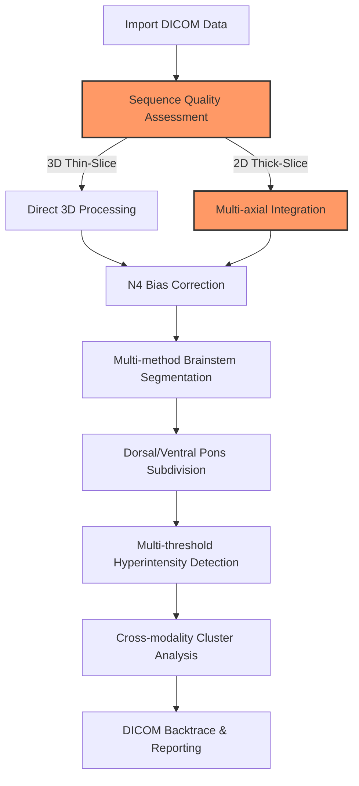

# intensityclustering: Brainstem/Pons MRI Analysis Pipeline ("BrainstemX")

BrainStem X (_Brainstem/Pons specific_ intensityclustering implementation) is an end-to-end pipeline designed for precise analysis of subtle T2/FLAIR hyperintensity/T1 hypointensity clusters in these critical brain neuroanatomical regions. Brainstem regions can present clinically with very subtle variations below the clinical threshold to human radiologists and standard research methods. This pipeline tries to address some the  challenges via:

- **Multi-modal integration** across T1/T2/FLAIR/SWI/DWI sequences with cross-modality anomaly detection
- **N4 Bias Field AND slice-acquisiton** correction (e.g., SAG-acquired FLAIR sequences).
- **Precise orientation preservation** critical for analyzing directionally sensitive brainstem microstructure
- **Real-time cluster analysis** that identifies signal anomalies without manual segmentation bias
- **Multiple fallback methods** ensuring robust results even with suboptimal input data
- **DICOM backtrace capability** for clinical validation of findings in native scanner format

## What Makes BrainStem X Different

BrainStem X supports analysis of a wide spectrum of clinical datasets:

- **High-end Research Protocols**: Optimized for 3D isotropic thin-slice acquisitions (1mm³ voxels)
  - 3D MPRAGE T1-weighted imaging
  - Optimisations for 3T scanners
  - 3D SPACE/VISTA T2-FLAIR with SAG acquisition
  - Multi-parametric SWI/DWI integration

- **Routine Clinical Protocols**: Robust fallback for standard clinical acquisitions
  - Thick-slice (3-5mm) 1.5T 2D axial FLAIR with gaps, along with standard T1/T1-MPR to register against
  - Non-isotropic voxel reconstruction
  - Single-sequence limited protocols

The pipeline extracts DICOM metadata including acquisition/scanner parameters, slice thickness, and orientation/modality/dimensionality to apply consistent, reliable, and transparent transformations, normalizations, and registration techniques using research-grade ANTs and FSL libraries and segmentation against cutting-edge atlases. N4 bias field correction and scanner orientation correction help ensure integrity of your results. 20 validations within the qa module alone ensure consistency and reliability of your results.

This enables analysis of datasets from scans of varying imaging capabilities and protocols, making BrainStem X particularly effective for multi-center studies and retrospective analyses of existing clinical data.

## Key Features

### Acquisition-Specific Processing and Registration
- Detection of 3D isotropic sequences through header metadata analysis
- Multi-axial integration for 2D sequences with gap interpolation
- Resolution-specific parameter selection for registration and segmentation
- Quantitative quality metrics that reflect acquisition limitations

### Advanced Segmentation
- Harvard-Oxford, Talairach and ANTs segmentation approaches with automatic fallback
- Precise dorsal/ventral pons division using principal component analysis
- Geometric approximation fallback when atlas approaches fail

### Cluster Analysis
- Statistical hyperintensity detection with multiple threshold approaches (1.5-3.0 SD)
- Cross-modality cluster overlap quantification across MRI sequences
- Objective anomaly detection independent of manual segmentation bias

### Technical Implementation
- Orientation distortion correction leveraging ANTs transformation frameworks
- Quantitative registration validation with comprehensive QA metrics
- Efficient resource utilization through parallel processing
- 3D visualization of anomalies with comprehensive HTML reporting

### Clinical Focus
- Vendor-specific optimizations for Siemens, Philips, and GE scanners
- Validated processing across 1.5T and 3T field strengths
- DICOM backtrace for clinical verification of findings in native viewer format

## Example Workflow



## Installation

```
# Clone the repository
git clone https://github.com/yourusername/brainstem-x
cd brainstem-x

# Install dependencies
# Ensure you have ANTs, FSL, Convert3D, dcm2niix, and FreeSurfer installed

If you don't the script will conveniently tell you

[INFO] ==== MRI Processing Dependency Checker ====
[ERROR] ✗ dcm2niix is not installed or not in PATH
[INFO] Try: brew install dcm2niix
[INFO] Checking ANTs tools...
[SUCCESS] ✓ ANTs (antsRegistrationSyN.sh) is installed (/Users/davidbrewster/ants/bin/antsRegistrationSyN.sh)
[SUCCESS] ✓ ANTs (N4BiasFieldCorrection) is installed (/Users/davidbrewster/ants/bin/N4BiasFieldCorrection)
[SUCCESS] ✓ ANTs (antsApplyTransforms) is installed (/Users/davidbrewster/ants/bin/antsApplyTransforms)
[SUCCESS] ✓ ANTs (antsBrainExtraction.sh) is installed (/Users/davidbrewster/ants/bin/antsBrainExtraction.sh)
[INFO] Checking FSL...
[ERROR] ✗ FSL (fslinfo) is not installed or not in PATH
[ERROR] ✗ FSL (fslstats) is not installed or not in PATH
[ERROR] ✗ FSL (fslmaths) is not installed or not in PATH
[ERROR] ✗ FSL (bet) is not installed or not in PATH
[ERROR] ✗ FSL (flirt) is not installed or not in PATH
[ERROR] ✗ FSL (fast) is not installed or not in PATH
[INFO] Checking FreeSurfer...
[ERROR] ✗ FreeSurfer (mri_convert) is not installed or not in PATH
[ERROR] ✗ FreeSurfer (freeview) is not installed or not in PATH
[INFO] Checking Convert3D...
[SUCCESS] ✓ Convert3D is installed (/usr/local/bin/c3d)
[INFO] Checking operating system...
[SUCCESS] ✓ Running on macOS
[INFO] ==== Checking optional but recommended tools ====
[ERROR] ✗ ImageMagick is not installed or not in PATH
[INFO] Install with: brew install imagemagick
[WARNING] ImageMagick is recommended for image conversions
[ERROR] ✗ GNU Parallel is not installed or not in PATH
[INFO] Install with: brew install parallel
[ERROR] GNU Parallel is required for faster processing
[INFO] ==== Dependency Check Summary ====
[ERROR] 3 required dependencies are missing.
```

## Then install Python requirements

```
python -m pip install -r requirements.txt
```

Pro-tip: prefereably use `uv` - everything is already packaged for this!

## Quick Start

```
# Basic usage with default parameters
./pipeline.sh -i /path/to/dicom -o /path/to/output -s subject_id

# High quality processing for research use
./pipeline.sh -i /path/to/dicom -o /path/to/output -s subject_id -q HIGH

# Batch processing multiple subjects
./pipeline.sh -p BATCH -i /path/to/base_dir -o /path/to/output_base --subject-list /path/to/subject_list.txt
```

## Unique Advantages

BrainStem X provides:

### Specialized Brainstem Focus: Targeted methods for brainstem and pontine lesion detection
### Acquisition-Specific Processing: Tailored workflows for both research-grade and standard clinical protocols
### Objective Anomaly Detection: Statistical cluster identification using intensity distribution analysis
### Multi-modality Integration: Correlative analysis across T1/T2/FLAIR/SWI/DWI sequences
### Clinical Translation: DICOM backtrace for radiological verification in standard clinical viewers
### Reliability: Comprehensive validation metrics for registration and segmentation quality

# Acknowledgments 

BrainStem X leverages established neuroimaging tools while extending them for brainstem-specific analysis:

- **ANTs**: Extended with custom orientation preservation constraints
- **FSL**: Integrated with enhanced cluster analysis thresholding
- **FreeSurfer**: Utilized for 3D visualization of anomaly distribution
- **Custom Python modules**: Implemented for cross-modality registration and cluster correlation

## Neuroimaging Tools

* ANTs (Advanced Normalization Tools)
* FSL (FMRIB Software Library)
* FreeSurfer
* Convert3D
* dcm2niix
* ITK-SNAP

## Atlases & Templates

* Harvard-Oxford Subcortical Structural Atlas
* Talairach Atlas
* MNI152 Standard Space Templates
* SUIT Cerebellar Atlas

## Programming Resources / Libraries (including..)

* Python Neuroimaging Libraries (NiBabel, PyDicom)
* GNU Parallel
* Matplotlib & Seaborn
* NumPy & SciPy

# Independent Development

This project was developed independently without institutional backing

## Citation

If you use BrainStem X in your research, you may cite:
@software{BrainStemX2025,
  author = {Myztery Evaluation c/o LazyEvaluation},
  title = {BrainStem X: Advanced Brainstem/Pons MRI Analysis Pipeline},
  year = {2025},
  url = {https://github.com/myzteryneuro/intensityclustering}
}

# License
This project is licensed under the MIT License - see the LICENSE file for details.

# Contributing
Yes, please! Just submit a PR, all contributions are welcome as are research or clinical feedback about the radiological and technical pipeline foundations! Thanks in advance..
