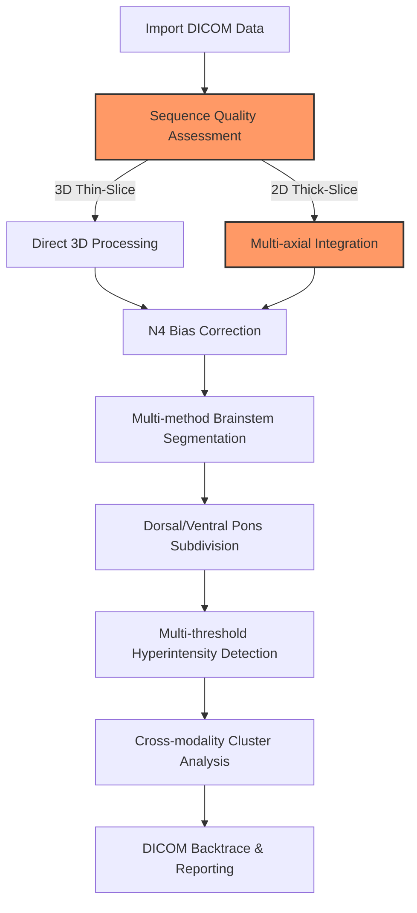

# brainstemx-full: Brainstem/Pons MRI Analysis Pipeline

BrainStem X (_Brainstem/Pons specific_ intensityclustering implementation) is an end-to-end pipeline designed for precise analysis of subtle T2/FLAIR hyperintensity/T1 hypointensity clusters in these critical brain neuroanatomical regions. Brainstem regions can present clinically with very subtle variations below the clinical threshold to human radiologists and standard research methods. This pipeline tries to address some the  challenges via

- **Multi-modal integration** across T1/T2/FLAIR/SWI/DWI sequences with cross-modality anomaly detection
- **N4 Bias Field AND slice-acquisiton** correction (e.g., SAG-acquired FLAIR sequences).
- **Precise orientation preservation** critical for analyzing directionally sensitive brainstem microstructure
- **Zero-shot/unsupervised cluster analysis** which could identify signal anomalies without manual segmentation or human false negative biases
- **Multiple fallback methods** at various steps, activated by quantitative quality metrics, adding robustness to results even with suboptimal slice thickness, modalities and IPR
- **DICOM backtrace capability** for clinical validation of findings in native scanner format
- **Parallel processing** of subjects and optimisation of multithreaded performance and standardised outputs to support larger cohort analysis
- **Modern approach** Attempts to take modern non-ML analytics approaches as of 2023/2024 and combine them, see https://github.com/myztery-neuroimg/brainstemx-full/blob/main/docs/sota-comparison.md 

<image width="400" alt="Simulated Hyperintensity Cluster on T2-SPACE-FLAIR" src="https://github.com/user-attachments/assets/5dc95c74-e270-47cf-aad5-9afaf70c85c1" />


## Project status

The project is in active development as of June 2025. Whilst many improvements are in the works, we hope it already offers some helpful functionality. Future works including a platform portable docker implementation via neurodocker.

For a minimal pure-python implemention with synthetic data generation, LLM report generation and a web-ui, refer to https://github.com/myztery-neuroimg/brainstemx (currently a very immature implementation and work in progress).

## Recent Segmentation Improvements (June 2025)
- Corrected Harvard-Oxford atlas selection: now uses only brainstem index 7, eliminating erroneous multi-index summation.
- Improved MNI→native space transformation: switched to trilinear interpolation + 0.5 thresholding, preserving partial volumes.
- Consistent file naming: updated pipeline and modules to use `_brainstem.nii.gz` and `_brainstem_flair_intensity.nii.gz` uniformly.
- Updated Juelich pons segmentation: applied same interpolation fix, yielding anatomically reasonable voxel counts.
- Integrated FLAIR enhancement: generated separate FLAIR intensity masks for segmentation quality analysis.

## Features

### Acquisition-Specific Processing and Registration
- Detection of 3D isotropic sequences through header metadata analysis - slice thicknesses for example, not just scanner specific private headers
- Multi-axial integration for 2D sequences with gap interpolation
- Resolution-specific parameter selection for registration and segmentation
- Quantitative quality metrics that reflect acquisition limitations
- Pick the highest quality T1 (ideally MPR) and T2-FLAIR (or SWI/DWI/etc) acquisition modality and series automatically
- Align them to standard space when you need to, otherwise keep at high resolution, and process in float number format so you donb't lose resolution or intoduce noise

### Advanced Segmentation
- Harvard-Oxford, Talairach, SUIT ATLASes and spaces and ANTs segmentation approaches with a "pseduo" fallback of just splitting the brainstem identified by Harvard atlas into "two" - ventral and dorsal
- Dorsal/ventral pons division using principal component analysis eg WM tissue in this anatomical region
- Quantified "quality assessment" of the brain extraction, registration quality and segmentation accuracy with an extremely "over-the-top" QA module

### Cluster Analysis
- Statistical hyperintensity detection with multiple threshold approaches (1.5-3.0 SD, or whatever you want to configure, from the baseline intensity, and also whatever minimum size).
- Cross-modality cluster overlap quantification across MRI sequences
- Smoothing of white-matter regions so you don't just pick up spotty outlier pixels
- Cross-plane confirmation:- validate via axial, sagital and coronal views that what you're seeing is a real cluster of hyperintense pixels on FLAIR
- Pure quantile-bassd anomaly detection specific to subject, independent of manual labelling bias associated with deep learning models
- This means you can manipulate DICOM files to add clusters, hyperintensities/hypointensities and manually validate the _process_ - every step of its decision making - rather than it being a "black box"

### Technical Implementation
- Orientation distortion correction leveraging ANTs transformation frameworks
- Quantitative registration validation with comprehensive QA metrics
- Efficient resource utilization through parallel processing
- 3D visualization via standard NiFTi volumes and masks of anomalies with comprehensive HTML reporting

### Clinical Focus
- Vendor-specific optimizations for Siemens and Philips scanners (future: implement DICOM-RT and PACS integration as well)
- Practical configuration support to optimise output validity across 1.5T and 3T field strengths
- A novel DICOM backtrace for clinical verification of findings in native viewer format, because nothing in post-processing pipelines is proven until you can map it back to source of truth raw scanner output

### Data compatibility 
BrainStem X supports analysis of a wide variety of clinical neuroimaging MRI datasets:

- **High-end Research Protocols**: Optimized for 3D isotropic thin-slice acquisitions (1mm³ voxels)
  - 3D MPRAGE T1-weighted imaging
  - Optimisations for 3T scanners, accomodations for 1.5T
  - 3D SPACE/VISTA T2-FLAIR with SAG acquisition where available
  - Multi-parametric SWI/DWI integration as quantifiable support for T1W/FLAIR clustering results

- **Routine Clinical Protocols**: Robust fallback for standard clinical acquisitions
  - Thick-slice (3-5mm) 1.5T 2D axial FLAIR with gaps, where we likely have thin slice 3D T1/T1-MPR to register against
  - Non-isotropic voxel reconstruction estimation via ANTs
  - Single-sequence limited protocols e.g., AX FLAIR
  - Normalisation against MNT space and signal levels agaisnt the baseline of the individual subject

The pipeline extracts DICOM metadata including acquisition/scanner parameters, slice thickness, and orientation/modality/dimensionality to apply consistent, reliable, and transparent transformations, normalizations, and attempts registration techniques using ANTs and FSL libraries and atlas-based segmentation of the brainsteam, dorsal and ventral pons. 
Configurable N4 bias field correction and scanner orientation correction implementations help ensure integrity of the results. 20 validations within the qa module alone ensure consistency and reliability of your results.

These capabilities are included to support analysis of signal intensity actoss datasets from scans of varying imaging capabilities and protocols, making BrainStem X particularly effective for multi-center studies and retrospective analyses of existing clinical data.

This kind of visualisation with the ability to track back to raw DICOM files and map clusters across modalities could potentially be quite useful, even without machine learning techniques which of course are all the rage nowadays. This is a very much first-principles approach but it uses the very latest techniques and grounded research up to 2023.

### Example Workflow



## Installation

### Requirements

- ANTs (Advanced Normalization Tools): https://github.com/ANTsX/ANTs/wiki/Installing-ANTs-release-binaries
- FSL (FMRIB Software Library): https://git.fmrib.ox.ac.uk/fsl/conda/installer
- Convert3D (c3d) (SourceForge download link for Apple Silicon: https://sourceforge.net/projects/c3d/files/c3d/Nightly/c3d-nightly-MacOS-x86_64.dmg/download or just use Homebrew)
- dcm2niix (distributed with FreeSurfer): install via homebrew
- FreeSurfer (optional, for 3D visualization): https://surfer.nmr.mgh.harvard.edu/fswiki/rel7downloads
- Python 3 (for metadata extraction): use `conda` or preferably `uv` to manage python versions
- GNU Parallel (via homebrew)
- MacOS or (untested) Linux OS
- Python 3.12 (various libraries are unavailable on 3.13 at the time of writing)
- I reccomend the ITK-SNAP visualisation and manual segmentation tool so that you can compare the autoamted results vs manual segmentation. I also have a separate CNN based segmentation but it doesn't go down to the level that the automated tooling does.

### Install dependencies

Ensure you have ANTs, FSL, Convert3D, dcm2niix, Parallel and FreeSurfer installed. 
* NOTE: Some of these tools and ATLASes have different licences and you must agree or disagree individually with their licence terms.*
Most are available via `homebrew` (macOS). If you don't the script will conveniently tell you

``` 
==== Dependency Checker ====
[ERROR] ✗ dcm2niix is not installed or not in PATH
[INFO] Try: brew install dcm2niix
[INFO] Checking ANTs tools...
[SUCCESS] ✓ ANTs (antsRegistrationSyN.sh) is installed (/Users/username/ants/bin/antsRegistrationSyN.sh)
[SUCCESS] ✓ ANTs (N4BiasFieldCorrection) is installed (/Users/username/ants/bin/N4BiasFieldCorrection)
[SUCCESS] ✓ ANTs (antsApplyTransforms) is installed (/Users/username/ants/bin/antsApplyTransforms)
[SUCCESS] ✓ ANTs (antsBrainExtraction.sh) is installed (/Users/username/ants/bin/antsBrainExtraction.sh)
[INFO] Checking FSL...
[ERROR] ✗ FSL (fslinfo) is not installed or not in PATH
[ERROR] ✗ FSL (fslstats) is not installed or not in PATH
[ERROR] ✗ FSL (fslmaths) is not installed or not in PATH
[ERROR] ✗ FSL (bet) is not installed or not in PATH
[ERROR] ✗ FSL (flirt) is not installed or not in PATH
[ERROR] ✗ FSL (fast) is not installed or not in PATH
[INFO] Checking FreeSurfer...
[ERROR] ✗ FreeSurfer (mri_convert) is not installed or not in PATH
[ERROR] ✗ FreeSurfer (freeview) is not installed or not in PATH
[INFO] Checking Convert3D...
[SUCCESS] ✓ Convert3D is installed (/usr/local/bin/c3d)
[INFO] Checking operating system...
[SUCCESS] ✓ Running on macOS
[INFO] ==== Checking optional but recommended tools ====
[ERROR] ✗ ImageMagick is not installed or not in PATH
[INFO] Install with: brew install imagemagick
[WARNING] ImageMagick is recommended for image conversions
[ERROR] ✗ GNU Parallel is not installed or not in PATH
[INFO] Install with: brew install parallel
[ERROR] GNU Parallel is required for faster processing
[INFO] ==== Dependency Check Summary ====
[ERROR] 3 required dependencies are missing.
```

### Python dependencies

```
python -m pip install -r requirements.txt
```

Pro-tip: prefereably use `uv` - everything is already packaged for this and its much easier.

I will release a docker image some time in the future but bear in mind that GPU acceleration isn't available in Docker on Apple Silicon.

### Setup

1. Clone this repository:
   ```
   git clone https://github.com/myztery-neuroimg/brainstemx-full
   cd brainstemx-full
   ```

2. Ensure all dependencies are installed and in your PATH. The easiest way to do this is either run tests/integration.sh or run_pipeline.sh.

3. Make the pipeline script executable:
   ```
   chmod +x pipeline.sh
   chmod +x modules/*.sh
   chmod +x tests/*.sh
   ```

4. Create a python venv and install required packages. I *strongly* recommend to use `uv` instead of `venv` especially to ensure python 3.12
   ```
   python -m venv venv .
   source ./bin/activate
   pip install -r requirements.txt
   # alternatively:
   uv init
   uv python pin #version
   uv pip install -r requirements.txt
   uv venv / uv sync
   ```

### Quick Start

```
# Basic usage with default parameters
./pipeline.sh -i /path/to/dicom -o /path/to/output -s subject_id

# High quality processing for research use
./pipeline.sh -i /path/to/dicom -o /path/to/output -s subject_id -q HIGH

# Batch processing multiple subjects
./pipeline.sh -p BATCH -i /path/to/base_dir -o /path/to/output_base --subject-list /path/to/subject_list.txt
```

## Acknowledgments 

BrainStem X leverages established neuroimaging tools, reinventing very little but combining some of these excellent projects:

- **ANTs**: Advanced Normalizations Tools ecosystem - highly incorporated in the pipeline
- **FSL**: Integrated with enhanced cluster analysis thresholding
- **FreeSurfer**: Utilized for 3D visualization of anomaly distribution
- **Custom Python modules**: Implemented for cross-modality registration and cluster correlation
- **Convert3D**
- **dcm2niix**
- **DCMTK**: dcmdump utility for extracting headers from DiCOM files
- **ITK-SNAP**

### Atlases & Templates

- Harvard-Oxford Subcortical Structural Atlas
- Talairach Atlas 
- MNI152 Standard Space Templates

### Programming Resources / Libraries (including..)
- Python Neuroimaging Libraries (NiBabel, PyDicom, antspyx)
- GNU Parallel  
- Matplotlib & Seaborn
- NumPy & SciPy

## Independent Development

This project was developed independently without institutional or any other backing. I'm making this as available as possible to inspire development in this area of research.

I should qualify my background is Computer Science and Mathematics. I don't know the inner workings of the brainstem, what "normal" looks like, but I tried to find as many open source datasets as I could and relied on AI assistance in the radioneurological details, my expertise is in glueing things together. Real neuroradiological expertise would help a whole bunch here.. but I think computer science and mathematics have a lot to offer the field in terms of processing pipelines that put it all together and so this is our naive attempt.

This is a purely exploratory research project to understand the capabilities of existing tools in advanced pipelines in identifiying specific types of computationally "noticable" but clinically non-obvious anomalies. It is not clinically validated or necessarily robust or accurate and decisions and interpretations should always be made by qualified medical staff. 

## License
This project is released under the MIT License - see the LICENSE file for details.

Note: 
- Please review the licence terms of dependencies when setting up the environment for brainstemx.
- Users must accept responsibility for installing and accepting the licence terms of those projects individually.
- We have attempted where possible to minimise individual dependencies or provide alternatives (pluggable atlasses, for example); however, in practice some of these dependencies are going to be absolutely required as noted in the installation script and for convenience, in the output above.

If you use BrainStem X in your research, feel free to cite:

```
@software{BrainStemX2025,
  author = {D.J. Brewster},
  title = {BrainStem X: Advanced Brainstem/Pons MRI Analysis Pipeline},
  year = {2025},
  url = {https://github.com/myztery-neuroimg/brainstemx-full}
}
```

## Contributing
- Yes, please! Submit a PR or comment on the repository page if you like, all contributions are welcome.
- In particular, any neuroresearch related feedback about the neurological, radiological and computational/technical pipeline foundations would be amazing and will be cited if used to progress the project.
