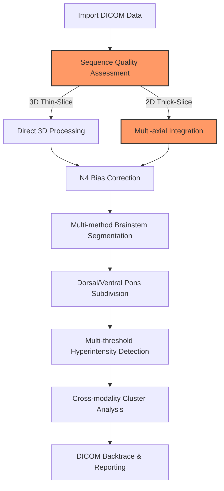

# brainstemx-full: Brainstem/Pons MRI Analysis Pipeline

BrainStem X (_Brainstem/Pons specific_ intensityclustering implementation) is an end-to-end pipeline designed for precise analysis of subtle T2/FLAIR hyperintensity/T1 hypointensity clusters in these critical brain neuroanatomical regions. Brainstem regions can present clinically with very subtle variations below the clinical threshold to human radiologists and standard research methods. This pipeline tries to address some the  challenges via

- **Multi-modal integration** across T1/T2/FLAIR/SWI/DWI sequences with cross-modality anomaly detection
- **N4 Bias Field AND slice-acquisiton** correction (e.g., SAG-acquired FLAIR sequences).
- **Precise orientation preservation** critical for analyzing directionally sensitive brainstem microstructure
- **Zero-shot/unsupervised cluster analysis** which could identify signal anomalies without manual segmentation or human false negative biases
- **Multiple fallback methods** at various steps, activated by quantitative quality metrics, adding robustness to results even with suboptimal slice thickness, modalities and IPR
- **DICOM backtrace capability** for clinical validation of findings in native scanner format
- **Parallel processing** of subjects and optimisation of multithreaded performance and standardised outputs to support larger cohort analysis
- **Modern approach** Attempts to take modern non-ML analytics approaches as of 2023/2024 and combine them, see https://github.com/myztery-neuroimg/brainstemx-full/blob/main/docs/sota-comparison.md 

<image width="400" alt="Simulated Hyperintensity Cluster on T2-SPACE-FLAIR" src="https://github.com/user-attachments/assets/5dc95c74-e270-47cf-aad5-9afaf70c85c1" />


## Project status

The project is in active development as of June 2025. Whilst many improvements are in the works, we hope it already offers some helpful functionality. Future works including a platform portable docker implementation via neurodocker.

For a minimal pure-python implemention with synthetic data generation, LLM report generation and a web-ui, refer to https://github.com/myztery-neuroimg/brainstemx (currently a very immature implementation and work in progress).

## Recent Segmentation Improvements (June 2025)
- Corrected Harvard-Oxford atlas selection: now uses only brainstem index 7, eliminating erroneous multi-index summation.
- Improved MNI→native space transformation: switched to trilinear interpolation + 0.5 thresholding, preserving partial volumes.
- Consistent file naming: updated pipeline and modules to use `_brainstem.nii.gz` and `_brainstem_flair_intensity.nii.gz` uniformly.
- Updated Juelich pons segmentation: applied same interpolation fix, yielding anatomically reasonable voxel counts.
- Integrated FLAIR enhancement: generated separate FLAIR intensity masks for segmentation quality analysis.

## Features

### Acquisition-Specific Processing and Registration
- Orientation standardization
  - Uses `fslswapdim` + `fslorient` then ANTs transform to enforce RAS orientation
  - Fallback for missing/ambiguous header fields via header-driven heuristics in `src/modules/preprocess.sh`
- Adaptive Rician denoising
  - Iterative patch-based NLM via `antsDenoiseImage` tuned by local variance
  - Auto-switch to FSL SUSAN when ANTs binaries are unavailable or memory-constrained
- Metadata-driven parameter tuning
  - Python metadata extractor reads DICOM tags to set N4 smoothing and denoising patch sizes dynamically
  - Ensures consistency across scanners/field strengths without manual config
- Multi-stage ANTs registration
  - Rigid → Affine → SyN with subject-specific mask weighting from white-matter segmentation (`src/modules/registration.sh`)
  - Template resolution automatically chosen based on voxel size; two-pass registration for submillimeter accuracy
  - Emergency fallback to SyNQuick or FSL FLIRT when MI/CC drops below QA thresholds
- White-matter guided initialization
  - Builds a WM mask via FSL FAST and uses it to bias initial transform for improved pons alignment
- Comprehensive hyperintensity clustering
  - Per-subject z-score thresholding on FLAIR intensities, minimum cluster-size filter, morphological closing
  - 3-plane confirmation to eliminate spurious outliers
  - DICOM backtrace JSON mapping results into original scanner coordinates for PACS validation

### Advanced Segmentation
- **Harvard-Oxford subcortical atlas** (index 7 for brainstem) as the gold standard primary method
- **Talairach atlas** for detailed brainstem subdivision (left/right medulla, pons, midbrain)
- **Atlas-to-subject transformation** preserving native resolution by bringing MNI atlases to subject space
- **Subject-specific brainstem refinement** using tissue segmentation to address shape variance in pathological cases
- **FLAIR integration** for enhanced multi-modal segmentation with intensity information
- Quantified "quality assessment" of the brain extraction, registration quality and segmentation accuracy with an extremely "over-the-top" QA module

### Cluster Analysis
- Statistical hyperintensity detection with multiple threshold approaches (1.5-3.0 SD, or whatever you want to configure, from the baseline intensity, and also whatever minimum size).
- Cross-modality cluster overlap quantification across MRI sequences
- Smoothing of white-matter regions so you don't just pick up spotty outlier pixels
- Cross-plane confirmation:- validate via axial, sagital and coronal views that what you're seeing is a real cluster of hyperintense pixels on FLAIR
- Pure quantile-bassd anomaly detection specific to subject, independent of manual labelling bias associated with deep learning models
- This means you can manipulate DICOM files to add clusters, hyperintensities/hypointensities and manually validate the _process_ - every step of its decision making - rather than it being a "black box"

### Technical Implementation

#### Preprocessing (preprocess.sh)
- **RAS/LPS orientation enforcement** with header-heuristic fallback for missing/ambiguous DICOM orientation fields
- **Iterative Rician NLM denoising** with automatic patch selection based on local image variance and noise characteristics
- **N4 bias-field correction** with dynamic shrink-factor and convergence settings optimized per acquisition protocol
- **Brain extraction** via ANTs BrainExtraction.sh with tissue-specific masks and morphological refinement
- **Scanner metadata parameter optimization** automatically adjusts processing parameters based on field strength, vendor, and acquisition settings

#### Registration Pipeline (registration.sh)
- **Template & resolution detection** automatically selects MNI152 or custom atlas templates based on input voxel dimensions
- **Multi-resolution registration stages** with white-matter mask weighting for improved anatomical correspondence
- **Emergency fallback triggers** using quantitative QA metrics (mutual information, cross-correlation thresholds) to switch methods
- **Transform validation** outputs detailed QA plots and metrics for each registration stage with comprehensive error handling

#### Enhanced Validation & Hyperintensity Analysis (enhanced_registration_validation.sh)
- **Extended registration metrics** including cross-correlation, normalized mutual information, and histogram skewness analysis
- **Coordinate-space and file-integrity checks** performed before each major processing step with detailed error reporting
- **Multi-atlas intensity mask creation** across Harvard-Oxford subcortical and Talairach atlases
- **Comprehensive cluster analysis** with volume quantification, morphological characterization, and interactive HTML visualization
- **DICOM coordinate backtrace** maintains mapping between processed results and original scanner coordinate systems

#### DICOM Import & Data Management (import.sh)
- **Vendor-agnostic DICOM conversion** with dcm2niix using scanner-specific optimization flags for Siemens/Philips/GE systems
- **Maximum data preservation** approach prevents slice loss through multiple fallback conversion strategies and series-by-series processing
- **Intelligent deduplication control** permanently disabled to prevent accidental removal of unique slices with safety checks for different series
- **Metadata extraction pipeline** extracts scanner parameters, field strength, and acquisition settings for downstream parameter optimization
- **Parallel DICOM processing** with GNU parallel for multi-series datasets and automatic series detection

#### Intelligent Scan Selection (scan_selection.sh)
- **Multi-modal quality assessment** evaluates file size, dimensions, voxel isotropy, and tissue contrast for optimal scan selection
- **ORIGINAL vs DERIVED acquisition detection** from DICOM metadata with significant scoring bonus for original acquisitions
- **Registration-optimized selection modes** including aspect ratio matching, dimension matching, and resolution-based selection
- **Interactive scan selection interface** with detailed comparison tables showing quality metrics, acquisition types, and recommendations
- **Cross-sequence compatibility analysis** calculates voxel similarity and aspect ratio matching between T1/FLAIR sequences

#### Advanced Brain Extraction & Standardization (brain_extraction.sh)
- **3D isotropic sequence detection** automatically identifies MPRAGE, SPACE, VISTA sequences to prevent quality degradation from multi-axial combination
- **Enhanced resolution quality metrics** considers voxel anisotropy, total volume, and in-plane resolution for optimal processing path selection
- **Multi-axial template construction** combines SAG/COR/AX orientations using antsMultivariateTemplateConstruction2.sh for 2D sequences
- **Smart dimension standardization** with optimal resolution detection across sequences and reference grid matching for identical matrix dimensions
- **Orientation consistency validation** performs detailed sform/qform matrix comparison with comprehensive error reporting

#### Additional Pipeline Modules

#### Advanced Segmentation (segmentation.sh)
- **Harvard-Oxford atlas segmentation** using subcortical index 7 (brainstem) as the gold standard primary method
- **Talairach atlas subdivision** for detailed brainstem regions: left/right medulla, pons, midbrain
- **Atlas-to-subject transformation** preserving native resolution by bringing MNI atlases to subject space
- **Subject-specific refinement** using tissue segmentation (Atropos/FAST) to address shape variance in hydrocephalus & Chiari cases
- **FLAIR enhancement integration** creating both T1 and FLAIR intensity versions for multi-modal analysis
- **Native space preservation** maintains segmentation accuracy in subject's original high-resolution space rather than downsampling to template resolution

#### Comprehensive Analysis Pipeline (analysis.sh)
- **Atlas-based regional analysis** using all available Talairach brainstem regions for per-region hyperintensity detection
- **Gaussian Mixture Model (GMM) thresholding** with 3-component analysis for intelligent threshold selection
- **Per-region z-score normalization** addressing tissue inhomogeneity across different brainstem regions
- **Connectivity weighting** for refined detection using 3D morphological operations
- **Multi-threshold hyperintensity detection** with configurable standard deviation multipliers and minimum cluster size filtering
- **Cross-modality validation** analyzes both FLAIR hyperintensities and T1 hypointensities with statistical correlation

#### Advanced Visualization & QA (visualization.sh, qa.sh)
- **Interactive 3D rendering** creates volume renderings of hyperintensity clusters with customizable opacity and color mapping
- **Multi-threshold comparison visualizations** generates side-by-side comparisons across different detection thresholds
- **Comprehensive QA validation** performs 20+ validation checks including file integrity, coordinate space consistency, and segmentation accuracy
- **Enhanced visual QA interface** with real-time FSLView integration for immediate visual feedback during processing

#### DICOM Integration & Clinical Validation (dicom_analysis.sh, dicom_cluster_mapping.sh)
- **Vendor-agnostic DICOM metadata extraction** analyzes scanner parameters, acquisition settings, and sequence characteristics for optimal processing
- **Clinical coordinate backtrace** maps processed results back to original DICOM coordinate system for PACS viewer compatibility
- **Comprehensive cluster-to-DICOM mapping** creates coordinate lookup tables enabling medical imaging viewer navigation to identified clusters
- **Scanner-specific optimization** automatically detects Siemens, Philips, and GE scanners and applies vendor-specific processing parameters

#### Intelligent Reference Space Selection (reference_space_selection.sh)
- **Adaptive reference space optimization** analyzes T1 and FLAIR scan quality, resolution, and acquisition parameters to select optimal processing space
- **Multi-modal compatibility assessment** calculates voxel aspect ratios, dimension matching, and registration compatibility between sequences
- **Resolution preservation strategy** intelligently chooses between maintaining native high-resolution vs standardized template space based on data quality
- **ORIGINAL vs DERIVED acquisition prioritization** significantly weights selection toward original scanner acquisitions over post-processed images

#### Environment & Utilities (environment.sh, utils.sh, fast_wrapper.sh)
- **Dynamic environment configuration** automatically detects available tools (ANTs, FSL, FreeSurfer) and configures optimal processing paths
- **Enhanced ANTs command execution** provides comprehensive error handling, progress monitoring, and automatic fallback strategies
- **Parallel FSL FAST wrapper** optimizes tissue segmentation with intelligent job distribution and memory management
- **Comprehensive validation framework** performs file integrity checks, coordinate space validation, and processing pipeline verification

#### Core Pipeline Integration
- **8-stage resumable pipeline** with intelligent checkpoint detection allowing restart from any processing stage
- **Smart data flow management** automatically tracks file dependencies and validates upstream processing completion
- **Comprehensive error handling** with graceful degradation and detailed diagnostic reporting for troubleshooting
- **Orientation distortion correction** leveraging ANTs transformation frameworks with comprehensive validation
- **Quantitative registration validation** with comprehensive QA metrics and emergency fallback triggers
- **Efficient resource utilization** through intelligent parallel processing with CPU-intensive job management
- **3D visualization pipeline** via standard NiFTi volumes and masks with comprehensive HTML reporting and DICOM backtrace

### Actual Implementation Details

#### Segmentation Module (segmentation.sh)
The segmentation module implements a **two-tier atlas approach**:

1. **Harvard-Oxford Subcortical Atlas (Primary)**
   - Uses index 7 specifically for brainstem segmentation
   - Applied via `antsApplyTransforms` with trilinear interpolation + 0.5 thresholding
   - Creates both `_brainstem.nii.gz` and `_brainstem_flair_intensity.nii.gz` versions

2. **Talairach Atlas (Detailed Subdivision)**
   - Six brainstem regions: Left/Right Medulla, Pons, Midbrain
   - Atlas indices: 172-177 for comprehensive brainstem coverage
   - Same transformation methodology preserving partial volumes

3. **Subject-Specific Refinement**
   - Uses ANTs Atropos or FSL FAST tissue segmentation as fallback
   - Addresses shape variance in hydrocephalus and Chiari malformation cases
   - Integrates CSF, gray matter, and white matter probability maps

#### Analysis Module (analysis.sh)
The analysis module implements **atlas-based regional hyperintensity detection**:

1. **Gaussian Mixture Model (GMM) Analysis**
   - 3-component GMM for each Talairach brainstem region
   - Intelligent threshold selection beyond simple z-score methods
   - Per-region normalization addressing tissue inhomogeneity

2. **Multi-Modal Integration**
   - FLAIR hyperintensity detection with configurable SD thresholds
   - T1 hypointensity correlation analysis
   - Cross-modal validation using statistical correlation

3. **Morphological Refinement**
   - 3D connectivity analysis with 26-neighbor connectivity
   - Minimum cluster size filtering (configurable, default 27 voxels)
   - Morphological closing operations to eliminate noise

#### QA Module (qa.sh)
The QA module performs **20+ comprehensive validation checks**:

1. **File Integrity Validation**
   - NIfTI header consistency across processing stages
   - Coordinate space validation (sform/qform matrices)
   - Volume preservation checks throughout pipeline

2. **Registration Quality Assessment**
   - Cross-correlation and normalized mutual information metrics
   - Histogram skewness analysis for registration accuracy
   - Emergency fallback triggers based on quantitative thresholds

3. **Segmentation Accuracy Validation**
   - Volume consistency across atlas spaces
   - Anatomical location verification (brainstem center-of-mass)
   - Cross-atlas agreement analysis

### Key Algorithmic Functions

#### Advanced Scan Selection & Reference Space Optimization
- **`select_best_scan()`** - Multi-modal quality assessment with registration-optimized selection modes including `original`, `highest_resolution`, `registration_optimized`, `matched_dimensions`, and `interactive` modes
- **`select_optimal_reference_space()`** - Intelligent reference space selection that analyzes voxel dimensions, aspect ratios, and acquisition types to determine the optimal template space for registration
- **`evaluate_scan_quality()`** - Comprehensive quality scoring based on file size, dimensions, voxel isotropy, tissue contrast, and ORIGINAL vs DERIVED acquisition detection

#### Enhanced N4 Bias Correction Pipeline
- **`process_n4_correction()`** - Adaptive N4 bias field correction with scanner-specific parameter optimization
- **Dynamic convergence settings** based on field strength (1.5T vs 3T) and acquisition protocol (2D vs 3D)
- **Iterative shrink-factor optimization** automatically adjusts based on image resolution and tissue contrast
- **Multi-stage bias correction** for severely biased images with progressive refinement

#### Intelligent Resolution & Template Detection
- **`detect_optimal_resolution()`** - Cross-sequence resolution analysis to determine the finest achievable target grid
- **`calculate_voxel_aspect_ratio()`** - Registration compatibility assessment between sequences
- **`is_3d_isotropic_sequence()`** - Automatic detection of 3D MPRAGE, SPACE, VISTA sequences to prevent quality degradation
- **Template resolution matching** automatically selects MNI152 templates based on input voxel dimensions for optimal registration accuracy

### Clinical Focus
- Vendor-specific optimizations for Siemens and Philips scanners (future: implement DICOM-RT and PACS integration as well)
- Practical configuration support to optimise output validity across 1.5T and 3T field strengths
- A novel DICOM backtrace for clinical verification of findings in native viewer format, because nothing in post-processing pipelines is proven until you can map it back to source of truth raw scanner output

### Data compatibility 
BrainStem X supports analysis of a wide variety of clinical neuroimaging MRI datasets:

- **High-end Research Protocols**: Optimized for 3D isotropic thin-slice acquisitions (1mm³ voxels)
  - 3D MPRAGE T1-weighted imaging
  - Optimisations for 3T scanners, accomodations for 1.5T
  - 3D SPACE/VISTA T2-FLAIR with SAG acquisition where available
  - Multi-parametric SWI/DWI integration as quantifiable support for T1W/FLAIR clustering results

- **Routine Clinical Protocols**: Robust fallback for standard clinical acquisitions
  - Thick-slice (3-5mm) 1.5T 2D axial FLAIR with gaps, where we likely have thin slice 3D T1/T1-MPR to register against
  - Non-isotropic voxel reconstruction estimation via ANTs
  - Single-sequence limited protocols e.g., AX FLAIR
  - Normalisation against MNT space and signal levels agaisnt the baseline of the individual subject

The pipeline extracts DICOM metadata including acquisition/scanner parameters, slice thickness, and orientation/modality/dimensionality to apply consistent, reliable, and transparent transformations, normalizations, and attempts registration techniques using ANTs and FSL libraries and atlas-based segmentation of the brainsteam, dorsal and ventral pons. 
Configurable N4 bias field correction and scanner orientation correction implementations help ensure integrity of the results. 20 validations within the qa module alone ensure consistency and reliability of your results.

These capabilities are included to support analysis of signal intensity actoss datasets from scans of varying imaging capabilities and protocols, making BrainStem X particularly effective for multi-center studies and retrospective analyses of existing clinical data.

This kind of visualisation with the ability to track back to raw DICOM files and map clusters across modalities could potentially be quite useful, even without machine learning techniques which of course are all the rage nowadays. This is a very much first-principles approach but it uses the very latest techniques and grounded research up to 2023.

### Example Workflow



### 8-Stage Resumable Pipeline Architecture

The pipeline implements a sophisticated 8-stage processing workflow with intelligent checkpoint detection and resumability:

#### Stage 1: DICOM Import & Data Management
- **Vendor-agnostic DICOM conversion** using dcm2niix with scanner-specific optimization flags
- **Maximum data preservation** through series-by-series processing and emergency fallback conversion strategies
- **Intelligent metadata extraction** captures scanner parameters, field strength, acquisition settings for downstream optimization
- **Quality assessment** validates DICOM integrity and performs initial sequence classification

#### Stage 2: Preprocessing (Rician Denoising + N4 Bias Correction)
- **Adaptive reference space selection** analyzes scan quality and chooses optimal T1/FLAIR combination using [`select_optimal_reference_space()`](src/modules/reference_space_selection.sh:1)
- **Registration-optimized scan selection** with multiple modes: `original`, `highest_resolution`, `registration_optimized`, `matched_dimensions`
- **Enhanced N4 bias correction** with scanner-specific parameter optimization and iterative convergence
- **Orientation consistency validation** performs detailed sform/qform matrix comparison with comprehensive error reporting

#### Stage 3: Brain Extraction, Standardization & Cropping
- **Smart resolution detection** via [`detect_optimal_resolution()`](src/modules/brain_extraction.sh:214) analyzes voxel dimensions across sequences
- **Reference grid standardization** ensures T1 and FLAIR have identical matrix dimensions while preserving highest resolution
- **Enhanced ANTs brain extraction** with tissue-specific masks and morphological refinement
- **3D isotropic sequence detection** prevents quality degradation from unnecessary multi-axial combination

#### Stage 4: Registration with Bidirectional Transform Management
- **Multi-stage ANTs registration** Rigid → Affine → SyN with white-matter guided initialization
- **Bidirectional space mapping** calculates native ↔ MNI transforms without resampling high-resolution data
- **Emergency fallback system** automatic SyNQuick or FSL FLIRT when quality metrics drop below thresholds
- **Enhanced registration validation** comprehensive metrics including cross-correlation, mutual information, normalized CC

#### Stage 5: Multi-Atlas Segmentation
- **Harvard-Oxford gold standard** subcortical atlas (index 7) for reliable brainstem boundaries
- **Talairach detailed subdivision** for left/right medulla, pons, midbrain regions
- **Subject-specific refinement** using tissue segmentation to address shape variance in pathological cases
- **Native space preservation** maintains segmentation accuracy in subject's original high-resolution space
- **FLAIR integration** creates both T1 and FLAIR intensity versions for comprehensive analysis
- **Volume consistency validation** with anatomical location verification and comprehensive QA reporting

#### Stage 6: Comprehensive Hyperintensity Analysis
- **Multi-threshold detection** configurable SD multipliers (1.5-3.0) with minimum cluster size filtering
- **Cross-modality validation** analyzes hyperintensity patterns across T1/T2/FLAIR with statistical correlation
- **Native-to-standard space mapping** enables analysis in both subject native and standardized coordinates
- **DICOM cluster backtrace** creates coordinate lookup tables for medical imaging viewer navigation

#### Stage 7: Advanced Visualization & Reporting
- **3D volume rendering** with customizable opacity and color mapping for hyperintensity clusters
- **Multi-threshold comparison** side-by-side visualizations across different detection thresholds
- **Interactive QA interface** real-time FSLView integration for immediate visual feedback
- **Comprehensive HTML reporting** with embedded visualizations and quantitative metrics

#### Stage 8: Progress Tracking & Validation
- **Pipeline completion validation** verifies all processing stages and output file integrity
- **Comprehensive QA reporting** 20+ validation checks including coordinate space consistency
- **Batch processing summary** CSV reports with volume metrics and registration quality scores
- **Error tracking and diagnostics** detailed logging for troubleshooting and quality assurance

**Complete Module Implementation:**
- Core Pipeline → [`src/pipeline.sh`](src/pipeline.sh:1)
- Environment & Configuration → [`src/modules/environment.sh`](src/modules/environment.sh:1), [`src/modules/utils.sh`](src/modules/utils.sh:1)
- DICOM Import & Data Management → [`src/modules/import.sh`](src/modules/import.sh:1)
- DICOM Analysis & Clinical Integration → [`src/modules/dicom_analysis.sh`](src/modules/dicom_analysis.sh:1), [`src/modules/dicom_cluster_mapping.sh`](src/modules/dicom_cluster_mapping.sh:1)
- Intelligent Scan Selection → [`src/modules/scan_selection.sh`](src/modules/scan_selection.sh:1)
- Reference Space Optimization → [`src/modules/reference_space_selection.sh`](src/modules/reference_space_selection.sh:1)
- Advanced Brain Extraction & Standardization → [`src/modules/brain_extraction.sh`](src/modules/brain_extraction.sh:1)
- Preprocessing → [`src/modules/preprocess.sh`](src/modules/preprocess.sh:1)
- Registration → [`src/modules/registration.sh`](src/modules/registration.sh:1)
- Multi-Atlas Segmentation → [`src/modules/segmentation.sh`](src/modules/segmentation.sh:1)
- Comprehensive Analysis → [`src/modules/analysis.sh`](src/modules/analysis.sh:1)
- Enhanced Registration Validation → [`src/modules/enhanced_registration_validation.sh`](src/modules/enhanced_registration_validation.sh:1)
- Advanced Visualization → [`src/modules/visualization.sh`](src/modules/visualization.sh:1)
- Quality Assurance → [`src/modules/qa.sh`](src/modules/qa.sh:1)
- Parallel Processing → [`src/modules/fast_wrapper.sh`](src/modules/fast_wrapper.sh:1)

## Installation

### Requirements

- ANTs (Advanced Normalization Tools): https://github.com/ANTsX/ANTs/wiki/Installing-ANTs-release-binaries
- FSL (FMRIB Software Library): https://git.fmrib.ox.ac.uk/fsl/conda/installer
- Convert3D (c3d) (SourceForge download link for Apple Silicon: https://sourceforge.net/projects/c3d/files/c3d/Nightly/c3d-nightly-MacOS-x86_64.dmg/download or just use Homebrew)
- dcm2niix (distributed with FreeSurfer): install via homebrew
- FreeSurfer (optional, for 3D visualization): https://surfer.nmr.mgh.harvard.edu/fswiki/rel7downloads
- Python 3 (for metadata extraction): use `conda` or preferably `uv` to manage python versions
- GNU Parallel (via homebrew)
- MacOS or (untested) Linux OS
- Python 3.12 (various libraries are unavailable on 3.13 at the time of writing)
- I reccomend the ITK-SNAP visualisation and manual segmentation tool so that you can compare the autoamted results vs manual segmentation. I also have a separate CNN based segmentation but it doesn't go down to the level that the automated tooling does.

### Install dependencies

Ensure you have ANTs, FSL, Convert3D, dcm2niix, Parallel and FreeSurfer installed. 
* NOTE: Some of these tools and ATLASes have different licences and you must agree or disagree individually with their licence terms.*
Most are available via `homebrew` (macOS). If you don't the script will conveniently tell you

``` 
==== Dependency Checker ====
[ERROR] ✗ dcm2niix is not installed or not in PATH
[INFO] Try: brew install dcm2niix
[INFO] Checking ANTs tools...
[SUCCESS] ✓ ANTs (antsRegistrationSyN.sh) is installed (/Users/username/ants/bin/antsRegistrationSyN.sh)
[SUCCESS] ✓ ANTs (N4BiasFieldCorrection) is installed (/Users/username/ants/bin/N4BiasFieldCorrection)
[SUCCESS] ✓ ANTs (antsApplyTransforms) is installed (/Users/username/ants/bin/antsApplyTransforms)
[SUCCESS] ✓ ANTs (antsBrainExtraction.sh) is installed (/Users/username/ants/bin/antsBrainExtraction.sh)
[INFO] Checking FSL...
[ERROR] ✗ FSL (fslinfo) is not installed or not in PATH
[ERROR] ✗ FSL (fslstats) is not installed or not in PATH
[ERROR] ✗ FSL (fslmaths) is not installed or not in PATH
[ERROR] ✗ FSL (bet) is not installed or not in PATH
[ERROR] ✗ FSL (flirt) is not installed or not in PATH
[ERROR] ✗ FSL (fast) is not installed or not in PATH
[INFO] Checking FreeSurfer...
[ERROR] ✗ FreeSurfer (mri_convert) is not installed or not in PATH
[ERROR] ✗ FreeSurfer (freeview) is not installed or not in PATH
[INFO] Checking Convert3D...
[SUCCESS] ✓ Convert3D is installed (/usr/local/bin/c3d)
[INFO] Checking operating system...
[SUCCESS] ✓ Running on macOS
[INFO] ==== Checking optional but recommended tools ====
[ERROR] ✗ ImageMagick is not installed or not in PATH
[INFO] Install with: brew install imagemagick
[WARNING] ImageMagick is recommended for image conversions
[ERROR] ✗ GNU Parallel is not installed or not in PATH
[INFO] Install with: brew install parallel
[ERROR] GNU Parallel is required for faster processing
[INFO] ==== Dependency Check Summary ====
[ERROR] 3 required dependencies are missing.
```

### Python dependencies

```
python -m pip install -r requirements.txt
```

Pro-tip: prefereably use `uv` - everything is already packaged for this and its much easier.

I will release a docker image some time in the future but bear in mind that GPU acceleration isn't available in Docker on Apple Silicon.

### Setup

1. Clone this repository:
   ```
   git clone https://github.com/myztery-neuroimg/brainstemx-full
   cd brainstemx-full
   ```

2. Ensure all dependencies are installed and in your PATH. The easiest way to do this is either run tests/integration.sh or run_pipeline.sh.

3. Make the pipeline script executable:
   ```
   chmod +x pipeline.sh
   chmod +x modules/*.sh
   chmod +x tests/*.sh
   ```

4. Create a python venv and install required packages. I *strongly* recommend to use `uv` instead of `venv` especially to ensure python 3.12
   ```
   python -m venv venv .
   source ./bin/activate
   pip install -r requirements.txt
   # alternatively:
   uv init
   uv python pin #version
   uv pip install -r requirements.txt
   uv venv / uv sync
   ```

### Quick Start

```
# Basic usage with default parameters
./pipeline.sh -i /path/to/dicom -o /path/to/output -s subject_id

# High quality processing for research use
./pipeline.sh -i /path/to/dicom -o /path/to/output -s subject_id -q HIGH

# Batch processing multiple subjects
./pipeline.sh -p BATCH -i /path/to/base_dir -o /path/to/output_base --subject-list /path/to/subject_list.txt
```

## Acknowledgments 

BrainStem X leverages established neuroimaging tools, reinventing very little but combining some of these excellent projects:

- **ANTs**: Advanced Normalizations Tools ecosystem - highly incorporated in the pipeline
- **FSL**: Integrated with enhanced cluster analysis thresholding
- **FreeSurfer**: Utilized for 3D visualization of anomaly distribution
- **Custom Python modules**: Implemented for cross-modality registration and cluster correlation
- **Convert3D**
- **dcm2niix**
- **DCMTK**: dcmdump utility for extracting headers from DiCOM files
- **ITK-SNAP**

### Atlases & Templates

- **Harvard-Oxford Subcortical Structural Atlas** - Primary brainstem segmentation (index 7)
- **Talairach Atlas** - Detailed brainstem subdivision (medulla, pons, midbrain)
- **MNI152 Standard Space Templates** - Registration targets with automatic resolution selection

### Programming Resources / Libraries (including..)
- Python Neuroimaging Libraries (NiBabel, PyDicom, antspyx)
- GNU Parallel  
- Matplotlib & Seaborn
- NumPy & SciPy

## Independent Development

This project was developed independently without institutional or any other backing. I'm making this as available as possible to inspire development in this area of research.

I should qualify my background is Computer Science and Mathematics. I don't know the inner workings of the brainstem, what "normal" looks like, but I tried to find as many open source datasets as I could and relied on AI assistance in the radioneurological details, my expertise is in glueing things together. Real neuroradiological expertise would help a whole bunch here.. but I think computer science and mathematics have a lot to offer the field in terms of processing pipelines that put it all together and so this is our naive attempt.

This is a purely exploratory research project to understand the capabilities of existing tools in advanced pipelines in identifiying specific types of computationally "noticable" but clinically non-obvious anomalies. It is not clinically validated or necessarily robust or accurate and decisions and interpretations should always be made by qualified medical staff. 

## License
This project is released under the MIT License - see the LICENSE file for details.

Note: 
- Please review the licence terms of dependencies when setting up the environment for brainstemx.
- Users must accept responsibility for installing and accepting the licence terms of those projects individually.
- We have attempted where possible to minimise individual dependencies or provide alternatives (pluggable atlasses, for example); however, in practice some of these dependencies are going to be absolutely required as noted in the installation script and for convenience, in the output above.

If you use BrainStem X in your research, feel free to cite:

```
@software{BrainStemX2025,
  author = {D.J. Brewster},
  title = {BrainStem X: Advanced Brainstem/Pons MRI Analysis Pipeline},
  year = {2025},
  url = {https://github.com/myztery-neuroimg/brainstemx-full}
}
```

## Contributing
- Yes, please! Submit a PR or comment on the repository page if you like, all contributions are welcome.
- In particular, any neuroresearch related feedback about the neurological, radiological and computational/technical pipeline foundations would be amazing and will be cited if used to progress the project.
