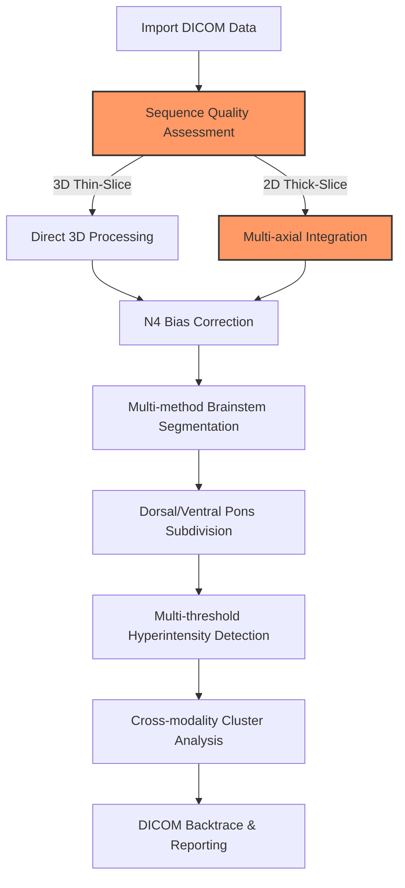

# BrainStemX-Full: Technical Overview & Deep Dive

## Introduction

BrainStem X is a sophisticated neuroimaging research pipeline for analyzing subtle T2/FLAIR hyperintensity and T1 hypointensity clusters in brainstem and pons regions. This document provides comprehensive technical details about the implementation, algorithms, and clinical considerations.

## Technical Motivation

Brainstem regions can present clinically with very subtle variations below the clinical threshold to human radiologists and standard research methods. This pipeline addresses these challenges through:

- **Multi-modal integration** across T1/T2/FLAIR/SWI/DWI sequences with cross-modality anomaly detection
- **N4 Bias Field AND slice-acquisition correction** (e.g., SAG-acquired FLAIR sequences)
- **Precise orientation preservation** critical for analyzing directionally sensitive brainstem microstructure
- **Zero-shot/unsupervised cluster analysis** identifying signal anomalies without manual segmentation or human false negative biases
- **Multiple fallback methods** at various steps, activated by quantitative quality metrics
- **DICOM backtrace capability** for clinical validation of findings in native scanner format
- **Parallel processing** of subjects with optimized multithreaded performance
- **Modern approach** combining non-ML analytics approaches as of 2023/2024 (see [sota-comparison.md](sota-comparison.md))


## Recent Improvements (June 2025)

- Corrected Harvard-Oxford atlas selection: now uses only brainstem index 7, eliminating erroneous multi-index summation
- Improved MNI→native space transformation: switched to trilinear interpolation + 0.5 thresholding, preserving partial volumes
- Consistent file naming: updated pipeline and modules to use `_brainstem.nii.gz` and `_brainstem_flair_intensity.nii.gz` uniformly
- Updated Juelich pons segmentation: applied same interpolation fix, yielding anatomically reasonable voxel counts
- Integrated FLAIR enhancement: generated separate FLAIR intensity masks for segmentation quality analysis

## Complete Feature Set

### Acquisition-Specific Processing and Registration

#### Orientation Standardization
- Uses `fslswapdim` + `fslorient` then ANTs transform to enforce RAS orientation
- Fallback for missing/ambiguous header fields via header-driven heuristics in `src/modules/preprocess.sh`

#### Adaptive Rician Denoising
- Iterative patch-based NLM via `antsDenoiseImage` tuned by local variance
- Auto-switch to FSL SUSAN when ANTs binaries are unavailable or memory-constrained

#### Metadata-Driven Parameter Tuning
- Python metadata extractor reads DICOM tags to set N4 smoothing and denoising patch sizes dynamically
- Ensures consistency across scanners/field strengths without manual config

#### Multi-Stage ANTs Registration
- Rigid → Affine → SyN with subject-specific mask weighting from white-matter segmentation (`src/modules/registration.sh`)
- Template resolution automatically chosen based on voxel size; two-pass registration for submillimeter accuracy
- Emergency fallback to SyNQuick or FSL FLIRT when MI/CC drops below QA thresholds

#### White-Matter Guided Initialization
- Builds a WM mask via FSL FAST and uses it to bias initial transform for improved pons alignment

#### Comprehensive Hyperintensity Clustering
- Per-subject z-score thresholding on FLAIR intensities, minimum cluster-size filter, morphological closing
- 3-plane confirmation to eliminate spurious outliers
- DICOM backtrace JSON mapping results into original scanner coordinates for PACS validation

### Advanced Segmentation

#### Atlas-Based Approaches
- **Harvard-Oxford subcortical atlas** (index 7 for brainstem) as the gold standard primary method
- **Talairach atlas** for detailed brainstem subdivision (left/right medulla, pons, midbrain)
- **Atlas-to-subject transformation** preserving native resolution by bringing MNI atlases to subject space

#### Subject-Specific Refinement
- Uses tissue segmentation to address shape variance in pathological cases
- **FLAIR integration** for enhanced multi-modal segmentation with intensity information
- Quantified quality assessment of brain extraction, registration quality, and segmentation accuracy with comprehensive QA module

### Cluster Analysis

- Statistical hyperintensity detection with multiple threshold approaches (1.5-3.0 SD from baseline intensity, configurable minimum size)
- Cross-modality cluster overlap quantification across MRI sequences
- Smoothing of white-matter regions to avoid spotty outlier pixels
- Cross-plane confirmation: validate via axial, sagittal, and coronal views
- Pure quantile-based anomaly detection specific to subject, independent of manual labelling bias
- Manipulable DICOM files allow manual validation of the process - every step of decision making

## Detailed Technical Implementation

### Preprocessing (preprocess.sh)

- **RAS/LPS orientation enforcement** with header-heuristic fallback for missing/ambiguous DICOM orientation fields
- **Iterative Rician NLM denoising** with automatic patch selection based on local image variance and noise characteristics
- **N4 bias-field correction** with dynamic shrink-factor and convergence settings optimized per acquisition protocol
- **Brain extraction** via ANTs BrainExtraction.sh with tissue-specific masks and morphological refinement
- **Scanner metadata parameter optimization** automatically adjusts processing parameters based on field strength, vendor, and acquisition settings

### Registration Pipeline (registration.sh)

- **Template & resolution detection** automatically selects MNI152 or custom atlas templates based on input voxel dimensions
- **Multi-resolution registration stages** with white-matter mask weighting for improved anatomical correspondence
- **Emergency fallback triggers** using quantitative QA metrics (mutual information, cross-correlation thresholds) to switch methods
- **Transform validation** outputs detailed QA plots and metrics for each registration stage with comprehensive error handling

### Enhanced Validation & Hyperintensity Analysis (enhanced_registration_validation.sh)

- **Extended registration metrics** including cross-correlation, normalized mutual information, and histogram skewness analysis
- **Coordinate-space and file-integrity checks** performed before each major processing step with detailed error reporting
- **Multi-atlas intensity mask creation** across Harvard-Oxford subcortical and Talairach atlases
- **Comprehensive cluster analysis** with volume quantification, morphological characterization, and interactive HTML visualization
- **DICOM coordinate backtrace** maintains mapping between processed results and original scanner coordinate systems

### DICOM Import & Data Management (import.sh)

- **Vendor-agnostic DICOM conversion** with dcm2niix using scanner-specific optimization flags for Siemens/Philips/GE systems
- **Maximum data preservation** approach prevents slice loss through multiple fallback conversion strategies and series-by-series processing
- **Intelligent deduplication control** permanently disabled to prevent accidental removal of unique slices with safety checks for different series
- **Metadata extraction pipeline** extracts scanner parameters, field strength, and acquisition settings for downstream parameter optimization
- **Parallel DICOM processing** with GNU parallel for multi-series datasets and automatic series detection

### Intelligent Scan Selection (scan_selection.sh)

- **Multi-modal quality assessment** evaluates file size, dimensions, voxel isotropy, and tissue contrast for optimal scan selection
- **ORIGINAL vs DERIVED acquisition detection** from DICOM metadata with significant scoring bonus for original acquisitions
- **Registration-optimized selection modes** including aspect ratio matching, dimension matching, and resolution-based selection
- **Interactive scan selection interface** with detailed comparison tables showing quality metrics, acquisition types, and recommendations
- **Cross-sequence compatibility analysis** calculates voxel similarity and aspect ratio matching between T1/FLAIR sequences

### Advanced Brain Extraction & Standardization (brain_extraction.sh)

- **3D isotropic sequence detection** automatically identifies MPRAGE, SPACE, VISTA sequences to prevent quality degradation from multi-axial combination
- **Enhanced resolution quality metrics** considers voxel anisotropy, total volume, and in-plane resolution for optimal processing path selection
- **Multi-axial template construction** combines SAG/COR/AX orientations using antsMultivariateTemplateConstruction2.sh for 2D sequences
- **Smart dimension standardization** with optimal resolution detection across sequences and reference grid matching for identical matrix dimensions
- **Orientation consistency validation** performs detailed sform/qform matrix comparison with comprehensive error reporting

### Advanced Segmentation (segmentation.sh)

- **Harvard-Oxford atlas segmentation** using subcortical index 7 (brainstem) as the gold standard primary method
- **Talairach atlas subdivision** for detailed brainstem regions: left/right medulla, pons, midbrain
- **Atlas-to-subject transformation** preserving native resolution by bringing MNI atlases to subject space
- **Subject-specific refinement** using tissue segmentation (Atropos/FAST) to address shape variance in hydrocephalus & Chiari cases
- **FLAIR enhancement integration** creating both T1 and FLAIR intensity versions for multi-modal analysis
- **Native space preservation** maintains segmentation accuracy in subject's original high-resolution space rather than downsampling to template resolution

### Comprehensive Analysis Pipeline (analysis.sh)

- **Atlas-based regional analysis** using all available Talairach brainstem regions for per-region hyperintensity detection
- **Gaussian Mixture Model (GMM) thresholding** with 3-component analysis for intelligent threshold selection
- **Per-region z-score normalization** addressing tissue inhomogeneity across different brainstem regions
- **Connectivity weighting** for refined detection using 3D morphological operations
- **Multi-threshold hyperintensity detection** with configurable standard deviation multipliers and minimum cluster size filtering
- **Cross-modality validation** analyzes both FLAIR hyperintensities and T1 hypointensities with statistical correlation

### Advanced Visualization & QA (visualization.sh, qa.sh)

- **Interactive 3D rendering** creates volume renderings of hyperintensity clusters with customizable opacity and color mapping
- **Multi-threshold comparison visualizations** generates side-by-side comparisons across different detection thresholds
- **Comprehensive QA validation** performs 20+ validation checks including file integrity, coordinate space consistency, and segmentation accuracy
- **Enhanced visual QA interface** with real-time FSLView integration for immediate visual feedback during processing

### DICOM Integration & Clinical Validation (dicom_analysis.sh, dicom_cluster_mapping.sh)

- **Vendor-agnostic DICOM metadata extraction** analyzes scanner parameters, acquisition settings, and sequence characteristics for optimal processing
- **Clinical coordinate backtrace** maps processed results back to original DICOM coordinate system for PACS viewer compatibility
- **Comprehensive cluster-to-DICOM mapping** creates coordinate lookup tables enabling medical imaging viewer navigation to identified clusters
- **Scanner-specific optimization** automatically detects Siemens, Philips, and GE scanners and applies vendor-specific processing parameters

### Intelligent Reference Space Selection (reference_space_selection.sh)

- **Adaptive reference space optimization** analyzes T1 and FLAIR scan quality, resolution, and acquisition parameters to select optimal processing space
- **Multi-modal compatibility assessment** calculates voxel aspect ratios, dimension matching, and registration compatibility between sequences
- **Resolution preservation strategy** intelligently chooses between maintaining native high-resolution vs standardized template space based on data quality
- **ORIGINAL vs DERIVED acquisition prioritization** significantly weights selection toward original scanner acquisitions over post-processed images

### Environment & Utilities (environment.sh, utils.sh, fast_wrapper.sh)

- **Dynamic environment configuration** automatically detects available tools (ANTs, FSL, FreeSurfer) and configures optimal processing paths
- **Enhanced ANTs command execution** provides comprehensive error handling, progress monitoring, and automatic fallback strategies
- **Parallel FSL FAST wrapper** optimizes tissue segmentation with intelligent job distribution and memory management
- **Comprehensive validation framework** performs file integrity checks, coordinate space validation, and processing pipeline verification

## Key Algorithmic Functions

### Advanced Scan Selection & Reference Space Optimization

- **`select_best_scan()`** - Multi-modal quality assessment with registration-optimized selection modes including `original`, `highest_resolution`, `registration_optimized`, `matched_dimensions`, and `interactive` modes
- **`select_optimal_reference_space()`** - Intelligent reference space selection that analyzes voxel dimensions, aspect ratios, and acquisition types to determine the optimal template space for registration
- **`evaluate_scan_quality()`** - Comprehensive quality scoring based on file size, dimensions, voxel isotropy, tissue contrast, and ORIGINAL vs DERIVED acquisition detection

### Enhanced N4 Bias Correction Pipeline

- **`process_n4_correction()`** - Adaptive N4 bias field correction with scanner-specific parameter optimization
- **Dynamic convergence settings** based on field strength (1.5T vs 3T) and acquisition protocol (2D vs 3D)
- **Iterative shrink-factor optimization** automatically adjusts based on image resolution and tissue contrast
- **Multi-stage bias correction** for severely biased images with progressive refinement

### Intelligent Resolution & Template Detection

- **`detect_optimal_resolution()`** - Cross-sequence resolution analysis to determine the finest achievable target grid
- **`calculate_voxel_aspect_ratio()`** - Registration compatibility assessment between sequences
- **`is_3d_isotropic_sequence()`** - Automatic detection of 3D MPRAGE, SPACE, VISTA sequences to prevent quality degradation
- **Template resolution matching** automatically selects MNI152 templates based on input voxel dimensions for optimal registration accuracy

## 8-Stage Resumable Pipeline Architecture

### Stage 1: DICOM Import & Data Management
- **Vendor-agnostic DICOM conversion** using dcm2niix with scanner-specific optimization flags
- **Maximum data preservation** through series-by-series processing and emergency fallback conversion strategies
- **Intelligent metadata extraction** captures scanner parameters, field strength, acquisition settings for downstream optimization
- **Quality assessment** validates DICOM integrity and performs initial sequence classification

### Stage 2: Preprocessing (Rician Denoising + N4 Bias Correction)
- **Adaptive reference space selection** analyzes scan quality and chooses optimal T1/FLAIR combination using [`select_optimal_reference_space()`](../src/modules/reference_space_selection.sh:1)
- **Registration-optimized scan selection** with multiple modes: `original`, `highest_resolution`, `registration_optimized`, `matched_dimensions`
- **Enhanced N4 bias correction** with scanner-specific parameter optimization and iterative convergence
- **Orientation consistency validation** performs detailed sform/qform matrix comparison with comprehensive error reporting

### Stage 3: Brain Extraction, Standardization & Cropping
- **Smart resolution detection** via [`detect_optimal_resolution()`](../src/modules/brain_extraction.sh:214) analyzes voxel dimensions across sequences
- **Reference grid standardization** ensures T1 and FLAIR have identical matrix dimensions while preserving highest resolution
- **Enhanced ANTs brain extraction** with tissue-specific masks and morphological refinement
- **3D isotropic sequence detection** prevents quality degradation from unnecessary multi-axial combination

### Stage 4: Registration with Bidirectional Transform Management
- **Multi-stage ANTs registration** Rigid → Affine → SyN with white-matter guided initialization
- **Bidirectional space mapping** calculates native ↔ MNI transforms without resampling high-resolution data
- **Emergency fallback system** automatic SyNQuick or FSL FLIRT when quality metrics drop below thresholds
- **Enhanced registration validation** comprehensive metrics including cross-correlation, mutual information, normalized CC

### Stage 5: Multi-Atlas Segmentation
- **Harvard-Oxford gold standard** subcortical atlas (index 7) for reliable brainstem boundaries
- **Talairach detailed subdivision** for left/right medulla, pons, midbrain regions
- **Subject-specific refinement** using tissue segmentation to address shape variance in pathological cases
- **Native space preservation** maintains segmentation accuracy in subject's original high-resolution space
- **FLAIR integration** creates both T1 and FLAIR intensity versions for comprehensive analysis
- **Volume consistency validation** with anatomical location verification and comprehensive QA reporting

### Stage 6: Comprehensive Hyperintensity Analysis
- **Multi-threshold detection** configurable SD multipliers (1.5-3.0) with minimum cluster size filtering
- **Cross-modality validation** analyzes hyperintensity patterns across T1/T2/FLAIR with statistical correlation
- **Native-to-standard space mapping** enables analysis in both subject native and standardized coordinates
- **DICOM cluster backtrace** creates coordinate lookup tables for medical imaging viewer navigation

### Stage 7: Advanced Visualization & Reporting
- **3D volume rendering** with customizable opacity and color mapping for hyperintensity clusters
- **Multi-threshold comparison** side-by-side visualizations across different detection thresholds
- **Interactive QA interface** real-time FSLView integration for immediate visual feedback
- **Comprehensive HTML reporting** with embedded visualizations and quantitative metrics

### Stage 8: Progress Tracking & Validation
- **Pipeline completion validation** verifies all processing stages and output file integrity
- **Comprehensive QA reporting** 20+ validation checks including coordinate space consistency
- **Batch processing summary** CSV reports with volume metrics and registration quality scores
- **Error tracking and diagnostics** detailed logging for troubleshooting and quality assurance

## Module Implementation Reference

- Core Pipeline → [`src/pipeline.sh`](../src/pipeline.sh:1)
- Environment & Configuration → [`src/modules/environment.sh`](../src/modules/environment.sh:1), [`src/modules/utils.sh`](../src/modules/utils.sh:1)
- DICOM Import & Data Management → [`src/modules/import.sh`](../src/modules/import.sh:1)
- DICOM Analysis & Clinical Integration → [`src/modules/dicom_analysis.sh`](../src/modules/dicom_analysis.sh:1), [`src/modules/dicom_cluster_mapping.sh`](../src/modules/dicom_cluster_mapping.sh:1)
- Intelligent Scan Selection → [`src/modules/scan_selection.sh`](../src/modules/scan_selection.sh:1)
- Reference Space Optimization → [`src/modules/reference_space_selection.sh`](../src/modules/reference_space_selection.sh:1)
- Advanced Brain Extraction & Standardization → [`src/modules/brain_extraction.sh`](../src/modules/brain_extraction.sh:1)
- Preprocessing → [`src/modules/preprocess.sh`](../src/modules/preprocess.sh:1)
- Registration → [`src/modules/registration.sh`](../src/modules/registration.sh:1)
- Multi-Atlas Segmentation → [`src/modules/segmentation.sh`](../src/modules/segmentation.sh:1)
- Comprehensive Analysis → [`src/modules/analysis.sh`](../src/modules/analysis.sh:1)
- Enhanced Registration Validation → [`src/modules/enhanced_registration_validation.sh`](../src/modules/enhanced_registration_validation.sh:1)
- Advanced Visualization → [`src/modules/visualization.sh`](../src/modules/visualization.sh:1)
- Quality Assurance → [`src/modules/qa.sh`](../src/modules/qa.sh:1)
- Parallel Processing → [`src/modules/fast_wrapper.sh`](../src/modules/fast_wrapper.sh:1)

## Clinical Focus

- Vendor-specific optimizations for Siemens and Philips scanners (future: implement DICOM-RT and PACS integration)
- Practical configuration support to optimize output validity across 1.5T and 3T field strengths
- Novel DICOM backtrace for clinical verification of findings in native viewer format - nothing in post-processing pipelines is proven until you can map it back to source of truth raw scanner output

## Data Compatibility

BrainStem X supports analysis of a wide variety of clinical neuroimaging MRI datasets:

### High-End Research Protocols
Optimized for 3D isotropic thin-slice acquisitions (1mm³ voxels):
- 3D MPRAGE T1-weighted imaging
- Optimizations for 3T scanners, accommodations for 1.5T
- 3D SPACE/VISTA T2-FLAIR with SAG acquisition where available
- Multi-parametric SWI/DWI integration as quantifiable support for T1W/FLAIR clustering results

### Routine Clinical Protocols
Robust fallback for standard clinical acquisitions:
- Thick-slice (3-5mm) 1.5T 2D axial FLAIR with gaps
- Non-isotropic voxel reconstruction estimation via ANTs
- Single-sequence limited protocols (e.g., AX FLAIR only)
- Normalization against MNI space and signal levels against the baseline of the individual subject

The pipeline extracts DICOM metadata including acquisition/scanner parameters, slice thickness, and orientation/modality/dimensionality to apply consistent, reliable, and transparent transformations, normalizations, and registration techniques using ANTs and FSL libraries with atlas-based segmentation of the brainstem, dorsal and ventral pons.

Configurable N4 bias field correction and scanner orientation correction implementations help ensure integrity of the results. 20 validations within the QA module alone ensure consistency and reliability.

These capabilities support analysis of signal intensity across datasets from scans of varying imaging capabilities and protocols, making BrainStem X particularly effective for multi-center studies and retrospective analyses of existing clinical data.

This visualization approach with the ability to track back to raw DICOM files and map clusters across modalities is useful even without machine learning techniques. This is a first-principles approach using the very latest techniques and grounded research up to 2023.

## Example Workflow



## Detailed Segmentation Implementation

### Segmentation Module (segmentation.sh)
The segmentation module implements a **two-tier atlas approach**:

1. **Harvard-Oxford Subcortical Atlas (Primary)**
   - Uses index 7 specifically for brainstem segmentation
   - Applied via `antsApplyTransforms` with trilinear interpolation + 0.5 thresholding
   - Creates both `_brainstem.nii.gz` and `_brainstem_flair_intensity.nii.gz` versions

2. **Talairach Atlas (Detailed Subdivision)**
   - Six brainstem regions: Left/Right Medulla, Pons, Midbrain
   - Atlas indices: 172-177 for comprehensive brainstem coverage
   - Same transformation methodology preserving partial volumes

3. **Subject-Specific Refinement**
   - Uses ANTs Atropos or FSL FAST tissue segmentation as fallback
   - Addresses shape variance in hydrocephalus and Chiari malformation cases
   - Integrates CSF, gray matter, and white matter probability maps

## Detailed Analysis Implementation

### Analysis Module (analysis.sh)
The analysis module implements **atlas-based regional hyperintensity detection**:

1. **Gaussian Mixture Model (GMM) Analysis**
   - 3-component GMM for each Talairach brainstem region
   - Intelligent threshold selection beyond simple z-score methods
   - Per-region normalization addressing tissue inhomogeneity

2. **Multi-Modal Integration**
   - FLAIR hyperintensity detection with configurable SD thresholds
   - T1 hypointensity correlation analysis
   - Cross-modal validation using statistical correlation

3. **Morphological Refinement**
   - 3D connectivity analysis with 26-neighbor connectivity
   - Minimum cluster size filtering (configurable, default 27 voxels)
   - Morphological closing operations to eliminate noise

## Quality Assurance Details

### QA Module (qa.sh)
The QA module performs **20+ comprehensive validation checks**:

1. **File Integrity Validation**
   - NIfTI header consistency across processing stages
   - Coordinate space validation (sform/qform matrices)
   - Volume preservation checks throughout pipeline

2. **Registration Quality Assessment**
   - Cross-correlation and normalized mutual information metrics
   - Histogram skewness analysis for registration accuracy
   - Emergency fallback triggers based on quantitative thresholds

3. **Segmentation Accuracy Validation**
   - Volume consistency across atlas spaces
   - Anatomical location verification (brainstem center-of-mass)
   - Cross-atlas agreement analysis

## Installation Details

### External Dependencies

- **ANTs** (Advanced Normalization Tools): https://github.com/ANTsX/ANTs/wiki/Installing-ANTs-release-binaries
- **FSL** (FMRIB Software Library): https://git.fmrib.ox.ac.uk/fsl/conda/installer
- **Convert3D** (c3d): Available via Homebrew or SourceForge (https://sourceforge.net/projects/c3d/files/c3d/Nightly/)
- **dcm2niix**: Available via Homebrew or distributed with FreeSurfer
- **FreeSurfer** (optional, for 3D visualization): https://surfer.nmr.mgh.harvard.edu/fswiki/rel7downloads
- **GNU Parallel**: Available via Homebrew
- **Python 3.12.8**: Various libraries are unavailable on 3.13 at the time of writing
- **ITK-SNAP** (recommended): For visualization and manual segmentation comparison

### Dependency Installation

Most dependencies are available via Homebrew on macOS:

```bash
brew install dcm2niix
brew install parallel
brew install imagemagick
```

The pipeline provides helpful feedback if dependencies are missing:

```
==== Dependency Checker ====
[ERROR] ✗ dcm2niix is not installed or not in PATH
[INFO] Try: brew install dcm2niix
[INFO] Checking ANTs tools...
[SUCCESS] ✓ ANTs (antsRegistrationSyN.sh) is installed
[SUCCESS] ✓ ANTs (N4BiasFieldCorrection) is installed
...
```

### Python Environment Setup

Using `uv` (recommended):
```bash
uv init
uv python pin 3.12.8
uv sync
```

Using traditional venv:
```bash
python -m venv venv
source venv/bin/activate
pip install -r requirements.txt
```

## Command-Line Options Reference

### Input/Output Options
| Option | Description | Default |
|--------|-------------|---------|
| `-i, --input DIR` | Input directory with DICOM files | `../DiCOM` |
| `-o, --output DIR` | Output directory for results | `../mri_results` |
| `-s, --subject ID` | Subject identifier | derived from input dir |
| `-c, --config FILE` | Configuration file | `config/default_config.sh` |

### Processing Options
| Option | Description | Default |
|--------|-------------|---------|
| `-q, --quality LEVEL` | Quality preset: LOW, MEDIUM, HIGH | MEDIUM |
| `-p, --pipeline TYPE` | Pipeline type: BASIC, FULL, CUSTOM | FULL |
| `-t, --start-stage STAGE` | Resume from specific stage | import |
| `--compare-import-options` | Compare dcm2niix import strategies | - |
| `-f, --filter PATTERN` | Filter files by regex for import comparison | - |

### Verbosity Options
| Option | Description |
|--------|-------------|
| `--quiet` | Minimal output (errors and completion only) |
| `--verbose` | Detailed output with technical parameters |
| `--debug` | Full output including all ANTs technical details |
| `-h, --help` | Show help message |

## Usage Examples

```bash
# Full pipeline run with high quality
source ~/.bash_profile && src/pipeline.sh -i ../DiCOM -o ../mri_results -s patient001 -q HIGH

# Resume from registration stage with verbose output
source ~/.bash_profile && src/pipeline.sh -i ../DiCOM -o ../mri_results -s patient001 -t 4 --verbose

# Compare DICOM import strategies
source ~/.bash_profile && src/pipeline.sh -i ../DiCOM --compare-import-options

# Batch processing multiple subjects
source ~/.bash_profile && src/pipeline.sh -p BATCH -i /path/to/base_dir -o /path/to/output --subject-list subjects.txt
```

## Development Philosophy

This project was developed independently without institutional backing. The goal is to make this as available as possible to inspire development in this area of research.

The developer's background is in Computer Science and Mathematics, not neuroradiology. The pipeline relies on AI assistance for radioneurological details, with expertise in combining existing tools. Real neuroradiological expertise would be valuable, but computer science and mathematics have much to offer the field in terms of processing pipelines.

This is a purely exploratory research project to understand the capabilities of existing tools in advanced pipelines for identifying specific types of computationally "noticeable" but clinically non-obvious anomalies. It is not clinically validated and decisions should always be made by qualified medical staff.

## Related Projects

For a minimal pure-Python implementation with synthetic data generation, LLM report generation, and web UI, see:
- https://github.com/myztery-neuroimg/brainstemx (currently immature and work-in-progress)

For comparison with state-of-the-art approaches, see:
- [docs/sota-comparison.md](sota-comparison.md)

## License and Dependencies

This project is released under the MIT License.

**Important Notes:**
- Dependencies may have different licenses
- Users must accept responsibility for installing and accepting the license terms of those projects individually
- We have attempted to minimize dependencies where possible and provide alternatives (e.g., pluggable atlases)
- Some dependencies are required for core functionality as noted in the installation script

### Key Dependencies and Their Licenses
- **ANTs**: BSD-style license
- **FSL**: Custom FSL license (free for academic use)
- **FreeSurfer**: FreeSurfer Software License
- **Harvard-Oxford & Talairach Atlases**: Various academic licenses
- **MNI152 Templates**: MNI license (free for research)

## Acknowledgments

BrainStem X leverages established neuroimaging tools, reinventing very little but combining excellent projects:

### Core Tools
- **ANTs**: Advanced Normalizations Tools ecosystem - highly incorporated in the pipeline
- **FSL**: Integrated with enhanced cluster analysis thresholding
- **FreeSurfer**: Utilized for 3D visualization of anomaly distribution
- **Convert3D**: Volume manipulation and format conversion
- **dcm2niix**: DICOM to NIfTI conversion
- **DCMTK**: dcmdump utility for extracting headers from DICOM files
- **ITK-SNAP**: Recommended for visualization and manual segmentation

### Atlases & Templates
- **Harvard-Oxford Subcortical Structural Atlas** - Primary brainstem segmentation (index 7)
- **Talairach Atlas** - Detailed brainstem subdivision (medulla, pons, midbrain)
- **MNI152 Standard Space Templates** - Registration targets with automatic resolution selection

### Programming Resources
- Python Neuroimaging Libraries (NiBabel, PyDicom, antspyx)
- GNU Parallel
- Matplotlib & Seaborn
- NumPy & SciPy
