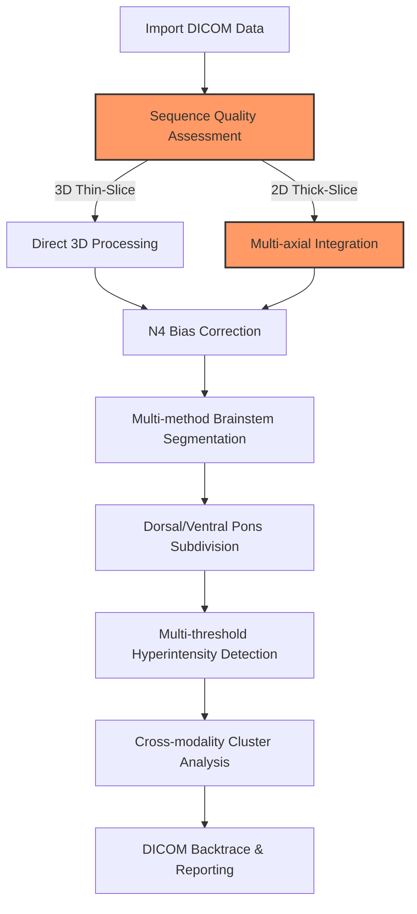

# BrainStemX-Full: Technical Overview & Deep Dive

## Introduction

BrainStem X is a sophisticated neuroimaging research pipeline for analyzing subtle T2/FLAIR hyperintensity and T1 hypointensity clusters in brainstem and pons regions. This document provides comprehensive technical details about the implementation, algorithms, and clinical considerations.

## Technical Motivation

Brainstem regions can present clinically with very subtle variations below the clinical threshold to human radiologists and standard research methods. This pipeline addresses these challenges through:

- **Multi-modal integration** across T1/T2/FLAIR/SWI/DWI sequences with cross-modality anomaly detection
- **N4 Bias Field AND slice-acquisition correction** (e.g., SAG-acquired FLAIR sequences)
- **Precise orientation preservation** critical for analyzing directionally sensitive brainstem microstructure
- **Zero-shot/unsupervised cluster analysis** identifying signal anomalies without manual segmentation or human false negative biases
- **Multiple fallback methods** at various steps, activated by quantitative quality metrics
- **DICOM backtrace capability** for clinical validation of findings in native scanner format
- **Parallel processing** of subjects with optimized multithreaded performance
- **Modern approach** combining non-ML analytics approaches as of 2023/2024 (see [sota-comparison.md](sota-comparison.md))


## Recent Improvements (June 2025)

- Corrected Harvard-Oxford atlas selection: now uses only brainstem index 7, eliminating erroneous multi-index summation
- Improved MNI→native space transformation: switched to trilinear interpolation + 0.5 thresholding, preserving partial volumes
- Consistent file naming: updated pipeline and modules to use `_brainstem.nii.gz` and `_brainstem_flair_intensity.nii.gz` uniformly
- Updated Juelich pons segmentation: applied same interpolation fix, yielding anatomically reasonable voxel counts
- Integrated FLAIR enhancement: generated separate FLAIR intensity masks for segmentation quality analysis

## Parallel Multi-Method Segmentation, Multi-Atlas Labeling, Optional Modules & Atlas Availability

The default segmentation mode is **`BRAINSTEM_SEGMENTATION_METHOD=all`**: every enabled path runs as a **concurrent parallel path**, and downstream per-region detection analyses the **union** of the masks they produce. The fast paths (Harvard-Oxford gross extent + multi-atlas warp, minutes) run side-by-side with the multi-hour FreeSurfer recon-all; each path is **independent and non-fatal** (a failed/skipped path logs a WARNING and never kills the others or the pipeline), and the MNI→subject SyN transform is computed once up front and shared. Per-path toggles `SEG_RUN_HARVARD_OXFORD` / `SEG_RUN_MULTI_ATLAS` / `SEG_RUN_FREESURFER` / `SEG_RUN_SYNTHSEG` (all default ON) drop individual paths (e.g. `SEG_RUN_FREESURFER=false` keeps the fast paths and skips recon-all). The single-method values (`freesurfer`, `atlas`/`harvard_oxford`, `multi_atlas`/`bianciardi`) remain mutually exclusive and behave exactly as before; each path's masks are provenance-tagged (`per_region_analysis/region_provenance.tsv`).

Several **opt-in** back-ends extend this:

- **Multi-atlas brainstem labeling** (`multi_atlas.sh`, enabled via `BRAINSTEM_SEGMENTATION_METHOD=multi_atlas`/`bianciardi`) — warps the **Bianciardi BrainstemNavigator v1.0**, **CIT168**, and (off-by-default) **AAL3** atlases into subject T1 space through one shared SyN→MNI registration with label-aware `GenericLabel` interpolation. Bianciardi's *overlapping* probabilistic maps are combined by a streaming winner-take-all argmax into an int16 dseg **plus** an overlay set for the 12 reticular-formation nuclei that argmax would zero out. Per-region masks land where `analysis.sh:find_all_atlas_regions` discovers them, so per-region GMM detection consumes them unchanged. Full detail: [multi_atlas_integration_spec.md](multi_atlas_integration_spec.md).
- **FreeSurfer full-recon harvest + ML methods** (`freesurfer_harvest.sh`) — recon-all is paid for **once**; the harvest then extracts the rest of its output with **no second recon**: aseg/wmparc/aparc + `aparc.a2009s` stats, eTIV, and (opt-in, extra-time) thalamic / hypothalamic / hippo-amygdala subregions. Aseg/SynthSeg CSF + 4th-ventricle masks feed the FP-exclusion path (`CSF_USE_FREESURFER_MASK`). Fast contrast/resolution-agnostic ML methods run on a clinical/2D T1 with no recon: **SynthSeg+** (`mri_synthseg --robust`, default on), **SynthSR** (`mri_synthsr`, optional 1 mm-T1 synthesis pre-step `USE_SYNTHSR`), and **sclimbic** (`mri_sclimbic_seg`, gated). Cheap harvests default ON; multi-hour/extra-time pieces default OFF.
- **Atlas-availability check** (`check_atlas_availability` in `environment.sh`, invoked at startup) — reports presence/absence of each atlas under `$FSLDIR/data/atlases` (`ATLAS_DIR`) and warns if the selected method needs a missing one. Absence is **non-fatal**: the pipeline degrades to the Harvard-Oxford gross mask. Layout is overridable via `ATLAS_{BIANCIARDI,CIT168,AAL3,HARVARDOXFORD}_REL`.
- **Optional supervised / deep-learning WMH modules** (each self-gated — a no-op WARNING+skip until its tool/model/training data is present), each intersected with the brainstem mask: FSL **BIANCA** (`wmh_bianca.sh`), **LST-AI + FreeSurfer SAMSEG** (`wmh_lst_samseg.sh`), **WMH-SynthSeg** (`wmh_synthseg.sh`), **segcsvdWMH** (`wmh_segcsvd.sh`), **SHIVA-WMH** (`wmh_shiva.sh`), **MARS-WMH** (`wmh_mars.sh`).
- **AANSegment** (`brainstem_aanseg.sh`) — **exploratory** FreeSurfer arousal-network nuclei segmentation; ≤1 mm input only, large-lesion-sensitive.
- **Post-detection false-positive filter** (`fp_filter.sh`) — config-gated FP suppression operating *after* detection, complementing the CSF/partial-volume exclusion that runs *before* thresholding. Lossy (removes true small lesions) — OFF by default for the brainstem.

> ⚠️ **None of the optional WMH/lesion modules is validated in the brainstem/pons.** Published WMH/lesion SOTA is supratentorial; the posterior fossa is repeatedly "under-evaluated", and Ryu et al. 2025 report DL is "relatively poor" there. Treat optional modules as exploratory, keep conservative pons QA with a human in the loop, and locally validate before relying on any tool. These add-ons only **corroborate** — none alters the primary per-region-GMM FLAIR detection.

## Multi-Modal Corroboration (SWI / DWI / T2 end-to-end)

Beyond the T1/FLAIR backbone, the pipeline brings the **secondary** T2-weighted modalities — SWI magnitude, the DERIVED DWI **trace** + **ADC** (not raw 4D diffusion), and a true T2 — all the way through, **only when they are present** (a T1+FLAIR-only study is byte-identically unchanged):

- **Contrast-matched cascaded registration** (`registration.sh:register_contrast_matched_cascade`, `CONTRAST_MATCHED_REGISTRATION=true`, default on/graceful) anchors each T2-weighted secondary to its nearest same-contrast 3D structural rather than directly to T1 — the cascade is `T1 ← FLAIR ← {T2, DWI, ADC, SWI}` (anchors set by `CONTRAST_ANCHOR_MAP`). Each secondary's transform is **composed** with the FLAIR→T1 transforms so it reaches T1/MNI in a single `antsApplyTransforms` (no double interpolation); both the composed **forward and inverse** transform lists are persisted (the inverse is needed by the downstream DICOM cluster→source mapping when it is re-enabled).
- **Cross-modal corroboration** (`cross_modal_analysis.sh` + `cross_modal_sample.py`, `CROSS_MODAL_ANALYSIS_ENABLED=true`) samples each co-registered secondary inside every PRIMARY FLAIR cluster ROI and flags **DWI restriction** (trace z ↑ AND ADC z ↓ → acute/ischemic), **SWI hypointensity** (→ hemorrhage/microbleed), and **T2 hyperintensity** (→ corroborates FLAIR). Each modality is z-scored within the brainstem ROI so thresholds (`CROSS_MODAL_*_Z`) are scanner-independent. This is corroboration **on top of** the primary detection — it never re-detects lesions and never alters the primary mask. Outputs a per-cluster table + summary under `analysis/cross_modal/`.

## Output & Reporting Layer

A final **reporting** stage (Step 8.5, `reporting.sh` + `reporting_tables.py`, after analysis/QA/viz) aggregates every merged capability over the **canonical results tree**. It **discovers** outputs wherever modules wrote them (it does not require fixed paths) and emits, all gated/graceful/idempotent:

- **Summary tables** under `reports/tables/`, each as **CSV/TSV + HTML**: `hyperintensity_per_region`, `wmh_tool_volumes`, `segmentation_volumes` (HO / FS / multi-atlas / SynthSeg-aseg / subregions), `cross_modal`, `freesurfer_morphometry` (aseg volumes + eTIV), and a `run_manifest`; plus a machine-readable `manifest.json`.
- **Report visualizations** under `visualizations/`: per-method segmentation overlays, hyperintensity clusters on FLAIR, and a multi-modal montage (FLAIR/DWI/SWI/T2).
- **Top-level report** `reports/brainstemx_report.html` (+ `.md` fallback) — a one-stop dashboard embedding all populated tables, the run manifest, and the discovered visualizations.

Heavy parsing/rendering lives in the stdlib-only `reporting_tables.py` (run via `uv`); the bash layer owns only the FSL-dependent volume sidecars. A minimal T1+FLAIR run still produces a valid smaller report; absent sections render as "No data". Governed by `REPORTING_ENABLED` (default `true`); report visualizations honour `SKIP_VISUALIZATION`. Full tree + table schemas: [output_structure.md](output_structure.md).

## Recent Advances & Roadmap (2024–2026)

This section situates BrainStem X against the 2024–2026 literature. Items marked **[preprint]** / **[provisional]** are not peer-reviewed or have no released code and are cited with that caveat.

### Brain extraction
- **SynthStrip** — Hoopes et al., NeuroImage 2022;260:119474 (contrast-agnostic primary)
- **BET** — Smith, Hum Brain Mapp 2002;17(3):143-155 (fallback)
- **HD-BET** — Isensee et al., Hum Brain Mapp 2019;40(17):4952-4964 (candidate alternative)

### Denoising / bias correction
- **N4ITK** — Tustison et al., IEEE TMI 2010;29(6):1310-1320
- **Adaptive Rician NLM** — Manjón et al., JMRI 2010;31(1):192-203
- **MP-PCA `dwidenoise`** — Veraart et al., NeuroImage 2016;142:394-406
- **Gibbs unringing** — Kellner et al., MRM 2016;76(5):1574-1581
- **Patch2Self2** (dMRI) — Fadnavis et al., CVPR 2024 (candidate)
- **DeepN4** (T1-only N4 approximation, context) — Kanakaraj et al., Neuroinformatics 2024;22:193-205
- **FLAIR bias-correction harm under lesion load** — Valdés Hernández et al., 2016 (PMC4846712) — motivates the gentle FLAIR N4 preset

### Registration
- **SyN** — Avants et al., Med Image Anal 2008;12(1):26-41
- **Nonlinear-registration evaluation** — Klein et al., NeuroImage 2009;46(3):786-802
- **SynthMorph** (joint) — Hoffmann et al., Imaging Neuroscience 2024;2:1-33
- **uniGradICON** — Tian et al., MICCAI 2024
- **LUMIR/Learn2Reg 2024** — **[preprint, arXiv:2505.24160]**

### Segmentation / atlases
- **FreeSurfer brainstem substructures** — Iglesias et al., NeuroImage 2015;113:184-195
- **FreeSurfer** — Fischl, NeuroImage 2012;62(2):774-781
- **Harvard-Oxford** — Desikan et al., NeuroImage 2006;31(3):968-980 (Makris et al. 2006)
- **Bianciardi BrainstemNavigator** — Bianciardi et al., Brain Connect 2015;5(10):597-607; Toolkit v1.0 **[conference abstract]** Hannanu et al., ISMRM 2025 #0950
- **CIT168** — Pauli, Nili & Tyszka, Sci Data 2018;5:180063
- **AAL3** — Rolls et al., NeuroImage 2020;206:116189
- **AANSegment** — Olchanyi et al., Hum Brain Mapp 2025;46(14):e70357 (≤1 mm only; CC BY-NC-ND; large-lesion-sensitive)
- **MARS / dl-brainstem** — Gesierich et al., Hum Brain Mapp 2025;46(3):e70141
- **Talairach (legacy; removed)** — Lancaster et al. 2007 (PMC2856713); MNI↔Talairach disparity is worst inferiorly/posteriorly, i.e. in the brainstem
- **FSL FAST** — Zhang et al., IEEE TMI 2001;20(1):45-57; **Atropos** — Avants et al., Neuroinformatics 2011;9(4):381-400
- **SynthSeg** — Billot et al., Med Image Anal 2023;86:102789; **SynthSR** — Iglesias et al., Sci Adv 2023;9(5):eadd3607

### WMH / lesion detection
- **BIANCA** — Griffanti et al., NeuroImage 2016;141:191-205
- **LST-AI** — Wiltgen et al., NeuroImage: Clinical 2024;42:103611
- **SAMSEG lesion** — Cerri et al., NeuroImage 2021;225:117471
- **segcsvdWMH** — Gibson et al., Hum Brain Mapp 2024;45(18):e70104
- **SHIVA-WMH** — Tran et al., Hum Brain Mapp 2024;45(1):e26548
- **MARS-WMH** — Gesierich et al., Cereb Circ Cogn Behav 2025;9:100393
- **WMH-SynthSeg** — Laso et al., IEEE ISBI 2024 (arXiv:2312.05119)
- **DeepWMH** — Liu et al., Science Bulletin 2024;69(7):872-875
- **Normative/generative anomaly detection** — Bercea et al., Nat Commun 2025;16:1624
- **WMH methods review** — Rahmani et al., Brain Imaging Behav 2024;18:1310-1322
- **FLAMeS** — Dereskewicz et al., J Neuroimaging 2025 (**[preprint, medRxiv 2025.05.19.25327707]**)
- Benchmarks — Wu et al., J Imaging Inform Med 2026; DELCODE (Front Psychiatry 2023;13:1010273); Martersteck et al., Alzheimer's & Dementia 2025; WMH Segmentation Challenge (Kuijf et al., IEEE TMI 2019;38(11):2556-2568)

### Infratentorial false positives (CSF pulsation) — the dominant brainstem FP source
- **CSF flow artifacts review** — Pai et al., Insights into Imaging 2025;16:288
- **Peri-CSF pseudolesion class** — Bawil et al., BioMed Eng OnLine 2026;25:69
- **C-FLAIR (acquisition fix)** — Graf et al., Radiology 2025;317(2)
- **SegAE / joint ventricle-WMH** — Atlason et al., PLOS ONE 2022;17(8):e0274212
- **Small-lesion-removal caveat** — Molchanova et al., 2024 (**[preprint, arXiv:2507.12092]**)
- **DL poor in brainstem (reality check)** — Ryu et al., Sci Rep 2025;15:13214

### Standards
- **McDonald 2024** — Montalban et al., Lancet Neurol 2025;24(10):850-865
- **MAGNIMS-CMSC-NAIMS 2024** — Barkhof et al., Lancet Neurol 2025;24(10):866-879
- **STRIVE-2** — Duering et al., Lancet Neurol 2023;22(7):602-618

### Roadmap caveats (read these)
1. **No method is validated in the brainstem/pons.** Every cited WMH/segmentation tool was evaluated supratentorially; the posterior fossa is repeatedly "under-evaluated" and Ryu 2025 finds DL "relatively poor" there. Any adopted tool needs local brainstem validation; the pipeline keeps conservative pons QA / human-in-the-loop.
2. **3D-FLAIR acquisition is the single biggest lever** for infratentorial specificity — bigger than any post-processing step.
3. **Per-region GMM thresholding in the brainstem is a genuine published gap** (no 2024–2026 precedent identified). This is both the project's novelty *and* a lack-of-external-validation caveat: the approach is unproven against an established brainstem reference.

## Complete Feature Set

### Acquisition-Specific Processing and Registration

#### Orientation Standardization
- Uses `fslswapdim` + `fslorient` then ANTs transform to enforce RAS orientation
- Fallback for missing/ambiguous header fields via header-driven heuristics in `src/modules/preprocess.sh`

#### Modality-Aware Denoising
- Dispatcher routes by modality: T1/T2/FLAIR → Rician NLM (ANTs `DenoiseImage`); DWI → MP-PCA (`dwidenoise`, MRtrix); SWI/TOF → skipped
- Full DWI preprocessing path (`dwi_preprocess.sh`: dwidenoise → optional Gibbs → bias correction), gated by `PROCESS_DWI`
- Auto-switch to FSL SUSAN for structural NLM when ANTs binaries are unavailable or memory-constrained

#### Metadata-Driven Parameter Tuning
- Python metadata extractor reads DICOM tags to set N4 smoothing and denoising patch sizes dynamically
- Ensures consistency across scanners/field strengths without manual config

#### Multi-Stage ANTs Registration
- Rigid → Affine → SyN with subject-specific mask weighting from white-matter segmentation (`src/modules/registration.sh`)
- Template resolution automatically chosen based on voxel size; two-pass registration for submillimeter accuracy
- Emergency fallback to SyNQuick or FSL FLIRT when MI/CC drops below QA thresholds

#### White-Matter Guided Initialization
- Builds a WM mask via FSL FAST and uses it to bias initial transform for improved pons alignment

#### Comprehensive Hyperintensity Clustering
- Per-subject z-score thresholding on FLAIR intensities, minimum cluster-size filter, morphological closing
- 3-plane confirmation to eliminate spurious outliers
- DICOM backtrace JSON mapping results into original scanner coordinates for PACS validation

### Advanced Segmentation

#### Brainstem Segmentation Approaches
- **Parallel multi-method mode** (`BRAINSTEM_SEGMENTATION_METHOD=all`, the **default**) runs the HO gross-extent, FreeSurfer-substructure, multi-atlas, and SynthSeg+ paths concurrently and feeds their union to per-region detection; per-path `SEG_RUN_*` toggles
- **FreeSurfer brainstem substructures** (Iglesias 2015 `segmentBS`/`brainstemSsLabels`) for the detailed subdivision into midbrain / pons / medulla / SCP (single-method value `freesurfer`)
- **Harvard-Oxford subcortical atlas** (index 7, tightened to `maxprob-thr25`) used for the gross brainstem extent mask — also the fallback when FreeSurfer/recon-all/license is unavailable (`BRAINSTEM_SEGMENTATION_METHOD=atlas`)
- **Atlas-to-subject transformation** preserving native resolution by bringing the MNI HO atlas to subject space; FreeSurfer segments the subject's own T1 directly

#### Subject-Specific Refinement
- Uses tissue segmentation to address shape variance in pathological cases
- **FLAIR integration** for enhanced multi-modal segmentation with intensity information
- Quantified quality assessment of brain extraction, registration quality, and segmentation accuracy with comprehensive QA module

### Cluster Analysis

- Statistical hyperintensity detection with multiple threshold approaches (1.5-3.0 SD from baseline intensity, configurable minimum size)
- Cross-modality cluster overlap quantification across MRI sequences
- Smoothing of white-matter regions to avoid spotty outlier pixels
- Cross-plane confirmation: validate via axial, sagittal, and coronal views
- Pure quantile-based anomaly detection specific to subject, independent of manual labelling bias
- Manipulable DICOM files allow manual validation of the process - every step of decision making

## Detailed Technical Implementation

### Preprocessing (preprocess.sh)

- **RAS/LPS orientation enforcement** with header-heuristic fallback for missing/ambiguous DICOM orientation fields
- **Modality-aware denoising** with Rician NLM for T1/T2/FLAIR, MP-PCA (`dwidenoise`) for DWI, and SWI/TOF skipped; automatic patch selection based on local image variance and noise characteristics
- **N4 bias-field correction** where field strength adjusts the b-spline mesh / spline distance (`-b`); FLAIR uses a gentler, lesion-aware preset (optional lesion-weight mask) so diffuse lesion contrast is not absorbed into the bias field
- **Brain extraction** via SynthStrip (FreeSurfer `mri_synthstrip`, contrast-agnostic) as primary, with an automatic fallback chain SynthStrip → ANTs(Otsu) → BET, a shared `robustfov` neck-removal pre-step, modality-specific BET `-f` (T1 0.3 / FLAIR 0.2), and a posterior-fossa QC gate; selected via `BRAIN_EXTRACTION_METHOD`
- **Scanner metadata parameter optimization** automatically adjusts processing parameters based on field strength, vendor, and acquisition settings

### Registration Pipeline (registration.sh)

- **Template & resolution detection** automatically selects MNI152 or custom atlas templates based on input voxel dimensions
- **Multi-resolution registration stages** with white-matter mask weighting for improved anatomical correspondence
- **Modality-aware SyN metric** — cross-modality pairs (FLAIR↔T1) use Mutual Information; same-modality pairs use cross-correlation, with `--winsorize-image-intensities` to suppress intensity outliers
- **Label-aware warping** uses `GenericLabel` interpolation when applying transforms to atlases / masks to avoid label blurring
- **Emergency fallback triggers** using quantitative QA metrics (mutual information, cross-correlation thresholds) to switch methods
- **Transform validation** outputs detailed QA plots and metrics for each registration stage with comprehensive error handling

### Enhanced Validation & Hyperintensity Analysis (enhanced_registration_validation.sh)

- **Extended registration metrics** including cross-correlation, normalized mutual information, and histogram skewness analysis
- **Coordinate-space and file-integrity checks** performed before each major processing step with detailed error reporting
- **Regional intensity mask creation** over the Harvard-Oxford gross brainstem extent and the FreeSurfer brainstem substructures (midbrain/pons/medulla/SCP)
- **Comprehensive cluster analysis** with volume quantification, morphological characterization, and interactive HTML visualization
- **DICOM coordinate backtrace** maintains mapping between processed results and original scanner coordinate systems

### DICOM Import & Data Management (import.sh)

- **Vendor-agnostic DICOM conversion** with dcm2niix using scanner-specific optimization flags for Siemens/Philips/GE systems
- **Maximum data preservation** approach prevents slice loss through multiple fallback conversion strategies and series-by-series processing
- **Intelligent deduplication control** permanently disabled to prevent accidental removal of unique slices with safety checks for different series
- **Metadata extraction pipeline** extracts scanner parameters, field strength, and acquisition settings for downstream parameter optimization
- **Parallel DICOM processing** with GNU parallel for multi-series datasets and automatic series detection

### Intelligent Scan Selection (scan_selection.sh)

- **Multi-modal quality assessment** evaluates file size, dimensions, voxel isotropy, and tissue contrast for optimal scan selection
- **ORIGINAL vs DERIVED acquisition detection** from DICOM metadata with significant scoring bonus for original acquisitions
- **Registration-optimized selection modes** including aspect ratio matching, dimension matching, and resolution-based selection
- **Interactive scan selection interface** with detailed comparison tables showing quality metrics, acquisition types, and recommendations
- **Cross-sequence compatibility analysis** calculates voxel similarity and aspect ratio matching between T1/FLAIR sequences

### Advanced Brain Extraction & Standardization (brain_extraction.sh)

- **3D isotropic sequence detection** automatically identifies MPRAGE, SPACE, VISTA sequences to prevent quality degradation from multi-axial combination
- **Enhanced resolution quality metrics** considers voxel anisotropy, total volume, and in-plane resolution for optimal processing path selection
- **Multi-axial template construction** combines SAG/COR/AX orientations using antsMultivariateTemplateConstruction2.sh for 2D sequences
- **Smart dimension standardization** with optimal resolution detection across sequences and reference grid matching for identical matrix dimensions
- **Orientation consistency validation** performs detailed sform/qform matrix comparison with comprehensive error reporting

### Advanced Segmentation (segmentation.sh)

- **Harvard-Oxford gross brainstem extent** using subcortical index 7, tightened to `maxprob-thr25`, as the extent mask and the fallback when FreeSurfer is unavailable
- **FreeSurfer brainstem substructures** (Iglesias 2015 `segmentBS`/`brainstemSsLabels`) for the detailed subdivision into midbrain / pons / medulla / SCP, gated by an FS↔HO agreement (Dice + leakage) QC check
- **Parallel multi-method mode** (default `BRAINSTEM_SEGMENTATION_METHOD=all`) runs the HO, FreeSurfer-substructure, multi-atlas, and SynthSeg+ paths concurrently and union-feeds them to per-region detection; per-path `SEG_RUN_*` toggles. Single-method values (`freesurfer`, `atlas`/`harvard_oxford`, `multi_atlas`/`bianciardi`) remain available and mutually exclusive
- **Atlas-to-subject transformation** preserving native resolution by bringing the MNI HO atlas to subject space; FreeSurfer segments the subject's own T1 directly
- **Subject-specific refinement** using tissue segmentation (Atropos/FAST) to address shape variance in hydrocephalus & Chiari cases
- **FLAIR enhancement integration** creating both T1 and FLAIR intensity versions for multi-modal analysis
- **Native space preservation** maintains segmentation accuracy in subject's original high-resolution space rather than downsampling to template resolution

### Comprehensive Analysis Pipeline (analysis.sh)

- **Region-based analysis** using the FreeSurfer brainstem substructures (midbrain/pons/medulla/SCP) for per-region hyperintensity detection (falls back to the HO gross brainstem mask when substructures are absent)
- **Gaussian Mixture Model (GMM) thresholding** with adaptive 2–3-component analysis for intelligent threshold selection
- **CSF / partial-volume exclusion** subtracts a CSF mask derived from the FSL FAST CSF PVE map (posterior-fossa CSF is the dominant false-positive source) before thresholding
- **Single authoritative fallback SD multiplier** (`THRESHOLD_WM_SD_MULTIPLIER`) reconciled across the bash path and `gmm_threshold.py` so the GMM-skip fallback is consistent
- **Per-region z-score normalization** addressing tissue inhomogeneity across different brainstem regions
- **Connectivity weighting** for refined detection using 3D morphological operations
- **Multi-threshold hyperintensity detection** with configurable standard deviation multipliers and minimum cluster size filtering
- **Cross-modality validation** analyzes both FLAIR hyperintensities and T1 hypointensities with statistical correlation
- **Cross-modal corroboration** (`cross_modal_analysis.sh`, default on/graceful) annotates each primary FLAIR cluster with co-registered SWI/DWI-trace/ADC/T2 evidence (DWI restriction → acute, SWI → hemorrhage, T2 → corroborates), without altering the primary mask
- **Optional supervised / DL WMH modules** (each self-gated, no-op until its tool/data is present), each intersecting results with the brainstem mask: FSL BIANCA (`wmh_bianca.sh`), LST-AI + FreeSurfer SAMSEG (`wmh_lst_samseg.sh`), WMH-SynthSeg (`wmh_synthseg.sh`), segcsvdWMH (`wmh_segcsvd.sh`), SHIVA-WMH (`wmh_shiva.sh`), MARS-WMH (`wmh_mars.sh`); plus a post-detection false-positive filter (`fp_filter.sh`, off by default)

### Advanced Visualization & QA (visualization.sh, qa.sh)

- **Interactive 3D rendering** creates volume renderings of hyperintensity clusters with customizable opacity and color mapping
- **Multi-threshold comparison visualizations** generates side-by-side comparisons across different detection thresholds
- **Comprehensive QA validation** performs 20+ validation checks including file integrity, coordinate space consistency, and segmentation accuracy
- **Enhanced visual QA interface** with real-time FSLView integration for immediate visual feedback during processing

### DICOM Integration & Clinical Validation (dicom_analysis.sh, dicom_cluster_mapping.sh)

- **Vendor-agnostic DICOM metadata extraction** analyzes scanner parameters, acquisition settings, and sequence characteristics for optimal processing
- **Clinical coordinate backtrace** maps processed results back to original DICOM coordinate system for PACS viewer compatibility
- **Comprehensive cluster-to-DICOM mapping** creates coordinate lookup tables enabling medical imaging viewer navigation to identified clusters
- **Scanner-specific optimization** automatically detects Siemens, Philips, and GE scanners and applies vendor-specific processing parameters

### Intelligent Reference Space Selection (reference_space_selection.sh)

- **Adaptive reference space optimization** analyzes T1 and FLAIR scan quality, resolution, and acquisition parameters to select optimal processing space
- **Multi-modal compatibility assessment** calculates voxel aspect ratios, dimension matching, and registration compatibility between sequences
- **Resolution preservation strategy** intelligently chooses between maintaining native high-resolution vs standardized template space based on data quality
- **ORIGINAL vs DERIVED acquisition prioritization** significantly weights selection toward original scanner acquisitions over post-processed images

### Environment & Utilities (environment.sh, utils.sh, fast_wrapper.sh)

- **Dynamic environment configuration** automatically detects available tools (ANTs, FSL, FreeSurfer) and configures optimal processing paths
- **Enhanced ANTs command execution** provides comprehensive error handling, progress monitoring, and automatic fallback strategies
- **Parallel FSL FAST wrapper** optimizes tissue segmentation with intelligent job distribution and memory management
- **Comprehensive validation framework** performs file integrity checks, coordinate space validation, and processing pipeline verification

## Key Algorithmic Functions

### Advanced Scan Selection & Reference Space Optimization

- **`select_best_scan()`** - Multi-modal quality assessment with registration-optimized selection modes including `original`, `highest_resolution`, `registration_optimized`, `matched_dimensions`, and `interactive` modes
- **`select_optimal_reference_space()`** - Intelligent reference space selection that analyzes voxel dimensions, aspect ratios, and acquisition types to determine the optimal template space for registration
- **`evaluate_scan_quality()`** - Comprehensive quality scoring based on file size, dimensions, voxel isotropy, tissue contrast, and ORIGINAL vs DERIVED acquisition detection

### Enhanced N4 Bias Correction Pipeline

- **`process_n4_correction()`** - Adaptive N4 bias field correction with scanner-specific parameter optimization
- **Dynamic convergence settings** based on field strength (1.5T vs 3T) and acquisition protocol (2D vs 3D)
- **Iterative shrink-factor optimization** automatically adjusts based on image resolution and tissue contrast
- **Multi-stage bias correction** for severely biased images with progressive refinement

### Intelligent Resolution & Template Detection

- **`detect_optimal_resolution()`** - Cross-sequence resolution analysis to determine the finest achievable target grid
- **`calculate_voxel_aspect_ratio()`** - Registration compatibility assessment between sequences
- **`is_3d_isotropic_sequence()`** - Automatic detection of 3D MPRAGE, SPACE, VISTA sequences to prevent quality degradation
- **Template resolution matching** automatically selects MNI152 templates based on input voxel dimensions for optimal registration accuracy

## 8-Stage Resumable Pipeline Architecture

### Stage 1: DICOM Import & Data Management
- **Vendor-agnostic DICOM conversion** using dcm2niix with scanner-specific optimization flags
- **Maximum data preservation** through series-by-series processing and emergency fallback conversion strategies
- **Intelligent metadata extraction** captures scanner parameters, field strength, acquisition settings for downstream optimization
- **Quality assessment** validates DICOM integrity and performs initial sequence classification

### Stage 2: Preprocessing (Modality-Aware Denoising + N4 Bias Correction)
- **Adaptive reference space selection** analyzes scan quality and chooses optimal T1/FLAIR combination using [`select_optimal_reference_space()`](../src/modules/reference_space_selection.sh:1)
- **Registration-optimized scan selection** with multiple modes: `original`, `highest_resolution`, `registration_optimized`, `matched_dimensions`
- **Modality-aware denoising** routes T1/T2/FLAIR to Rician NLM, DWI to MP-PCA (`dwidenoise`), and skips SWI/TOF; a full DWI path (`dwi_preprocess.sh`) is gated by `PROCESS_DWI`
- **Enhanced N4 bias correction** where field strength tunes the b-spline mesh / spline distance (`-b`); FLAIR uses a gentler, lesion-aware preset
- **Orientation consistency validation** performs detailed sform/qform matrix comparison with comprehensive error reporting

### Stage 3: Brain Extraction, Standardization & Cropping
- **Smart resolution detection** via [`detect_optimal_resolution()`](../src/modules/brain_extraction.sh:214) analyzes voxel dimensions across sequences
- **Reference grid standardization** ensures T1 and FLAIR have identical matrix dimensions while preserving highest resolution
- **SynthStrip-primary brain extraction** (FreeSurfer `mri_synthstrip`, contrast-agnostic) with an automatic SynthStrip → ANTs(Otsu) → BET fallback chain, a shared `robustfov` neck-removal pre-step, modality-specific BET `-f`, and a posterior-fossa QC gate; selected via `BRAIN_EXTRACTION_METHOD`
- **3D isotropic sequence detection** prevents quality degradation from unnecessary multi-axial combination

### Stage 4: Registration with Bidirectional Transform Management
- **Multi-stage ANTs registration** Rigid → Affine → SyN with white-matter guided initialization
- **Modality-aware SyN metric** Mutual Information for cross-modality (FLAIR↔T1) and cross-correlation for same-modality pairs, with `--winsorize-image-intensities`; atlases/masks warped with label-aware `GenericLabel` interpolation
- **Bidirectional space mapping** calculates native ↔ MNI transforms without resampling high-resolution data
- **Emergency fallback system** automatic SyNQuick or FSL FLIRT when quality metrics drop below thresholds
- **Enhanced registration validation** comprehensive metrics including cross-correlation, mutual information, normalized CC

### Stage 5: Brainstem Segmentation
- **Parallel multi-method segmentation** (default `BRAINSTEM_SEGMENTATION_METHOD=all`): HO gross extent + FreeSurfer substructures + multi-atlas nuclei + SynthSeg+ run as concurrent, independent, non-fatal paths whose masks are union-fed and provenance-tagged; per-path `SEG_RUN_*` toggles. Single-method values (`freesurfer`, `atlas`/`harvard_oxford`, `multi_atlas`/`bianciardi`) remain available
- **Harvard-Oxford gross extent** subcortical atlas (index 7, `maxprob-thr25`) for the brainstem boundary mask and as the fallback
- **FreeSurfer brainstem substructures** (Iglesias 2015 `segmentBS`) for midbrain / pons / medulla / SCP, gated by an FS↔HO agreement QC check; plus the full FreeSurfer recon harvest (aseg/wmparc/aparc stats, eTIV, optional subregions) and ML methods (SynthSeg+, SynthSR, sclimbic)
- **Subject-specific refinement** using tissue segmentation to address shape variance in pathological cases
- **Native space preservation** maintains segmentation accuracy in subject's original high-resolution space
- **FLAIR integration** creates both T1 and FLAIR intensity versions for comprehensive analysis
- **Volume consistency validation** with anatomical location verification and comprehensive QA reporting

### Stage 6: Comprehensive Hyperintensity Analysis
- **Per-region GMM thresholding** over the FreeSurfer brainstem substructures with adaptive 2–3-component models and a single authoritative fallback SD multiplier (`THRESHOLD_WM_SD_MULTIPLIER`)
- **CSF / partial-volume exclusion** using the FSL FAST CSF PVE map before thresholding
- **Multi-threshold detection** configurable SD multipliers (1.5-3.0) with minimum cluster size filtering
- **Cross-modality validation** analyzes hyperintensity patterns across T1/T2/FLAIR with statistical correlation
- **Cross-modal corroboration** samples each co-registered secondary (SWI/DWI-trace/ADC/T2) inside every primary FLAIR cluster and flags DWI restriction (→ acute), SWI hypointensity (→ hemorrhage), and T2 hyperintensity (→ corroborates) — on top of, never altering, the primary detection
- **Optional supervised / DL WMH** BIANCA, LST-AI + SAMSEG, WMH-SynthSeg, segcsvdWMH, SHIVA-WMH, MARS-WMH modules (each self-gated, no-op until its tool/data is present), intersected with the brainstem mask; optional `fp_filter.sh` post-detection FP suppression (off by default)
- **Native-to-standard space mapping** enables analysis in both subject native and standardized coordinates
- **DICOM cluster backtrace** — the cluster→DICOM-source mapping (`dicom_cluster_mapping.sh`) maps each detected cluster back to its nearest source DICOM slice: the cluster index volume is resampled onto the original native FLAIR grid (`antsApplyTransforms -n GenericLabel`, identity — clusters are detected in native FLAIR space), the COG is re-derived and converted native voxel → world mm (NIfTI sform) → DICOM LPS patient mm (RAS↔LPS flip), then matched against the source DICOMs by `ImageOrientationPatient`/`ImagePositionPatient` slice-normal projection (pydicom; dcmdump fallback), emitting `InstanceNumber`/`SOPInstanceUID`/`SliceLocation` and a within-tolerance flag. On by default (`RUN_DICOM_MAPPING=true`; set `false` to opt out)

### Stage 7: Advanced Visualization & Reporting
- **3D volume rendering** with customizable opacity and color mapping for hyperintensity clusters
- **Multi-threshold comparison** side-by-side visualizations across different detection thresholds
- **Report visualizations** per-method segmentation overlays, hyperintensity-on-FLAIR, and a multi-modal montage (FLAIR/DWI/SWI/T2)
- **Interactive QA interface** real-time FSLView integration for immediate visual feedback
- **Comprehensive HTML reporting** with embedded visualizations and quantitative metrics

### Stage 8: Progress Tracking & Validation
- **Pipeline completion validation** verifies all processing stages and output file integrity
- **Comprehensive QA reporting** 20+ validation checks including coordinate space consistency
- **Batch processing summary** CSV reports with volume metrics and registration quality scores
- **Error tracking and diagnostics** detailed logging for troubleshooting and quality assurance

### Stage 8.5: Aggregation & Reporting Layer
- **Summary tables** under `reports/tables/` as CSV/TSV + HTML (per-region hyperintensity, WMH tool volumes, segmentation volumes, cross-modal, FreeSurfer morphometry, run manifest)
- **Top-level dashboard** `reports/brainstemx_report.html` (+ `.md` fallback) embeds all populated tables and discovered visualizations; `manifest.json` records which sections were populated
- **Discovers** outputs wherever modules wrote them; gated/graceful/idempotent (`REPORTING_ENABLED`). See [output_structure.md](output_structure.md)

## Module Implementation Reference

- Core Pipeline → [`src/pipeline.sh`](../src/pipeline.sh:1)
- Environment & Configuration → [`src/modules/environment.sh`](../src/modules/environment.sh:1), [`src/modules/utils.sh`](../src/modules/utils.sh:1)
- DICOM Import & Data Management → [`src/modules/import.sh`](../src/modules/import.sh:1)
- DICOM Analysis & Clinical Integration → [`src/modules/dicom_analysis.sh`](../src/modules/dicom_analysis.sh:1), [`src/modules/dicom_cluster_mapping.sh`](../src/modules/dicom_cluster_mapping.sh:1)
- Intelligent Scan Selection → [`src/modules/scan_selection.sh`](../src/modules/scan_selection.sh:1)
- Reference Space Optimization → [`src/modules/reference_space_selection.sh`](../src/modules/reference_space_selection.sh:1)
- Advanced Brain Extraction & Standardization → [`src/modules/brain_extraction.sh`](../src/modules/brain_extraction.sh:1)
- Preprocessing → [`src/modules/preprocess.sh`](../src/modules/preprocess.sh:1)
- Registration → [`src/modules/registration.sh`](../src/modules/registration.sh:1)
- Brainstem Segmentation (HO gross extent + FreeSurfer substructures) → [`src/modules/segmentation.sh`](../src/modules/segmentation.sh:1), [`src/modules/brainstem_freesurfer.sh`](../src/modules/brainstem_freesurfer.sh:1)
- Multi-Atlas Labeling (Bianciardi/CIT168/AAL3) → [`src/modules/multi_atlas.sh`](../src/modules/multi_atlas.sh:1)
- FreeSurfer Recon Harvest + ML methods (SynthSeg+/SynthSR/sclimbic) → [`src/modules/freesurfer_harvest.sh`](../src/modules/freesurfer_harvest.sh:1)
- Comprehensive Analysis → [`src/modules/analysis.sh`](../src/modules/analysis.sh:1), [`src/modules/gmm_threshold.py`](../src/modules/gmm_threshold.py:1)
- Cross-Modal Corroboration → [`src/modules/cross_modal_analysis.sh`](../src/modules/cross_modal_analysis.sh:1), [`src/modules/cross_modal_sample.py`](../src/modules/cross_modal_sample.py:1)
- Optional WMH Modules → [`src/modules/wmh_bianca.sh`](../src/modules/wmh_bianca.sh:1), [`src/modules/wmh_lst_samseg.sh`](../src/modules/wmh_lst_samseg.sh:1), [`src/modules/wmh_synthseg.sh`](../src/modules/wmh_synthseg.sh:1), [`src/modules/wmh_segcsvd.sh`](../src/modules/wmh_segcsvd.sh:1), [`src/modules/wmh_shiva.sh`](../src/modules/wmh_shiva.sh:1), [`src/modules/wmh_mars.sh`](../src/modules/wmh_mars.sh:1), [`src/modules/brainstem_aanseg.sh`](../src/modules/brainstem_aanseg.sh:1), [`src/modules/fp_filter.sh`](../src/modules/fp_filter.sh:1)
- Enhanced Registration Validation → [`src/modules/enhanced_registration_validation.sh`](../src/modules/enhanced_registration_validation.sh:1)
- Advanced Visualization → [`src/modules/visualization.sh`](../src/modules/visualization.sh:1)
- Aggregation & Reporting Layer → [`src/modules/reporting.sh`](../src/modules/reporting.sh:1), [`src/modules/reporting_tables.py`](../src/modules/reporting_tables.py:1)
- Quality Assurance → [`src/modules/qa.sh`](../src/modules/qa.sh:1)
- Parallel Processing → [`src/modules/fast_wrapper.sh`](../src/modules/fast_wrapper.sh:1)

## Clinical Focus

- Vendor-specific optimizations for Siemens and Philips scanners (future: implement DICOM-RT and PACS integration)
- Practical configuration support to optimize output validity across 1.5T and 3T field strengths
- Novel DICOM backtrace for clinical verification of findings in native viewer format - nothing in post-processing pipelines is proven until you can map it back to source of truth raw scanner output

## Data Compatibility

BrainStem X supports analysis of a wide variety of clinical neuroimaging MRI datasets:

### High-End Research Protocols
Optimized for 3D isotropic thin-slice acquisitions (1mm³ voxels):
- 3D MPRAGE T1-weighted imaging
- Optimizations for 3T scanners, accommodations for 1.5T
- 3D SPACE/VISTA T2-FLAIR with SAG acquisition where available
- Multi-parametric SWI/DWI integration as quantifiable support for T1W/FLAIR clustering results

### Routine Clinical Protocols
Robust fallback for standard clinical acquisitions:
- Thick-slice (3-5mm) 1.5T 2D axial FLAIR with gaps
- Non-isotropic voxel reconstruction estimation via ANTs
- Single-sequence limited protocols (e.g., AX FLAIR only)
- Normalization against MNI space and signal levels against the baseline of the individual subject

The pipeline extracts DICOM metadata including acquisition/scanner parameters, slice thickness, and orientation/modality/dimensionality to apply consistent, reliable, and transparent transformations, normalizations, and registration techniques using ANTs and FSL libraries with atlas-based segmentation of the brainstem, dorsal and ventral pons.

Configurable N4 bias field correction and scanner orientation correction implementations help ensure integrity of the results. 20 validations within the QA module alone ensure consistency and reliability.

These capabilities support analysis of signal intensity across datasets from scans of varying imaging capabilities and protocols, making BrainStem X particularly effective for multi-center studies and retrospective analyses of existing clinical data.

This visualization approach with the ability to track back to raw DICOM files and map clusters across modalities is useful even without machine learning techniques. This is a first-principles approach using the very latest techniques and grounded research up to 2023.

## Example Workflow



## Detailed Segmentation Implementation

### Segmentation Module (segmentation.sh)
The segmentation module implements a **two-tier approach** (gross extent + substructures):

1. **Harvard-Oxford Subcortical Atlas (Gross Extent)**
   - Uses index 7 specifically for the gross brainstem extent, tightened to `maxprob-thr25` (`HO_SUB_MAXPROB_THR`)
   - Warped into subject space; creates both `_brainstem.nii.gz` and `_brainstem_flair_intensity.nii.gz`
   - Always produced — serves as the FreeSurfer fallback and the reference for the FS↔HO agreement QC gate

2. **FreeSurfer Brainstem Substructures (Detailed Subdivision)**
   - Iglesias 2015 `segmentBS`/`brainstemSsLabels` → midbrain / pons / medulla / SCP masks in subject space (FreeSurfer segments the subject's own T1, no warp)
   - Run by default: the default `BRAINSTEM_SEGMENTATION_METHOD=all` mode runs this path concurrently with the HO / multi-atlas / SynthSeg+ paths (toggle with `SEG_RUN_FREESURFER`); also selectable as the single-method value `freesurfer` (`atlas`/`harvard_oxford` = gross mask only)
   - Gated by an FS↔HO agreement check (Dice + leakage); on disagreement or missing FreeSurfer/license, falls back to the HO gross mask and flags low confidence
   - Talairach has been removed entirely (single 1988 post-mortem brain; largest MNI-mapping error inferiorly/posteriorly — worst exactly in the brainstem)

3. **Subject-Specific Refinement**
   - Uses ANTs Atropos or FSL FAST tissue segmentation as fallback
   - Addresses shape variance in hydrocephalus and Chiari malformation cases
   - Integrates CSF, gray matter, and white matter probability maps

## Detailed Analysis Implementation

### Analysis Module (analysis.sh)
The analysis module implements **region-based hyperintensity detection**:

1. **Gaussian Mixture Model (GMM) Analysis**
   - Adaptive 2–3-component GMM for each FreeSurfer brainstem substructure (falls back to the HO gross mask when substructures are absent)
   - Intelligent threshold selection beyond simple z-score methods
   - Per-region normalization addressing tissue inhomogeneity
   - Single authoritative fallback SD multiplier (`THRESHOLD_WM_SD_MULTIPLIER`), reconciled across the bash path and `gmm_threshold.py`, used when GMM is skipped

2. **CSF / Partial-Volume Exclusion**
   - Builds a CSF exclusion mask from the FSL FAST CSF PVE map (computed once per subject, reused per region)
   - Removes posterior-fossa CSF (4th ventricle, basal cisterns), the dominant false-positive source, before thresholding

3. **Multi-Modal Integration**
   - FLAIR hyperintensity detection with configurable SD thresholds
   - T1 hypointensity correlation analysis
   - Cross-modal validation using statistical correlation

4. **Morphological Refinement**
   - 3D connectivity analysis with 26-neighbor connectivity
   - Minimum cluster size filtering (configurable, default 27 voxels)
   - Morphological closing operations to eliminate noise

5. **Optional Supervised / DL WMH Modules** (each self-gated; no-op until its tool/model/training data is present)
   - Each intersects results with the brainstem mask: FSL BIANCA (`wmh_bianca.sh`), LST-AI + FreeSurfer SAMSEG (`wmh_lst_samseg.sh`), WMH-SynthSeg (`wmh_synthseg.sh`), segcsvdWMH (`wmh_segcsvd.sh`), SHIVA-WMH (`wmh_shiva.sh`), MARS-WMH (`wmh_mars.sh`)
   - A post-detection false-positive filter (`fp_filter.sh`) can be applied afterward (config-gated; off by default — lossy for small lesions)
   - **None is validated in the brainstem** — keep conservative pons QA / human-in-the-loop; these corroborate, they never alter the primary detection

## Quality Assurance Details

### QA Module (qa.sh)
The QA module performs **20+ comprehensive validation checks**:

1. **File Integrity Validation**
   - NIfTI header consistency across processing stages
   - Coordinate space validation (sform/qform matrices)
   - Volume preservation checks throughout pipeline

2. **Registration Quality Assessment**
   - Cross-correlation and normalized mutual information metrics
   - Histogram skewness analysis for registration accuracy
   - Emergency fallback triggers based on quantitative thresholds

3. **Segmentation Accuracy Validation**
   - Volume consistency across atlas spaces
   - Anatomical location verification (brainstem center-of-mass)
   - Cross-atlas agreement analysis

## Installation Details

### External Dependencies

- **ANTs** (Advanced Normalization Tools): https://github.com/ANTsX/ANTs/wiki/Installing-ANTs-release-binaries
- **FSL** (FMRIB Software Library): https://git.fmrib.ox.ac.uk/fsl/conda/installer
- **Convert3D** (c3d): Available via Homebrew or SourceForge (https://sourceforge.net/projects/c3d/files/c3d/Nightly/)
- **dcm2niix**: Available via Homebrew or distributed with FreeSurfer
- **FreeSurfer** (optional, for 3D visualization): https://surfer.nmr.mgh.harvard.edu/fswiki/rel7downloads
- **GNU Parallel**: Available via Homebrew
- **Python 3.12.8**: Various libraries are unavailable on 3.13 at the time of writing
- **ITK-SNAP** (recommended): For visualization and manual segmentation comparison

### Dependency Installation

Most dependencies are available via Homebrew on macOS:

```bash
brew install dcm2niix
brew install parallel
brew install imagemagick
```

The pipeline provides helpful feedback if dependencies are missing:

```
==== Dependency Checker ====
[ERROR] ✗ dcm2niix is not installed or not in PATH
[INFO] Try: brew install dcm2niix
[INFO] Checking ANTs tools...
[SUCCESS] ✓ ANTs (antsRegistrationSyN.sh) is installed
[SUCCESS] ✓ ANTs (N4BiasFieldCorrection) is installed
...
```

### Python Environment Setup

Using `uv` (recommended):
```bash
uv init
uv python pin 3.12.8
uv sync
```

Using traditional venv:
```bash
python -m venv venv
source venv/bin/activate
pip install -r requirements.txt
```

## Command-Line Options Reference

### Input/Output Options
| Option | Description | Default |
|--------|-------------|---------|
| `-i, --input DIR` | Input directory with DICOM files | `../DiCOM` |
| `-o, --output DIR` | Output directory for results | `../mri_results` |
| `-s, --subject ID` | Subject identifier | derived from input dir |
| `-c, --config FILE` | Configuration file | `config/default_config.sh` |

### Processing Options
| Option | Description | Default |
|--------|-------------|---------|
| `-q, --quality LEVEL` | Quality preset: LOW, MEDIUM, HIGH | MEDIUM |
| `-p, --pipeline TYPE` | Pipeline type: BASIC, FULL, CUSTOM | FULL |
| `-t, --start-stage STAGE` | Resume from specific stage | import |
| `--compare-import-options` | Compare dcm2niix import strategies | - |
| `-f, --filter PATTERN` | Filter files by regex for import comparison | - |

### Verbosity Options
| Option | Description |
|--------|-------------|
| `--quiet` | Minimal output (errors and completion only) |
| `--verbose` | Detailed output with technical parameters |
| `--debug` | Full output including all ANTs technical details |
| `-h, --help` | Show help message |

## Usage Examples

```bash
# Full pipeline run with high quality
source ~/.bash_profile && src/pipeline.sh -i ../DiCOM -o ../mri_results -s patient001 -q HIGH

# Resume from registration stage with verbose output
source ~/.bash_profile && src/pipeline.sh -i ../DiCOM -o ../mri_results -s patient001 -t 4 --verbose

# Compare DICOM import strategies
source ~/.bash_profile && src/pipeline.sh -i ../DiCOM --compare-import-options

# Batch processing multiple subjects
source ~/.bash_profile && src/pipeline.sh -p BATCH -i /path/to/base_dir -o /path/to/output --subject-list subjects.txt
```

## Development Philosophy

This project was developed independently without institutional backing. The goal is to make this as available as possible to inspire development in this area of research.

The developer's background is in Computer Science and Mathematics, not neuroradiology. The pipeline relies on AI assistance for radioneurological details, with expertise in combining existing tools. Real neuroradiological expertise would be valuable, but computer science and mathematics have much to offer the field in terms of processing pipelines.

This is a purely exploratory research project to understand the capabilities of existing tools in advanced pipelines for identifying specific types of computationally "noticeable" but clinically non-obvious anomalies. It is not clinically validated and decisions should always be made by qualified medical staff.

## Related Projects

For a minimal pure-Python implementation with synthetic data generation, LLM report generation, and web UI, see:
- https://github.com/myztery-neuroimg/brainstemx (currently immature and work-in-progress)

For comparison with state-of-the-art approaches, see:
- [docs/sota-comparison.md](sota-comparison.md)

## License and Dependencies

This project is released under the MIT License.

**Important Notes:**
- Dependencies may have different licenses
- Users must accept responsibility for installing and accepting the license terms of those projects individually
- We have attempted to minimize dependencies where possible and provide alternatives (e.g., pluggable atlases)
- Some dependencies are required for core functionality as noted in the installation script

### Key Dependencies and Their Licenses
- **ANTs**: BSD-style license
- **FSL**: Custom FSL license (free for academic use)
- **FreeSurfer**: FreeSurfer Software License
- **Harvard-Oxford Atlas**: Various academic licenses
- **MNI152 Templates**: MNI license (free for research)

## Acknowledgments

BrainStem X leverages established neuroimaging tools, reinventing very little but combining excellent projects:

### Core Tools
- **ANTs**: Advanced Normalizations Tools ecosystem - highly incorporated in the pipeline
- **FSL**: Integrated with enhanced cluster analysis thresholding
- **FreeSurfer**: Utilized for 3D visualization of anomaly distribution
- **Convert3D**: Volume manipulation and format conversion
- **dcm2niix**: DICOM to NIfTI conversion
- **DCMTK**: dcmdump utility for extracting headers from DICOM files
- **ITK-SNAP**: Recommended for visualization and manual segmentation

### Atlases & Templates
- **Harvard-Oxford Subcortical Structural Atlas** - Gross brainstem extent mask (index 7, `maxprob-thr25`)
- **FreeSurfer brainstem substructures** (Iglesias 2015 `segmentBS`) - Detailed subdivision (midbrain, pons, medulla, SCP)
- **MNI152 Standard Space Templates** - Registration targets with automatic resolution selection

### Programming Resources
- Python Neuroimaging Libraries (NiBabel, PyDicom, antspyx)
- GNU Parallel
- Matplotlib & Seaborn
- NumPy & SciPy
