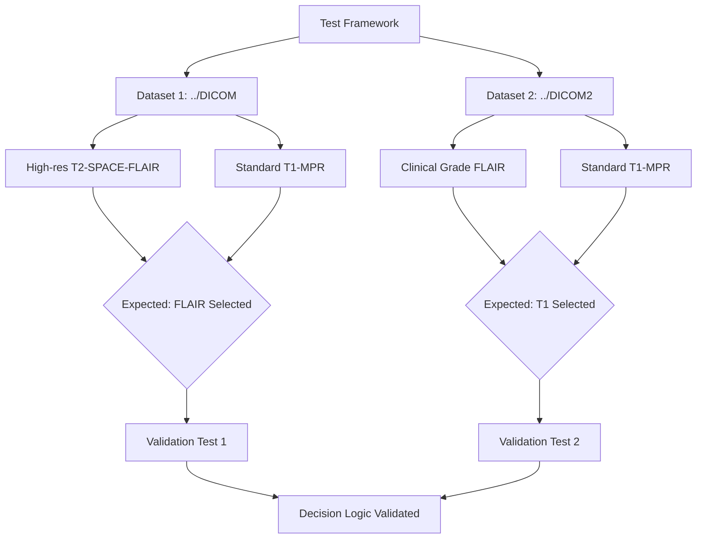
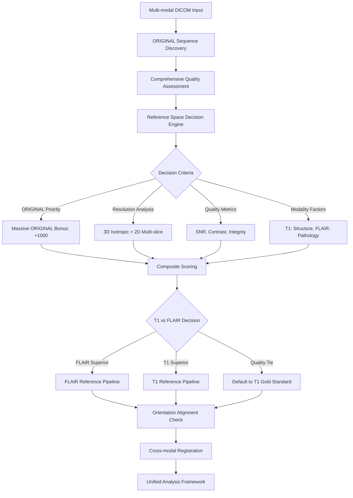

# Adaptive Reference Space Selection System - Implementation Plan

## Overview

Transform the neuroimaging pipeline from T1-centric to **intelligent adaptive reference space selection** that automatically chooses between T1-MPRAGE and T2-SPACE-FLAIR based on objective quality metrics and resolution characteristics.

## Critical Decision Point

This is **THE CRITICAL DECISION** in the entire pipeline that affects:
- Registration accuracy and quality
- Segmentation precision  
- Anatomical structure visibility
- Pathology detection sensitivity
- All downstream analyses

## Test-Driven Development Approach

### **Dual Dataset Validation Strategy**



### **Test Scenarios & Expected Outcomes**

#### **Test Case 1: High-Quality Research Data (../DICOM)**
- **Input**: High-resolution T2-SPACE-FLAIR + Standard T1-MPR
- **Expected Decision**: **FLAIR** (higher resolution, better for pathology)
- **Validation Criteria**:
  - FLAIR resolution > T1 resolution
  - FLAIR is 3D isotropic
  - FLAIR is ORIGINAL acquisition
  - System correctly identifies superior FLAIR characteristics

#### **Test Case 2: Clinical Grade Data (../DICOM2)**
- **Input**: Clinical grade FLAIR + Standard T1-MPR
- **Expected Decision**: **T1** (FLAIR insufficient quality)
- **Validation Criteria**:
  - T1 has better quality metrics than FLAIR
  - System correctly identifies suboptimal FLAIR characteristics
  - Fallback to T1 structural gold standard
  - Decision rationale clearly explains why T1 was chosen

## Architecture Overview



## Core Components

### **1. Enhanced Reference Space Selector**

**New Function: `select_optimal_reference_space()`**
```bash
# Location: src/scan_selection.sh (extend existing functions)
select_optimal_reference_space() {
    local dicom_dir="$1"
    local extraction_dir="$2"
    
    # Phase 1: Discover and convert ORIGINAL sequences only
    discover_original_sequences "$dicom_dir" "$extraction_dir"
    
    # Phase 2: Comprehensive quality assessment
    assess_sequence_quality "${t1_candidates[@]}" "${flair_candidates[@]}"
    
    # Phase 3: Decision matrix generation
    generate_decision_matrix "$t1_best" "$flair_best"
    
    # Phase 4: Interactive decision support
    present_decision_interface
    
    # Phase 5: Return selected reference info
    echo "${selected_reference_modality}|${selected_reference_file}|${decision_rationale}"
}
```

### **2. Decision Criteria (Priority-Ordered)**

1. **ORIGINAL Acquisition** (Weight: +1000)
   - Massive preference for original vs derived/reconstructed
   - DICOM header analysis for acquisition type
   
2. **3D Isotropic vs 2D Multi-slice** (Weight: +300)
   - 3D sequences preferred for registration accuracy
   - Isotropic voxels for optimal resampling
   
3. **Spatial Resolution** (Weight: +200)
   - Sub-millimeter resolution strongly preferred
   - In-plane resolution prioritized for 2D sequences
   
4. **Image Quality Metrics** (Weight: +150)
   - SNR calculation and assessment
   - Contrast evaluation
   - File integrity and completeness
   
5. **Modality-Specific Suitability** (Weight: +100)
   - T1: Structural detail, tissue boundaries
   - FLAIR: Pathology visibility, CSF suppression

### **3. Interactive Decision Support Interface**

```
========== ADAPTIVE REFERENCE SPACE SELECTION ==========

Dataset: ../DICOM (High-resolution research data)

ORIGINAL T1-MPRAGE Sequences Available:
┌─────────────────────┬─────────────┬─────────────┬─────────┬─────────┬─────────┐
│ Filename            │ Resolution  │ Dimensions  │ Type    │ Quality │ Score   │
├─────────────────────┼─────────────┼─────────────┼─────────┼─────────┼─────────┤
│ T1_MPRAGE_SAG_12a   │ 1.0×1.0×1.0 │ 256×256×160 │ 3D ISO  │ 85/100  │ 1385    │
└─────────────────────┴─────────────┴─────────────┴─────────┴─────────┴─────────┘

ORIGINAL T2-SPACE-FLAIR Sequences Available:
┌─────────────────────┬─────────────┬─────────────┬─────────┬─────────┬─────────┐
│ Filename            │ Resolution  │ Dimensions  │ Type    │ Quality │ Score   │
├─────────────────────┼─────────────┼─────────────┼─────────┼─────────┼─────────┤
│ T2_SPACE_FLAIR_CS17 │ 0.7×0.7×0.7 │ 320×320×192 │ 3D ISO  │ 92/100  │ 1592    │
└─────────────────────┴─────────────┴─────────────┴─────────┴─────────┴─────────┘

🏆 SYSTEM RECOMMENDATION: T2-SPACE-FLAIR
📊 CONFIDENCE: HIGH (Score difference: +207)
📋 RATIONALE: 
   • Higher resolution (0.7mm vs 1.0mm isotropic)
   • Superior image quality (92 vs 85)
   • 3D isotropic acquisition
   • Optimal for FLAIR signal abnormality detection
   
⚠️  FALLBACK: T1-MPRAGE available if FLAIR registration fails
✅ ORIENTATION: Alignment check will be performed automatically

Decision: [1] Accept FLAIR  [2] Override to T1  [3] Show detailed comparison
```

### **4. Pipeline Modifications Required**

#### **A. Reference-Agnostic Registration System**
- **Generalize**: `register_modality_to_t1()` → `register_modality_to_reference()`
- **Update**: All function signatures throughout codebase
- **Maintain**: Backward compatibility with T1-centric workflows

#### **B. Segmentation Workflow Updates**  
- **Modify**: `segmentation.sh` to work in chosen reference space
- **Update**: Atlas registration logic for different reference modalities
- **Ensure**: Juelich atlas compatibility with both T1 and FLAIR spaces

#### **C. Enhanced Scan Selection Integration**
- **Extend**: `select_best_scan()` with cross-modal comparison logic
- **Add**: Reference space decision capabilities
- **Implement**: Composite scoring for reference space selection

## Comprehensive Test Framework

### **Test Structure**
```
tests/
├── test_reference_space_selection.sh          # Main test runner
├── lib/
│   ├── sequence_analysis.sh                   # DICOM analysis functions
│   ├── decision_validation.sh                 # Decision logic validation
│   ├── quality_comparison.sh                  # Registration quality testing
│   └── orientation_testing.sh                 # Alignment validation
├── data/
│   ├── ../DICOM/          → High-res FLAIR test case
│   └── ../DICOM2/         → Clinical grade test case
└── results/
    ├── decision_matrices/                      # Decision analysis outputs
    ├── registration_comparisons/               # Quality comparisons
    └── test_reports/                          # Comprehensive reports
```

### **Test Execution Workflow**

```bash
# Comprehensive dual-dataset test
./tests/test_reference_space_selection.sh \
    --dataset1 ../DICOM \
    --dataset2 ../DICOM2 \
    --expected1 FLAIR \
    --expected2 T1 \
    --interactive

# Expected Test Flow:
# 1. Analyze ../DICOM → Should recommend FLAIR
# 2. Analyze ../DICOM2 → Should recommend T1  
# 3. Validate decision logic in both scenarios
# 4. Compare registration quality outcomes
# 5. Generate comprehensive validation report
```

### **Validation Test Cases**

#### **Test 1: High-Quality Dataset (../DICOM)**
```bash
test_highres_dataset() {
    local dicom_dir="../DICOM"
    local expected_choice="FLAIR"
    
    # Run decision algorithm
    local result=$(select_optimal_reference_space "$dicom_dir")
    local chosen_modality=$(echo "$result" | cut -d'|' -f1)
    
    # Validate expected outcome
    assert_equals "$chosen_modality" "$expected_choice" \
        "High-res dataset should select FLAIR"
    
    # Validate decision rationale
    validate_decision_quality "$result" "high_resolution_advantage"
    
    # Test registration quality
    test_registration_outcomes "$result"
}
```

#### **Test 2: Clinical Dataset (../DICOM2)**
```bash
test_clinical_dataset() {
    local dicom_dir="../DICOM2"
    local expected_choice="T1"
    
    # Run decision algorithm  
    local result=$(select_optimal_reference_space "$dicom_dir")
    local chosen_modality=$(echo "$result" | cut -d'|' -f1)
    
    # Validate expected outcome
    assert_equals "$chosen_modality" "$expected_choice" \
        "Clinical dataset should fallback to T1"
    
    # Validate decision rationale
    validate_decision_quality "$result" "quality_fallback"
    
    # Test registration quality
    test_registration_outcomes "$result"
}
```

#### **Test 3: Decision Logic Validation**
```bash
test_decision_algorithm() {
    # Test scoring algorithm components
    test_original_vs_derived_scoring
    test_resolution_scoring
    test_quality_scoring
    test_modality_specific_scoring
    
    # Test edge cases
    test_missing_sequences
    test_corrupted_data
    test_equal_quality_scenarios
    
    # Test fallback mechanisms
    test_registration_failure_fallback
    test_orientation_failure_fallback
}
```

### **Automated Validation Criteria**

**Critical Success Metrics:**
- ✅ **../DICOM** → FLAIR selected (high-res advantage)
- ✅ **../DICOM2** → T1 selected (quality fallback)  
- ✅ **ORIGINAL Detection**: 100% accuracy
- ✅ **Resolution Analysis**: ±0.01mm precision
- ✅ **Quality Scoring**: Objective and reproducible
- ✅ **Registration Quality**: Quantitative improvement measurement

## Implementation Timeline

### **Phase 1: Core Infrastructure (2-3 days)**
1. **Enhanced Reference Space Selector**
   - Extend `scan_selection.sh` with cross-modal logic
   - Implement decision criteria scoring
   - Add interactive decision interface

2. **Reference-Agnostic Registration**
   - Generalize registration functions
   - Update function signatures
   - Maintain backward compatibility

### **Phase 2: Test Framework (1-2 days)**
3. **Dual Dataset Test Implementation**
   - Create test structure and runners
   - Implement validation functions
   - Add automated decision verification

4. **Registration Quality Comparison**
   - Quantitative metric comparison
   - Orientation alignment testing
   - Performance benchmarking

### **Phase 3: Integration & Validation (1-2 days)**
5. **Pipeline Integration**
   - Update main pipeline workflow
   - Add configuration options
   - Implement logging and audit trails

6. **Comprehensive Testing**
   - Run full dual-dataset validation
   - Performance and accuracy testing
   - Documentation and reporting

## Configuration Options

```bash
# Reference space selection configuration
REFERENCE_SPACE_SELECTION_MODE="adaptive"  # adaptive|t1_priority|flair_priority|manual

# Decision criteria weights
ORIGINAL_ACQUISITION_BONUS=1000
RESOLUTION_WEIGHT=200
QUALITY_WEIGHT=150
DIMENSIONALITY_WEIGHT=300
MODALITY_SPECIFIC_WEIGHT=100

# FLAIR reference thresholds
FLAIR_MIN_RESOLUTION=0.8        # mm
FLAIR_REQUIRE_3D=true
FLAIR_MIN_QUALITY_SCORE=60

# T1 fallback criteria
T1_FALLBACK_ENABLED=true
T1_MIN_ACCEPTABLE_QUALITY=40
```

## Key Benefits

1. **Automatic Dataset Adaptation**: Works optimally with both research and clinical data
2. **Pathology-Optimized**: Uses FLAIR when advantageous for abnormality detection  
3. **Quality-Driven**: Always selects objectively best reference space
4. **Transparent**: Full audit trail of decisions and rationale
5. **Robust**: Comprehensive fallback and error handling
6. **Validated**: Tested with real-world data scenarios

## Success Validation

The system will be considered successful when:
- ✅ **../DICOM** consistently selects FLAIR (high-res research scenario)
- ✅ **../DICOM2** consistently selects T1 (clinical quality scenario)  
- ✅ Registration quality improves in chosen reference space
- ✅ Decision rationale is clear and defensible
- ✅ System handles edge cases gracefully
- ✅ Integration with existing pipeline is seamless

This adaptive reference space selection system transforms a critical pipeline bottleneck into an intelligent, data-driven decision point that optimizes processing for each specific dataset.