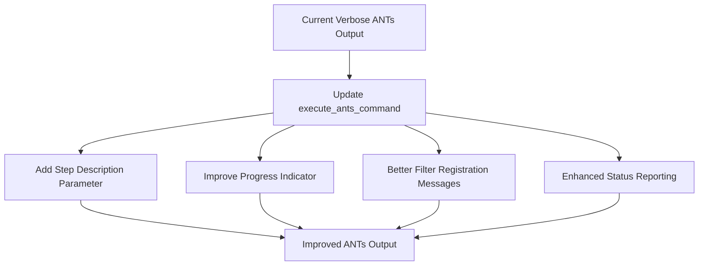

# ANTs Command Output Improvement Plan

## Overview

This focused plan addresses the most verbose output source in the pipeline - the ANTs commands. We'll update the existing `execute_ants_command` function in environment.sh to provide better explanations and progress indicators while reducing unnecessary output.

## Current Issues with ANTs Command Output

1. **Excessive Diagnostic Output**: ANTs commands produce hundreds to thousands of lines of diagnostic information
2. **Obscured Progress**: Important status messages get buried in diagnostic output
3. **Missing Context**: Limited explanation of what each command is doing and why
4. **Registration Messages**: "Running AffineTransform registration" and similar messages flood the output

## Implementation Plan



## Specific Changes to execute_ants_command Function

We'll modify the existing `execute_ants_command` function in environment.sh:

```bash
# Improved version of execute_ants_command function
execute_ants_command() {
  local log_prefix="${1:-ants_cmd}"
  local step_description="${2:-ANTs processing step}"  # New parameter for step description
  local diagnostic_log="${LOG_DIR}/${log_prefix}_diagnostic.log"
  local cmd=("${@:3}") # Shift parameters to accommodate the new description parameter
  
  # Create diagnostic log directory if needed
  mkdir -p "$LOG_DIR"
  
  # IMPROVEMENT: Better description of the command being executed
  log_formatted "INFO" "==== $step_description ===="
  log_message "Executing: ${cmd[0]} (full details in log)"
  log_message "Diagnostic output saved to: $diagnostic_log"
  
  # Create named pipes for better output handling
  local stdout_pipe=$(mktemp -u)
  local stderr_pipe=$(mktemp -u)
  mkfifo "$stdout_pipe"
  mkfifo "$stderr_pipe"
  
  # Start background processes to handle output with improved filtering
  (
    # Progress indicator counter
    local line_count=0
    
    while IFS= read -r line; do
      # Filter out diagnostic and verbose registration messages
      if echo "$line" | grep -qE "^(2)?DIAGNOSTIC|^XXDIAGNOSTIC|convergenceValue|metricValue|ITERATION_TIME|Running.*Transform registration|DIAGNOSTIC|CurrentIteration"; then
        # Increment counter for filtered lines
        line_count=$((line_count + 1))
        # Print a dot every 10 filtered lines to show progress
        if [ $((line_count % 10)) -eq 0 ]; then
          echo -n "." >&2
        fi
        # Log the diagnostic info to the log file (not to stdout)
        echo "$line" >> "$diagnostic_log"
      else
        # Pass through important non-diagnostic lines
        echo "$line" | tee -a "$LOG_FILE"
      fi
    done
  ) < "$stdout_pipe" &
  local stdout_pid=$!
  
  tee -a "$diagnostic_log" < "$stderr_pipe" >&2 &
  local stderr_pid=$!
  
  # Execute command directly
  "${cmd[@]}" > "$stdout_pipe" 2> "$stderr_pipe"
  local status=$?
  
  # Wait for output handling processes to complete
  wait $stdout_pid
  wait $stderr_pid
  
  # Remove named pipes
  rm -f "$stdout_pipe" "$stderr_pipe"
  
  # Add newline after dots
  echo ""
  
  # IMPROVEMENT: Better status reporting with time elapsed
  if [ $status -eq 0 ]; then
    log_formatted "SUCCESS" "$step_description completed successfully"
  else
    log_formatted "ERROR" "$step_description failed with status $status"
    # Extract important error lines from the diagnostic log
    tail -n 10 "$diagnostic_log" | grep -v -E "^(2)?DIAGNOSTIC|^XXDIAGNOSTIC|convergenceValue" | tail -n 3
  fi
  
  return $status
}
```

## Usage Examples

The updated function requires a new parameter for the step description, which will require updating call sites:

### Before:

```bash
execute_ants_command "registration" antsRegistrationSyN.sh -d 3 -f "$reference" -m "$moving" -o "$output_prefix" -t s
```

### After:

```bash
execute_ants_command "registration" "Registration to standard space" antsRegistrationSyN.sh -d 3 -f "$reference" -m "$moving" -o "$output_prefix" -t s
```

## Example Output Comparison

### Before:

```
[2025-05-08 08:21:02] Executing ANTs command: antsRegistrationSyN.sh -d 3 -f /path/to/template.nii.gz -m /path/to/subject.nii.gz -o /path/to/output -t s (diagnostic output redirected to /path/to/logs/ants_cmd_diagnostic.log)
*** Running AffineTransform registration ***
DIAGNOSTIC: /tmp/1234.nii.gz /tmp/5678.nii.gz, metric value = 100000
DIAGNOSTIC: /tmp/1234.nii.gz /tmp/5678.nii.gz, metric value = 95000
DIAGNOSTIC: /tmp/1234.nii.gz /tmp/5678.nii.gz, metric value = 90000
... [hundreds of similar lines] ...
*** Running Euler3DTransform registration ***
... [hundreds more diagnostic lines] ...
[2025-05-08 08:31:45] ANTs command completed successfully
```

### After:

```
[INFO] ==== Registration to standard space ====
[2025-05-08 08:21:02] Executing: antsRegistrationSyN.sh (full details in log)
[2025-05-08 08:21:02] Diagnostic output saved to: /path/to/logs/ants_cmd_diagnostic.log
......................................................
[SUCCESS] Registration to standard space completed successfully
```

## Update Plan for Call Sites

We need to update all places where `execute_ants_command` is called to include the step description parameter:

1. Find all occurrences with grep:
   ```bash
   grep -r "execute_ants_command" src/modules/
   ```

2. Update each call site with an appropriate description:

   - For brain extraction: "Brain extraction from skull"
   - For N4 bias correction: "Correcting intensity bias field"
   - For initial registration: "Initial alignment to template"
   - For SyN registration: "Deformable registration to template"
   - For template construction: "Building multi-subject template"

## Implementation Steps

1. Update `execute_ants_command` function in environment.sh first
2. Test with a single call site to verify functionality
3. Update all call sites to include descriptions
4. Test the full pipeline to ensure proper operation

This focused approach will address the most verbose output issue first while maintaining the existing pipeline structure.