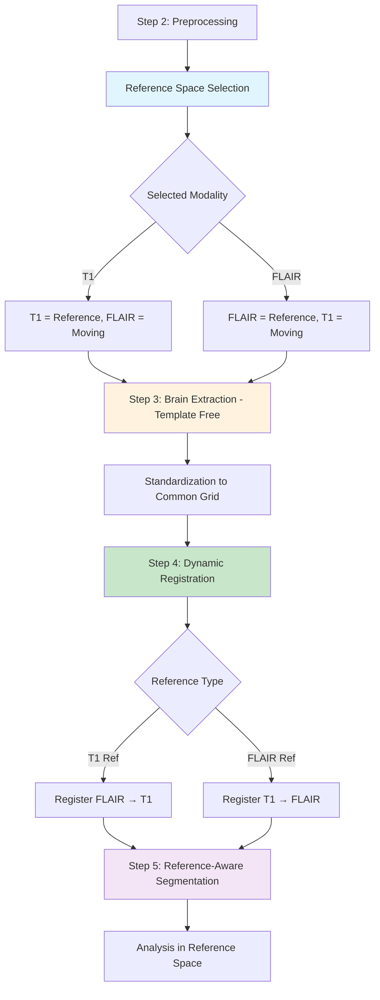

# Complete Pipeline Analysis & MNI Dependency Fix Plan

> **Status update (best-practice batch merged on `main`):** several items below are now addressed and are marked **✅ DONE** inline where they apply. In particular the brain-extraction / MNI-dependency rework landed via the brain-extraction overhaul (PR #111): SynthStrip is now the primary, contrast-agnostic extractor with an automatic SynthStrip → ANTs(Otsu) → BET fallback chain, a shared `robustfov` neck-removal pre-step, and a posterior-fossa QC gate (`BRAIN_EXTRACTION_METHOD`), removing the hard MNI-template dependency in the default path. Related merged work in the same batch: modality-aware denoising + DWI MP-PCA (#118), N4 b-spline field-strength knob + lesion-aware FLAIR (#115), modernized registration metrics/interpolation (#112), CSF/PV exclusion + reconciled fallback SD multiplier (#114), FreeSurfer brainstem substructures replacing Talairach (#119), and the supervised WMH modules (#113, #116). Items **not** marked DONE remain open as written.

## Current Pipeline Flow Analysis

After carefully analyzing both `pipeline.sh` and `reference_space_selection.sh`, I've identified a more complex issue than just the MNI dependency in brain extraction.

### Current Workflow (Steps 2-5)

#### Step 2: Preprocessing & Reference Space Selection (Lines 364-388)
```bash
# Line 365: Adaptive reference space selection
local selection_result=$(select_optimal_reference_space "$SRC_DIR" "$EXTRACT_DIR" "${REFERENCE_SPACE_SELECTION_MODE:-adaptive}")

# Lines 367-370: Parse result
local selected_modality=$(echo "$selection_result" | cut -d'|' -f1)  # "T1" or "FLAIR"
local selected_file=$(echo "$selection_result" | cut -d'|' -f2)
local selection_rationale=$(echo "$selection_result" | cut -d'|' -f3)

# Lines 376-388: File assignment based on selection
if [ "$selected_modality" = "T1" ]; then
    local t1_file="$selected_file"
    local flair_file=$(select_best_scan "FLAIR" "*FLAIR*.nii.gz" "$EXTRACT_DIR" "$t1_file" ...)
elif [ "$selected_modality" = "FLAIR" ]; then
    local flair_file="$selected_file" 
    local t1_file=$(select_best_scan "T1" "*T1*.nii.gz" "$EXTRACT_DIR" "$flair_file" ...)
fi
```

#### Step 3: Brain Extraction & Standardization (Lines 533-600)
```bash
# Lines 545-566: Determine reference based on resolution comparison (NOT reference space selection!)
local t1_inplane=$(calculate_inplane_resolution "$t1_brain")
local flair_inplane=$(calculate_inplane_resolution "$flair_brain")

if (( $(echo "$t1_inplane <= $flair_inplane" | bc -l) )); then
    reference_image="$t1_brain"      # T1 has higher resolution
    reference_modality="T1"
else
    reference_image="$flair_brain"   # FLAIR has higher resolution  
    reference_modality="FLAIR"
fi

# Lines 574-586: Standardization
standardize_dimensions "$reference_image" "$optimal_resolution"
standardize_dimensions "$moving_image" "" "$reference_std"

# Lines 588-595: File assignment
if [ "$reference_modality" = "T1" ]; then
    t1_std="$reference_std"
    flair_std="$moving_std"
else
    t1_std="$moving_std"
    flair_std="$reference_std"
fi
```

#### Step 4: Registration (Lines 695-701)
```bash
# HARDCODED: Always registers FLAIR to T1!
log_message "Running FLAIR to T1 registration..."
register_to_reference "$t1_std" "$flair_std" "FLAIR" "$reg_prefix"
```

#### Step 5: Segmentation (Lines 807, 827-852)
```bash
# Line 807: Always done on T1
extract_brainstem_final "$t1_std"

# Lines 827-852: Transform to reference space if T1 wasn't reference
if [ "$reference_modality" != "T1" ]; then
    # Transform T1-based segmentations to reference space
    apply_transformation "$mask_file" "$flair_std" "$out_mask" ...
fi
```

## **Critical Issues Identified**

### Issue 1: MNI Template Dependency — ✅ DONE (PR #111)
- **Location**: `src/modules/utils.sh:perform_brain_extraction()`
- **Problem**: `antsBrainExtraction.sh` has hardcoded MNI template dependencies
- **Impact**: Pipeline fails when MNI templates are not available
- **Resolution**: Default extraction now uses SynthStrip (FreeSurfer `mri_synthstrip`, contrast-agnostic, no MNI template) with a SynthStrip → ANTs(Otsu) → BET fallback chain and `robustfov` neck removal, selected via `BRAIN_EXTRACTION_METHOD`. See `src/modules/brain_extraction.sh`.

### Issue 2: Inconsistent Reference Space Logic
- **Problem**: Three different reference selection methods that can conflict:
  1. **Step 2**: `select_optimal_reference_space()` selects based on quality metrics
  2. **Step 3**: Resolution-based selection overwrites Step 2 decision
  3. **Step 4**: Hardcoded FLAIR→T1 registration ignores both previous decisions

### Issue 3: Incorrect Registration Direction
- **Problem**: Registration always goes FLAIR→T1, regardless of selected reference space
- **Impact**: If FLAIR was selected as reference, we should register T1→FLAIR

### Issue 4: Complex Segmentation Transformation
- **Problem**: Segmentation done on T1, then transformed to reference space
- **Better approach**: Register appropriately so segmentation can be done in reference space

## **Complete Fix Plan**

### Phase 1: Fix MNI Dependency (Immediate) — ✅ DONE (PR #111)
Replace `perform_brain_extraction()` in `src/modules/utils.sh` with template-free implementation. Done via the SynthStrip-primary extractor + ANTs(Otsu)/BET fallback chain in `src/modules/brain_extraction.sh` (no MNI template in the default path).

### Phase 2: Unify Reference Space Logic (Architectural)
Create a consistent reference space decision that flows through all pipeline stages.

### Phase 3: Dynamic Registration Direction (Critical)
Make registration direction respond to reference space selection.

### Phase 4: Simplified Segmentation Flow (Enhancement)
Eliminate need for complex segmentation transformations.

## **Detailed Implementation Plan**

### Step 1: Fix Brain Extraction (Template-Free) — ✅ DONE (PR #111)
The as-built solution uses SynthStrip (contrast-agnostic, no template) as primary with an automatic ANTs(Otsu) → BET fallback and `robustfov` neck removal, rather than the Otsu-only sketch below. The original sketch is kept for reference:
```bash
# Replace perform_brain_extraction() in src/modules/utils.sh
perform_brain_extraction() {
  local input_file="$1"
  local output_prefix="$2"
  
  # Template-free approach using intensity-based methods
  # 1. N4 bias correction
  # 2. Otsu thresholding  
  # 3. Connected component analysis
  # 4. Morphological operations
  # 5. Mask application
}
```

### Step 2: Unified Reference Space Management
Create global variables to track reference space decision:
```bash
# Set in Step 2, used throughout pipeline
export PIPELINE_REFERENCE_MODALITY="T1"  # or "FLAIR"
export PIPELINE_REFERENCE_FILE="/path/to/reference/image"
export PIPELINE_MOVING_FILE="/path/to/moving/image"
```

### Step 3: Dynamic Registration Logic
```bash
# In Step 4 registration
if [ "$PIPELINE_REFERENCE_MODALITY" = "T1" ]; then
    # FLAIR → T1 registration
    register_to_reference "$t1_std" "$flair_std" "FLAIR" "$reg_prefix"
    log_message "Registering FLAIR to T1 reference space"
else
    # T1 → FLAIR registration
    register_to_reference "$flair_std" "$t1_std" "T1" "$reg_prefix"
    log_message "Registering T1 to FLAIR reference space"
fi
```

### Step 4: Reference-Aware Segmentation
```bash
# In Step 5 segmentation
if [ "$PIPELINE_REFERENCE_MODALITY" = "T1" ]; then
    # Direct segmentation on T1 reference
    extract_brainstem_final "$t1_std"
else
    # Segmentation on T1, then transform to FLAIR reference
    extract_brainstem_final "$t1_std"
    transform_segmentation_to_reference_space
fi
```

## **Pipeline Flow After Fixes**



## **Critical Variables to Track**

### Global Pipeline State (Set in Step 2)
```bash
export PIPELINE_REFERENCE_MODALITY="T1|FLAIR"      # Which modality is reference
export PIPELINE_REFERENCE_IMAGE=""                  # Path to reference image  
export PIPELINE_MOVING_IMAGE=""                     # Path to moving image
export PIPELINE_REFERENCE_STD=""                    # Standardized reference
export PIPELINE_MOVING_STD=""                       # Standardized moving
export PIPELINE_REGISTERED_MOVING=""                # Registered moving image
```

### Registration Transform Files (Created in Step 4)
```bash
# Registration outputs depend on direction
if [ "$PIPELINE_REFERENCE_MODALITY" = "T1" ]; then
    # FLAIR→T1: Standard naming
    TRANSFORM_PREFIX="${reg_dir}/flair_to_t1"
else
    # T1→FLAIR: Reversed naming  
    TRANSFORM_PREFIX="${reg_dir}/t1_to_flair"
fi
```

## **Benefits of Complete Fix**

### 1. MNI Independence
- No external template dependencies
- Works with any population/protocol
- Robust intensity-based brain extraction

### 2. Consistent Reference Logic
- Single decision point in Step 2
- All subsequent steps respect this decision
- Clear variable tracking throughout pipeline

### 3. Optimal Registration
- Always registers moving → reference
- Maintains highest quality reference space
- Reduces accumulated errors

### 4. Simplified Analysis
- Analysis always done in reference space
- No complex space transformations needed
- Clear interpretation of results

## **Implementation Priority**

1. **Phase 1 (Critical)**: Fix MNI dependency - enables pipeline to run
2. **Phase 2 (Important)**: Unify reference space logic - improves consistency
3. **Phase 3 (Essential)**: Dynamic registration - ensures correct spatial alignment
4. **Phase 4 (Enhancement)**: Simplified segmentation - reduces complexity

## **Testing Strategy**

### Test Case 1: T1 as Reference
- Verify FLAIR→T1 registration works correctly
- Confirm segmentation quality in T1 space
- Check analysis results consistency

### Test Case 2: FLAIR as Reference  
- Verify T1→FLAIR registration works correctly
- Confirm segmentation transforms to FLAIR space
- Check analysis maintains accuracy

### Test Case 3: Template-Free Brain Extraction
- Compare brain extraction quality vs. template-based
- Verify mask quality across different image types
- Test fallback to FSL BET if needed

This comprehensive fix addresses both the immediate MNI dependency issue and the underlying architectural problems with reference space management throughout the pipeline.