# Brain MRI Processing Pipeline: Implementation Plan

This document outlines the detailed implementation plan for modularizing the existing `processing_script.sh` into a more maintainable and extensible architecture.

## Current State Analysis

The current implementation consists of a large monolithic script (`processing_script.sh`) with several key components:

1. **Environment Setup and Configuration** - Sets up paths, logging, and parameters
2. **QA/Validation Functions** - Extensive but not fully integrated
3. **Dependency Checks** - Verifies required tools are installed
4. **Core Processing Functions** - Image processing, registration, segmentation
5. **Hyperintensity Detection** - Detection and analysis of white matter hyperintensities
6. **Visualization and Reporting** - Multi-threshold overlays and HTML reports

The main issues identified:

- Lack of modularization makes the code difficult to maintain and extend
- QA/Validation blocks are well-defined but not fully integrated
- Some FSL/FIRST functions remain but shouldn't be invoked
- Hyperintensity detection needs better integration
- Multi-threshold overlays and HTML reports need refinement

## Proposed Architecture

We will implement a modular architecture with a single main script that sources modular components:

```mermaid
graph TD
    A[pipeline.sh] --> B[modules/environment.sh]
    A --> C[modules/import.sh]
    A --> D[modules/preprocess.sh]
    A --> E[modules/registration.sh]
    A --> F[modules/segmentation.sh]
    A --> G[modules/analysis.sh]
    A --> H[modules/visualization.sh]
    A --> I[modules/qa.sh]
    
    B --> B1[Configuration]
    B --> B2[Logging]
    B --> B3[Dependency Checks]
    
    C --> C1[DICOM Import]
    C --> C2[DICOM to NIfTI Conversion]
    
    D --> D1[Bias Field Correction]
    D --> D2[Brain Extraction]
    D --> D3[Multi-axial Integration]
    
    E --> E1[T2-SPACE-FLAIR to T1MPRAGE Registration]
    E --> E2[Registration QA]
    
    F --> F1[Tissue Segmentation]
    F --> F2[Brainstem Segmentation]
    F --> F3[Pons Segmentation]
    
    G --> G1[Hyperintensity Detection]
    G --> G2[Cluster Analysis]
    G --> G3[Volume Quantification]
    
    H --> H1[Multi-threshold Overlays]
    H --> H2[HTML Report Generation]
    H --> H3[3D Visualization]
    
    I --> I1[Image Quality Checks]
    I --> I2[Registration Validation]
    I --> I3[Segmentation Validation]
    I --> I4[Analysis Validation]
```



## File Structure

```
brainMRI-ants-e2e-pipeline/
├── pipeline.sh                   # Main pipeline script
├── README.md                     # Project documentation
├── LICENSE                       # License file
├── .gitignore                    # Git ignore file
├── modules/                      # Modular components
│   ├── environment.sh            # Environment setup
│   ├── import.sh                 # Data import functions
│   ├── preprocess.sh             # Preprocessing functions
│   ├── registration.sh           # Registration functions
│   ├── segmentation.sh           # Segmentation functions
│   ├── analysis.sh               # Analysis functions
│   ├── visualization.sh          # Visualization functions
│   └── qa.sh                     # QA/Validation functions
├── config/                       # Configuration files
│   ├── default_config.sh         # Default configuration
│   └── quality_thresholds.sh     # QA thresholds
└── docs/                         # Documentation
    ├── workflow.md               # End-to-end workflow documentation
    └── implementation_plan.md    # Implementation plan
```

## Implementation Steps

### 1. Create Directory Structure

```bash
mkdir -p modules config
```

### 2. Extract Environment Setup (modules/environment.sh)

Extract the following sections from `processing_script.sh`:
- Environment variables (paths, directories)
- Logging functions
- Configuration parameters
- Dependency checks

```bash
# modules/environment.sh
#!/usr/bin/env bash
#
# environment.sh - Environment setup for the brain MRI processing pipeline
#

# ------------------------------------------------------------------------------
# Shell Options
# ------------------------------------------------------------------------------
set -e
set -u
set -o pipefail

# ------------------------------------------------------------------------------
# Key Environment Variables (Paths & Directories)
# ------------------------------------------------------------------------------
export SRC_DIR="../DiCOM"          # DICOM input directory
export EXTRACT_DIR="../extracted"  # Where NIfTI files land after dcm2niix
export RESULTS_DIR="../mri_results"
mkdir -p "$RESULTS_DIR"
export ANTS_PATH="~/ants"
export PATH="$PATH:${ANTS_PATH}/bin"
export LOG_DIR="${RESULTS_DIR}/logs"
mkdir -p "$LOG_DIR"

# Log file capturing pipeline-wide logs
export LOG_FILE="${LOG_DIR}/processing_$(date +"%Y%m%d_%H%M%S").log"

# ------------------------------------------------------------------------------
# Logging & Color Setup
# ------------------------------------------------------------------------------
RED='\033[0;31m'
GREEN='\033[0;32m'
YELLOW='\033[0;33m'
BLUE='\033[0;34m'
NC='\033[0m' # No Color

log_formatted() {
  local level=$1
  local message=$2
  case $level in
    "INFO")    echo -e "${BLUE}[INFO]${NC} $message" >&2 ;;
    "SUCCESS") echo -e "${GREEN}[SUCCESS]${NC} $message" >&2 ;;
    "WARNING") echo -e "${YELLOW}[WARNING]${NC} $message" >&2 ;;
    "ERROR")   echo -e "${RED}[ERROR]${NC} $message" >&2 ;;
    *)         echo -e "[LOG] $message" >&2 ;;
  esac
}

log_message() {
  local text="$1"
  # Write to both stderr and the LOG_FILE
  echo "[$(date +"%Y-%m-%d %H:%M:%S")] $text" | tee -a "$LOG_FILE" >&2
}

export log_message
export log_formatted

# ------------------------------------------------------------------------------
# Pipeline Parameters / Presets
# ------------------------------------------------------------------------------
PROCESSING_DATATYPE="float"  # internal float
OUTPUT_DATATYPE="int"        # final int16

# Quality settings (LOW, MEDIUM, HIGH)
QUALITY_PRESET="HIGH"

# N4 Bias Field Correction presets: "iterations,convergence,bspline,shrink"
export N4_PRESET_LOW="20x20x25,0.0001,150,4"
export N4_PRESET_MEDIUM="50x50x50x50,0.000001,200,4"
export N4_PRESET_HIGH="100x100x100x50,0.0000001,300,2"
export N4_PRESET_FLAIR="$N4_PRESET_HIGH"  # override if needed

# Set default N4_PARAMS by QUALITY_PRESET
if [ "$QUALITY_PRESET" = "HIGH" ]; then
    export N4_PARAMS="$N4_PRESET_HIGH"
elif [ "$QUALITY_PRESET" = "MEDIUM" ]; then
    export N4_PARAMS="$N4_PRESET_MEDIUM"
else
    export N4_PARAMS="$N4_PRESET_LOW"
fi

# Parse out the fields for general sequences
N4_ITERATIONS=$(echo "$N4_PARAMS"      | cut -d',' -f1)
N4_CONVERGENCE=$(echo "$N4_PARAMS"    | cut -d',' -f2)
N4_BSPLINE=$(echo "$N4_PARAMS"        | cut -d',' -f3)
N4_SHRINK=$(echo "$N4_PARAMS"         | cut -d',' -f4)

# Parse out FLAIR-specific fields
N4_ITERATIONS_FLAIR=$(echo "$N4_PRESET_FLAIR"  | cut -d',' -f1)
N4_CONVERGENCE_FLAIR=$(echo "$N4_PRESET_FLAIR" | cut -d',' -f2)
N4_BSPLINE_FLAIR=$(echo "$N4_PRESET_FLAIR"     | cut -d',' -f3)
N4_SHRINK_FLAIR=$(echo "$N4_PRESET_FLAIR"      | cut -d',' -f4)

# Multi-axial integration parameters (antsMultivariateTemplateConstruction2.sh)
TEMPLATE_ITERATIONS=2
TEMPLATE_GRADIENT_STEP=0.2
TEMPLATE_TRANSFORM_MODEL="SyN"
TEMPLATE_SIMILARITY_METRIC="CC"
TEMPLATE_SHRINK_FACTORS="6x4x2x1"
TEMPLATE_SMOOTHING_SIGMAS="3x2x1x0"
TEMPLATE_WEIGHTS="100x50x50x10"

# Registration & motion correction
REG_TRANSFORM_TYPE=2  # antsRegistrationSyN.sh: 2 => rigid+affine+syn
REG_METRIC_CROSS_MODALITY="MI"
REG_METRIC_SAME_MODALITY="CC"
ANTS_THREADS=12
REG_PRECISION=1

# Hyperintensity detection
THRESHOLD_WM_SD_MULTIPLIER=2.3
MIN_HYPERINTENSITY_SIZE=4

# Tissue segmentation parameters
ATROPOS_T1_CLASSES=3
ATROPOS_FLAIR_CLASSES=4
ATROPOS_CONVERGENCE="5,0.0"
ATROPOS_MRF="[0.1,1x1x1]"
ATROPOS_INIT_METHOD="kmeans"

# Cropping & padding
PADDING_X=5
PADDING_Y=5
PADDING_Z=5
C3D_CROP_THRESHOLD=0.1
C3D_PADDING_MM=5

# Reference templates from FSL or other sources
if [ -z "${FSLDIR:-}" ]; then
  log_formatted "WARNING" "FSLDIR not set. Template references may fail."
else
  export TEMPLATE_DIR="${FSLDIR}/data/standard"
fi
EXTRACTION_TEMPLATE="MNI152_T1_1mm.nii.gz"
PROBABILITY_MASK="MNI152_T1_1mm_brain_mask.nii.gz"
REGISTRATION_MASK="MNI152_T1_1mm_brain_mask_dil.nii.gz"

# ------------------------------------------------------------------------------
# Dependency Checks
# ------------------------------------------------------------------------------
check_command() {
  local cmd=$1
  local package=$2
  local hint=${3:-""}

  if command -v "$cmd" &> /dev/null; then
    log_formatted "SUCCESS" "✓ $package is installed ($(command -v "$cmd"))"
    return 0
  else
    log_formatted "ERROR" "✗ $package is not installed or not in PATH"
    [ -n "$hint" ] && log_formatted "INFO" "$hint"
    return 1
  fi
}

check_ants() {
  log_formatted "INFO" "Checking ANTs tools..."
  local ants_tools=("antsRegistrationSyN.sh" "N4BiasFieldCorrection" \
                    "antsApplyTransforms" "antsBrainExtraction.sh")
  local missing=0
  for tool in "${ants_tools[@]}"; do
    if ! check_command "$tool" "ANTs ($tool)"; then
      missing=$((missing+1))
    fi
  done
  [ $missing -gt 0 ] && return 1 || return 0
}

check_fsl() {
  log_formatted "INFO" "Checking FSL..."
  local fsl_tools=("fslinfo" "fslstats" "fslmaths" "bet" "flirt" "fast")
  local missing=0
  for tool in "${fsl_tools[@]}"; do
    if ! check_command "$tool" "FSL ($tool)"; then
      missing=$((missing+1))
    fi
  done
  [ $missing -gt 0 ] && return 1 || return 0
}

check_freesurfer() {
  log_formatted "INFO" "Checking FreeSurfer..."
  local fs_tools=("mri_convert" "freeview")
  local missing=0
  for tool in "${fs_tools[@]}"; do
    if ! check_command "$tool" "FreeSurfer ($tool)"; then
      missing=$((missing+1))
    fi
  done
  [ $missing -gt 0 ] && return 1 || return 0
}

check_dependencies() {
  log_formatted "INFO" "==== MRI Processing Dependency Checker ===="
  
  check_command "dcm2niix" "dcm2niix" "Try: brew install dcm2niix" || error_count=$((error_count+1))
  check_ants || error_count=$((error_count+1))
  check_fsl || error_count=$((error_count+1))
  check_freesurfer || error_count=$((error_count+1))
  check_command "c3d" "Convert3D" "Download from: http://www.itksnap.org/pmwiki/pmwiki.php?n=Downloads.C3D" || error_count=$((error_count+1))
  
  log_formatted "INFO" "==== Checking optional but recommended tools ===="
  
  # Check for ImageMagick (useful for image manipulation)
  check_command "convert" "ImageMagick" "Install with: brew install imagemagick" || log_formatted "WARNING" "ImageMagick is recommended for image conversions"
  
  # Check for parallel (useful for parallel processing)
  check_command "parallel" "GNU Parallel" "Install with: brew install parallel" || log_formatted "WARNING" "GNU Parallel is recommended for faster processing"
  
  # Summary
  log_formatted "INFO" "==== Dependency Check Summary ===="
  
  if [ $error_count -eq 0 ]; then
    log_formatted "SUCCESS" "All required dependencies are installed!"
    return 0
  else
    log_formatted "ERROR" "$error_count required dependencies are missing."
    log_formatted "INFO" "Please install the missing dependencies before running the processing pipeline."
    return 1
  fi
}

# Create necessary directories
create_directories() {
  mkdir -p "$EXTRACT_DIR"
  mkdir -p "$RESULTS_DIR"
  mkdir -p "$RESULTS_DIR/metadata"
  mkdir -p "$RESULTS_DIR/combined"
  mkdir -p "$RESULTS_DIR/bias_corrected"
  mkdir -p "$RESULTS_DIR/brain_extraction"
  mkdir -p "$RESULTS_DIR/standardized"
  mkdir -p "$RESULTS_DIR/registered"
  mkdir -p "$RESULTS_DIR/segmentation/tissue"
  mkdir -p "$RESULTS_DIR/segmentation/brainstem"
  mkdir -p "$RESULTS_DIR/segmentation/pons"
  mkdir -p "$RESULTS_DIR/hyperintensities/thresholds"
  mkdir -p "$RESULTS_DIR/hyperintensities/clusters"
  mkdir -p "$RESULTS_DIR/validation/registration"
  mkdir -p "$RESULTS_DIR/validation/segmentation"
  mkdir -p "$RESULTS_DIR/validation/hyperintensities"
  mkdir -p "$RESULTS_DIR/qc_visualizations"
  mkdir -p "$RESULTS_DIR/reports"
  mkdir -p "$RESULTS_DIR/summary"
  
  log_message "Created directory structure"
}

# Initialize environment
initialize_environment() {
  # Set error handling
  set -e
  set -u
  set -o pipefail
  
  # Initialize error count
  error_count=0
  
  log_message "Initializing environment"
  
  # Export functions
  export -f log_message
  export -f log_formatted
  export -f check_command
  export -f check_dependencies
  
  log_message "Environment initialized"
}

# Parse command line arguments
parse_arguments() {
  # Default values
  CONFIG_FILE="config/default_config.sh"
  SRC_DIR="../DiCOM"
  RESULTS_DIR="../mri_results"
  SUBJECT_ID=""
  QUALITY_PRESET="MEDIUM"
  PIPELINE_TYPE="FULL"
  
  # Parse arguments
  while [[ $# -gt 0 ]]; do
    case $1 in
      -c|--config)
        CONFIG_FILE="$2"
        shift 2
        ;;
      -i|--input)
        SRC_DIR="$2"
        shift 2
        ;;
      -o|--output)
        RESULTS_DIR="$2"
        shift 2
        ;;
      -s|--subject)
        SUBJECT_ID="$2"
        shift 2
        ;;
      -q|--quality)
        QUALITY_PRESET="$2"
        shift 2
        ;;
      -p|--pipeline)
        PIPELINE_TYPE="$2"
        shift 2
        ;;
      -h|--help)
        show_help
        exit 0
        ;;
      *)
        log_formatted "ERROR" "Unknown option: $1"
        show_help
        exit 1
        ;;
    esac
  done
  
  # If subject ID is not provided, derive it from the input directory
  if [ -z "$SUBJECT_ID" ]; then
    SUBJECT_ID=$(basename "$SRC_DIR")
  fi
  
  # Export variables
  export SRC_DIR
  export RESULTS_DIR
  export SUBJECT_ID
  export QUALITY_PRESET
  export PIPELINE_TYPE
  
  log_message "Arguments parsed: SRC_DIR=$SRC_DIR, RESULTS_DIR=$RESULTS_DIR, SUBJECT_ID=$SUBJECT_ID, QUALITY_PRESET=$QUALITY_PRESET, PIPELINE_TYPE=$PIPELINE_TYPE"
}

# Show help message
show_help() {
  echo "Usage: ./pipeline.sh [options]"
  echo ""
  echo "Options:"
  echo "  -c, --config FILE    Configuration file (default: config/default_config.sh)"
  echo "  -i, --input DIR      Input directory (default: ../DiCOM)"
  echo "  -o, --output DIR     Output directory (default: ../mri_results)"
  echo "  -s, --subject ID     Subject ID (default: derived from input directory)"
  echo "  -q, --quality LEVEL  Quality preset (LOW, MEDIUM, HIGH) (default: MEDIUM)"
  echo "  -p, --pipeline TYPE  Pipeline type (BASIC, FULL, CUSTOM) (default: FULL)"
  echo "  -h, --help           Show this help message and exit"
}

log_message "Environment module loaded"
```

### 3. Extract QA/Validation Functions (modules/qa.sh)

Extract all QA/validation functions from `processing_script.sh` and place them in `modules/qa.sh`.

```bash
# modules/qa.sh
#!/usr/bin/env bash
#
# qa.sh - QA/Validation functions for the brain MRI processing pipeline
#

# Function to track pipeline progress and quality
track_pipeline_progress() {
    local subject_id="$1"
    local output_dir="$2"
    local log_file="${output_dir}/progress_log.txt"
    
    echo "Tracking progress for subject: $subject_id"
    mkdir -p "$output_dir"
    
    # Initialize log if it doesn't exist
    if [ ! -f "$log_file" ]; then
        echo "Pipeline Progress Log for $subject_id" > "$log_file"
        echo "Created: $(date)" >> "$log_file"
        echo "----------------------------------------" >> "$log_file"
    fi
    
    # Check for expected output files
    echo "Checking for expected outputs..." | tee -a "$log_file"
    
    # Define expected outputs and their quality metrics
    declare -A expected_outputs
    expected_outputs["T1_brain.nii.gz"]="check_image_statistics:min_nonzero=10000"
    expected_outputs["T2_FLAIR_registered.nii.gz"]="calculate_cc:threshold=0.5"
    expected_outputs["brainstem_mask.nii.gz"]="check_image_statistics:min_nonzero=1000,max_nonzero=50000"
    expected_outputs["pons_mask.nii.gz"]="check_image_statistics:min_nonzero=500,max_nonzero=20000"
    expected_outputs["dorsal_pons_mask.nii.gz"]="check_image_statistics:min_nonzero=200,max_nonzero=10000"
    
    # Check each expected output
    local all_present=true
    local all_valid=true
    
    for output in "${!expected_outputs[@]}"; do
        local file_path="${output_dir}/$output"
        local check_cmd="${expected_outputs[$output]}"
        
        echo -n "  $output: " | tee -a "$log_file"
        
        if [ -f "$file_path" ]; then
            echo -n "PRESENT - " | tee -a "$log_file"
            
            # Parse and run the check command
            local cmd_name=$(echo "$check_cmd" | cut -d':' -f1)
            local cmd_args=$(echo "$check_cmd" | cut -d':' -f2)
            
            # Convert cmd_args to array
            local args_array=()
            IFS=',' read -ra arg_pairs <<< "$cmd_args"
            for pair in "${arg_pairs[@]}"; do
                local key=$(echo "$pair" | cut -d'=' -f1)
                local value=$(echo "$pair" | cut -d'=' -f2)
                args_array+=("$value")
            done
            
            # Run the appropriate check function
            local check_result=false
            case "$cmd_name" in
                "check_image_statistics")
                    check_image_statistics "$file_path" "" "${args_array[0]}" "${args_array[1]}" > /dev/null 2>&1
                    check_result=$?
                    ;;
                "calculate_cc")
                    local cc=$(calculate_cc "$file_path" "${output_dir}/reference.nii.gz")
                    if (( $(echo "$cc > ${args_array[0]}" | bc -l) )); then
                        check_result=0
                    else
                        check_result=1
                    fi
                    ;;
                *)
                    echo "UNKNOWN CHECK" | tee -a "$log_file"
                    check_result=1
                    ;;
            esac
            
            if [ $check_result -eq 0 ]; then
                echo "VALID" | tee -a "$log_file"
            else
                echo "INVALID" | tee -a "$log_file"
                all_valid=false
            fi
        else
            echo "MISSING" | tee -a "$log_file"
            all_present=false
            all_valid=false
        fi
    done
    
    # Summarize progress
    echo "----------------------------------------" >> "$log_file"
    echo "Progress summary:" | tee -a "$log_file"
    
    if $all_present && $all_valid; then
        echo "  Status: COMPLETE - All outputs present and valid" | tee -a "$log_file"
        return 0
    elif $all_present && ! $all_valid; then
        echo "  Status: INVALID - All outputs present but some are invalid" | tee -a "$log_file"
        return 1
    else
        echo "  Status: INCOMPLETE - Some outputs are missing" | tee -a "$log_file"
        return 2
    fi
}

# Function to check image quality
qa_check_image() {
    local file="$1"
    [ ! -f "$file" ] && { echo "[ERROR] $file not found!" >&2; return 1; }

    echo "=== QA for $file ==="

    # 1) fslinfo: dims, data type, pixdims
    local info
    info=$(fslinfo "$file")
    echo "$info"

    # You might parse out dimension lines or pixdim lines if you want automated checks:
    local dim1 dim2 dim3 dt
    dim1=$(echo "$info" | awk '/dim1/ {print $2}')
    dim2=$(echo "$info" | awk '/dim2/ {print $2}')
    dim3=$(echo "$info" | awk '/dim3/ {print $2}')
    dt=$(echo "$info"  | awk '/datatype/ {print $2}')
    
    # Check for suspicious dimension (like 0 or 1)
    if [ "$dim1" -le 1 ] || [ "$dim2" -le 1 ] || [ "$dim3" -le 1 ]; then
        echo "[WARNING] $file has suspicious dimension(s)!"
    fi

    # 2) fslstats: intensity range, mean, std
    local stats
    stats=$(fslstats "$file" -R -M -S -V)
    echo "Stats: min max mean sd volume => $stats"

    # Extract them individually
    local minval maxval meanval sdval vox
    minval=$(echo "$stats" | awk '{print $1}')
    maxval=$(echo "$stats" | awk '{print $2}')
    meanval=$(echo "$stats"| awk '{print $3}')
    sdval=$(echo "$stats"  | awk '{print $4}')
    vox=$(echo "$stats"     | awk '{print $5}')  # number of voxels (if -V used)

    # Simple checks
    if (( $(echo "$minval == 0 && $maxval == 0" | bc -l) )); then
        echo "[WARNING] All intensities are zero in $file."
    fi
    if (( $(echo "$sdval < 0.0001" | bc -l) )); then
        echo "[WARNING] Very low standard deviation. Possibly uniform or empty volume."
    fi
    if [ "$vox" -le 0 ]; then
        echo "[WARNING] Zero voxels? Possibly corrupted image."
    fi

    echo "=== End QA for $file ==="
    echo
}

# Function to check registration dimensions
qa_check_registration_dims() {
    local warped="$1"
    local reference="$2"

    # Extract dims from fslinfo
    local w_info=$(fslinfo "$warped")
    local r_info=$(fslinfo "$reference")

    # Compare dimension lines
    local w_dim1=$(echo "$w_info" | awk '/dim1/ {print $2}')
    local r_dim1=$(echo "$r_info" | awk '/dim1/ {print $2}')

    # Check if they differ by more than some threshold
    if [ "$w_dim1" -ne "$r_dim1" ]; then
        echo "[WARNING] Warped image dimension doesn't match reference. Possibly reformat needed."
    fi

    # Similarly compare orientation or sform / qform codes using fslhd
}

# Function to check image correlation
qa_check_image_correlation() {
    local image1="$1"
    local image2="$2"

    # 'fslcc' computes correlation coefficient (Pearson's r) in the region where both images have data
    # if not installed, you might use c3d or '3dTcorrelate' from AFNI
    if ! command -v fslcc &>/dev/null; then
        echo "fslcc not found. Install from FSL 6.0.4+ or see alternative correlation methods."
        return
    fi

    local cc=$(fslcc -p 100 "$image1" "$image2" | tail -1 | awk '{print $7}')
    echo "Correlation between $image1 and $image2 = $cc"

    # If correlation < 0.2 => suspicious
    if (( $(echo "$cc < 0.2" | bc -l) )); then
        echo "[WARNING] Very low correlation. Registration may have failed."
    fi
}

# Function to check mask quality
qa_check_mask() {
    local mask_file="$1"
    [ ! -f "$mask_file" ] && { echo "[ERROR] Mask $mask_file not found!"; return 1; }

    # Count the number of non-zero voxels
    local nonzero_vox
    nonzero_vox=$(fslstats "$mask_file" -V | awk '{print $1}')
    local total_vox
    total_vox=$(fslstats "$mask_file" -v | awk '{print $1}') # or from `qa_check_image`

    echo "Mask $mask_file => non-zero voxels: $nonzero_vox"

    # Example logic: if mask has fewer than 500 voxels, or more than 95% of total is non-zero => suspicious
    if [ "$nonzero_vox" -lt 500 ]; then
        echo "[WARNING] Mask $mask_file might be too small."
    fi

    # Alternatively, if we know typical volumes in mm^3, we can do a ratio check:
    local fraction
    fraction=$(awk "BEGIN {printf \"%.3f\", ${nonzero_vox}/${total_vox}}")
    if (( $(echo "$fraction > 0.90" | bc -l) )); then
        echo "[WARNING] $mask_file covers > 90% of the brain? Possibly incorrect."
    fi
}

# Function to calculate Dice coefficient between two binary masks
calculate_dice() {
    local mask1="$1"
    local mask2="$2"
    local temp_dir=$(mktemp -d)
    
    # Ensure masks are binary
    fslmaths "$mask1" -bin "${temp_dir}/mask1_bin.nii.gz"
    fslmaths "$mask2" -bin "${temp_dir}/mask2_bin.nii.gz"
    
    # Calculate intersection
    fslmaths "${temp_dir}/mask1_bin.nii.gz" -mul "${temp_dir}/mask2_bin.nii.gz" "${temp_dir}/intersection.nii.gz"
    
    # Get volumes
    local vol1=$(fslstats "${temp_dir}/mask1_bin.nii.gz" -V | awk '{print $1}')
    local vol2=$(fslstats "${temp_dir}/mask2_bin.nii.gz" -V | awk '{print $1}')
    local vol_intersection=$(fslstats "${temp_dir}/intersection.nii.gz" -V | awk '{print $1}')
    
    # Calculate Dice
    local dice=$(echo "scale=4; 2 * $vol_intersection / ($vol1 + $vol2)" | bc)
    
    # Clean up
    rm -rf "$temp_dir"
    
    echo "$dice"
}

# Function to calculate Jaccard index
calculate_jaccard() {
    local mask1="$1"
    local mask2="$2"
    local temp_dir=$(mktemp -d)
    
    # Ensure masks are binary
    fslmaths "$mask1" -bin "${temp_dir}/mask1_bin.nii.gz"
    fslmaths "$mask2" -bin "${temp_dir}/mask2_bin.nii.gz"
    
    # Calculate intersection and union
    fslmaths "${temp_dir}/mask1_bin.nii.gz" -mul "${temp_dir}/mask2_bin.nii.gz" "${temp_dir}/intersection.nii.gz"
    fslmaths "${temp_dir}/mask1_bin.nii.gz" -add "${temp_dir}/mask2_bin.nii.gz" -bin "${temp_dir}/union.nii.gz"
    
    # Get volumes
