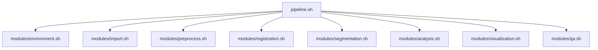

# Brain MRI Processing Pipeline: Modularization Plan

This document outlines the detailed plan for modularizing the existing `processing_script.sh` into a more maintainable and extensible architecture.

## Current State Analysis

The current implementation consists of a large monolithic script (`processing_script.sh`) with several key components:

1. **Environment Setup and Configuration** - Sets up paths, logging, and parameters
2. **QA/Validation Functions** - Extensive but not fully integrated
3. **Dependency Checks** - Verifies required tools are installed
4. **Core Processing Functions** - Image processing, registration, segmentation
5. **Hyperintensity Detection** - Detection and analysis of white matter hyperintensities
6. **Visualization and Reporting** - Multi-threshold overlays and HTML reports

The main issues identified:

- Lack of modularization makes the code difficult to maintain and extend
- QA/Validation blocks are well-defined but not fully integrated
- Some FSL/FIRST functions remain but shouldn't be invoked
- Hyperintensity detection needs better integration
- Multi-threshold overlays and HTML reports need refinement
- Some functions are accidentally nested but shouldn't be

## Proposed Architecture

We will implement a modular architecture with a single main script that sources modular components:



## File Structure

```
brainMRI-ants-e2e-pipeline/
├── pipeline.sh                   # Main pipeline script
├── README.md                     # Project documentation
├── LICENSE                       # License file
├── .gitignore                    # Git ignore file
├── modules/                      # Modular components
│   ├── environment.sh            # Environment setup
│   ├── import.sh                 # Data import functions
│   ├── preprocess.sh             # Preprocessing functions
│   ├── registration.sh           # Registration functions
│   ├── segmentation.sh           # Segmentation functions
│   ├── analysis.sh               # Analysis functions
│   ├── visualization.sh          # Visualization functions
│   └── qa.sh                     # QA/Validation functions
├── config/                       # Configuration files
│   ├── default_config.sh         # Default configuration
│   └── quality_thresholds.sh     # QA thresholds
└── docs/                         # Documentation
    ├── workflow.md               # End-to-end workflow documentation
    └── modularization_plan.md    # Modularization plan
```

## Function Allocation

Below is a detailed mapping of all existing functions to their new locations in the modular architecture. This ensures that all current functionality is preserved and properly organized.

### Environment Module (modules/environment.sh)

| Function | Description | Notes |
|----------|-------------|-------|
| `log_message` | Log message to file and stderr | Appears twice in current script, will be unified |
| `log_formatted` | Log formatted message with color | Appears twice in current script, will be unified |
| `check_command` | Check if command exists | Appears twice in current script, will be unified |
| `check_ants` | Check ANTs installation | Appears twice in current script, will be unified |
| `check_fsl` | Check FSL installation | Appears twice in current script, will be unified |
| `check_freesurfer` | Check FreeSurfer installation | Appears twice in current script, will be unified |
| `check_c3d` | Check Convert3D installation | |
| `check_dcm2niix` | Check dcm2niix installation | |
| `check_os` | Check operating system | |
| `standardize_datatype` | Standardize data type | Appears twice in current script, will be unified |
| `set_sequence_params` | Set sequence parameters | Appears twice in current script, will be unified |

### QA Module (modules/qa.sh)

| Function | Description | Notes |
|----------|-------------|-------|
| `track_pipeline_progress` | Track pipeline progress | Appears twice in current script, will be unified |
| `qa_check_image` | Check image quality | |
| `qa_check_registration_dims` | Check registration dimensions | |
| `qa_check_image_correlation` | Check image correlation | |
| `qa_check_mask` | Check mask quality | |
| `calculate_dice` | Calculate Dice coefficient | |
| `calculate_jaccard` | Calculate Jaccard index | |
| `calculate_hausdorff` | Calculate Hausdorff distance | |
| `validate_transformation` | Validate transformation | |
| `calculate_cc` | Calculate cross-correlation | |
| `calculate_mi` | Calculate mutual information | |
| `calculate_ncc` | Calculate normalized cross-correlation | |

### Import Module (modules/import.sh)

| Function | Description | Notes |
|----------|-------------|-------|
| `deduplicate_identical_files` | Deduplicate identical files | Appears twice in current script, will be unified |
| `extract_siemens_metadata` | Extract Siemens metadata | |
| `convert_dicom_to_nifti` | Convert DICOM to NIfTI | New function to encapsulate dcm2niix conversion |
| `validate_dicom_files` | Validate DICOM files | New function for QA of DICOM files |
| `validate_nifti_files` | Validate NIfTI files | New function for QA of converted NIfTI files |
| `process_all_nifti_files_in_dir` | Process all NIfTI files in directory | Moved from preprocess.sh to import.sh |
| `import_dicom_data` | Import DICOM data | New function to handle DICOM import |

### Preprocessing Module (modules/preprocess.sh)

| Function | Description | Notes |
|----------|-------------|-------|
| `combine_multiaxis_images` | Combine multi-axial images | Appears twice in current script, will be unified |
| `combine_multiaxis_images_highres` | Combine multi-axial images with high resolution | |
| `calculate_inplane_resolution` | Calculate in-plane resolution | |
| `get_n4_parameters` | Get N4 bias field correction parameters | Appears twice in current script, will be unified |
| `optimize_ants_parameters` | Optimize ANTs parameters | Appears twice in current script, will be unified |
| `process_n4_correction` | Process N4 bias field correction | Appears twice in current script, will be unified |
| `standardize_dimensions` | Standardize dimensions | Appears twice in current script, will be unified |
| `process_cropping_with_padding` | Process cropping with padding | |

### Registration Module (modules/registration.sh)

| Function | Description | Notes |
|----------|-------------|-------|
| `registration_flair_to_t1` | Register FLAIR to T1 | Will be renamed to `register_t2_flair_to_t1mprage` for clarity |
| `create_registration_visualizations` | Create registration visualizations | New function to generate registration QC visualizations |

### Segmentation Module (modules/segmentation.sh)

| Function | Description | Notes |
|----------|-------------|-------|
| `extract_brainstem_standardspace` | Extract brainstem in standard space | |
| `extract_brainstem_talairach` | Extract brainstem in Talairach space | Will be conditionally bypassed as it uses FSL/FIRST |
| `extract_brainstem_final` | Final brainstem extraction | |
| `extract_brainstem_ants` | Extract brainstem using ANTs | This will be the primary method used |

### Analysis Module (modules/analysis.sh)

| Function | Description | Notes |
|----------|-------------|-------|
| `detect_hyperintensities` | Detect hyperintensities | |
| `analyze_clusters` | Analyze hyperintensity clusters | New function to analyze clusters |
| `quantify_volumes` | Quantify hyperintensity volumes | New function to quantify volumes |

### Visualization Module (modules/visualization.sh)

| Function | Description | Notes |
|----------|-------------|-------|
| `generate_qc_visualizations` | Generate QC visualizations | |
| `create_multi_threshold_overlays` | Create multi-threshold overlays | New function to create overlays |
| `generate_html_report` | Generate HTML report | New function to generate reports |

### Pipeline Module (pipeline.sh)

| Function | Description | Notes |
|----------|-------------|-------|
| `run_pipeline_batch` | Run pipeline in batch mode | Will be integrated into main script with options |
| `process_subject_with_validation` | Process subject with validation | Will be integrated into main script workflow |

## Implementation Steps

### 1. Create Directory Structure

```bash
mkdir -p modules config
```

### 2. Extract Environment Setup (modules/environment.sh)

Extract the following functions and related code:
- `log_message`
- `log_formatted`
- `check_command`
- `check_ants`
- `check_fsl`
- `check_freesurfer`
- `check_c3d`
- `check_dcm2niix`
- `check_os`
- `standardize_datatype`
- `set_sequence_params`

### 3. Extract QA/Validation Functions (modules/qa.sh)

Extract the following functions:
- `track_pipeline_progress`
- `qa_check_image`
- `qa_check_registration_dims`
- `qa_check_image_correlation`
- `qa_check_mask`
- `calculate_dice`
- `calculate_jaccard`
- `calculate_hausdorff`
- `validate_transformation`
- `calculate_cc`
- `calculate_mi`
- `calculate_ncc`

### 4. Extract Import Functions (modules/import.sh)

Extract the following functions:
- `deduplicate_identical_files`
- `extract_siemens_metadata`
- `process_all_nifti_files_in_dir`

Create new functions:
- `convert_dicom_to_nifti`
- `validate_dicom_files`
- `validate_nifti_files`
- `import_dicom_data`

### 5. Extract Preprocessing Functions (modules/preprocess.sh)

Extract the following functions:
- `combine_multiaxis_images`
- `combine_multiaxis_images_highres`
- `calculate_inplane_resolution`
- `get_n4_parameters`
- `optimize_ants_parameters`
- `process_n4_correction`
- `standardize_dimensions`
- `process_cropping_with_padding`

### 6. Extract Registration Functions (modules/registration.sh)

Extract the following functions:
- `registration_flair_to_t1` (rename to `register_t2_flair_to_t1mprage`)

Create new functions:
- `create_registration_visualizations`

### 7. Extract Segmentation Functions (modules/segmentation.sh)

Extract the following functions:
- `extract_brainstem_standardspace`
- `extract_brainstem_talairach` (with conditional bypass)
- `extract_brainstem_final`
- `extract_brainstem_ants`

### 8. Extract Analysis Functions (modules/analysis.sh)

Extract the following functions:
- `detect_hyperintensities`

Create new functions:
- `analyze_clusters`
- `quantify_volumes`

### 9. Extract Visualization Functions (modules/visualization.sh)

Extract the following functions:
- `generate_qc_visualizations`

Create new functions:
- `create_multi_threshold_overlays`
- `generate_html_report`

### 10. Create Main Pipeline Script (pipeline.sh)

Create a new main script that sources all modules and orchestrates the workflow, integrating:
- `run_pipeline_batch`
- `process_subject_with_validation`

```bash
#!/usr/bin/env bash
#
# pipeline.sh - Main script for the brain MRI processing pipeline
#
# Usage: ./pipeline.sh [options]
#
# Options:
#   -c, --config FILE    Configuration file (default: config/default_config.sh)
#   -i, --input DIR      Input directory (default: ../DiCOM)
#   -o, --output DIR     Output directory (default: ../mri_results)
#   -s, --subject ID     Subject ID (default: derived from input directory)
#   -q, --quality LEVEL  Quality preset (LOW, MEDIUM, HIGH) (default: MEDIUM)
#   -p, --pipeline TYPE  Pipeline type (BASIC, FULL, CUSTOM) (default: FULL)
#   -h, --help           Show this help message and exit
#

# Set strict error handling
set -e
set -u
set -o pipefail

# Source modules
source modules/environment.sh
source modules/import.sh
source modules/preprocess.sh
source modules/registration.sh
source modules/segmentation.sh
source modules/analysis.sh
source modules/visualization.sh
source modules/qa.sh

# Parse command line arguments
parse_arguments "$@"

# Initialize environment
initialize_environment

# Check dependencies
check_dependencies

# Create directories
create_directories

# Import and convert data
import_dicom_data
validate_dicom_files
extract_siemens_metadata
convert_dicom_to_nifti
validate_nifti_files
deduplicate_identical_files
process_all_nifti_files_in_dir

# Preprocessing
combine_multiaxis_images
process_n4_correction
extract_brain
standardize_dimensions
process_cropping_with_padding

# Registration
register_t2_flair_to_t1mprage
create_registration_visualizations

# Segmentation
extract_brainstem_ants
extract_brainstem_final

# Analysis
detect_hyperintensities
analyze_clusters
quantify_volumes

# Visualization and reporting
generate_qc_visualizations
create_multi_threshold_overlays
generate_html_report

# Track pipeline progress
track_pipeline_progress "$SUBJECT_ID" "$RESULTS_DIR"

log_message "Pipeline completed successfully"
```

## Function Deduplication and Nesting Issues

Several functions appear multiple times in the current script. These will be unified in the modular architecture:

1. `log_message` - Appears twice, will be unified in environment.sh
2. `log_formatted` - Appears twice, will be unified in environment.sh
3. `track_pipeline_progress` - Appears twice, will be unified in qa.sh
4. `standardize_datatype` - Appears twice, will be unified in environment.sh
5. `set_sequence_params` - Appears twice, will be unified in environment.sh
6. `check_command` - Appears twice, will be unified in environment.sh
7. `check_ants` - Appears twice, will be unified in environment.sh
8. `check_fsl` - Appears twice, will be unified in environment.sh
9. `check_freesurfer` - Appears twice, will be unified in environment.sh
10. `deduplicate_identical_files` - Appears twice, will be unified in import.sh
11. `combine_multiaxis_images` - Appears twice, will be unified in preprocess.sh
12. `get_n4_parameters` - Appears twice, will be unified in preprocess.sh
13. `optimize_ants_parameters` - Appears twice, will be unified in preprocess.sh
14. `process_n4_correction` - Appears twice, will be unified in preprocess.sh
15. `standardize_dimensions` - Appears twice, will be unified in preprocess.sh

Additionally, some functions appear to be accidentally nested in the current script. These will be properly separated in the modular architecture:

1. `combine_multiaxis_images_highres` - Currently nested, will be properly defined in preprocess.sh
2. `calculate_inplane_resolution` - Currently nested, will be properly defined in preprocess.sh

## QA/Validation Integration

QA/validation functions will be integrated throughout the pipeline as mandatory steps:

1. After DICOM import and conversion:
   ```bash
   validate_dicom_files "$SRC_DIR"
   validate_nifti_files "$EXTRACT_DIR"
   ```

2. After each image processing step:
   ```bash
   qa_check_image "$output_file"
   ```

3. After registration:
   ```bash
   qa_check_registration_dims "$warped_file" "$reference_file"
   qa_check_image_correlation "$warped_file" "$reference_file"
   validate_transformation "$t1_file" "$flair_file" "$transform" \
                          "$t1_mask" "$flair_mask" \
                          "$validation_dir" "$threshold"
   ```

4. After segmentation:
   ```bash
   qa_check_mask "$mask_file"
   calculate_dice "$reference_mask" "$segmented_mask"
   calculate_jaccard "$reference_mask" "$segmented_mask"
   ```

5. After hyperintensity detection:
   ```bash
   # Validate using multiple thresholds
   for mult in 1.5 2.0 2.5 3.0; do
       # Check hyperintensity volume
       volume=$(fslstats "${output_prefix}_thresh${mult}.nii.gz" -V | awk '{print $1}')
       
       # Check cluster statistics
       cluster --in="${output_prefix}_thresh${mult}_bin.nii.gz" \
               --thresh=0.5 \
               --oindex="${output_prefix}_thresh${mult}_clusters" \
               --connectivity=26 \
               --mm > "${output_prefix}_thresh${mult}_clusters.txt"
   done
   ```

6. At the end of each major step:
   ```bash
   track_pipeline_progress "$subject_id" "$output_dir"
   ```

## Implementation Timeline

1. **Week 1**: Create directory structure and extract environment setup
2. **Week 2**: Extract QA/validation functions and import functions
3. **Week 3**: Extract preprocessing and registration functions
4. **Week 4**: Extract segmentation and analysis functions
5. **Week 5**: Extract visualization functions and create main pipeline script
6. **Week 6**: Testing and refinement

## Conclusion

This modularization plan provides a detailed roadmap for transforming the existing `processing_script.sh` into a more maintainable and extensible architecture. The modular design allows for easier maintenance, extension, and customization, while the integrated QA/validation ensures data quality and processing accuracy.

All existing functions have been accounted for and allocated to appropriate modules, with duplicated functions unified and accidentally nested functions properly separated. The FSL/FIRST functions that shouldn't be invoked will be conditionally bypassed, with ANTs-based alternatives used as the primary methods.