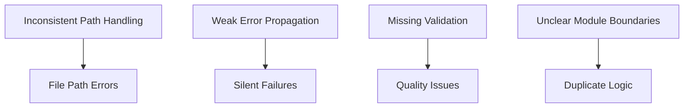

# Module Integration Improvements

This document outlines the detailed plan for improving the integration between modules in the brain MRI ANTs E2E pipeline.

## 1. Current Issues



The current implementation has several integration issues:

1. **Inconsistent Path Handling**: Files paths are constructed in different ways across modules
2. **Weak Error Propagation**: Errors in one module may not be properly propagated
3. **Missing Validation**: Insufficient validation between module steps
4. **Unclear Module Boundaries**: Some functions appear in multiple modules

## 2. Implementation Plan

### 2.1 Centralized Path Handling

```bash
# Create a centralized path generation function in environment.sh

get_output_path() {
    local module="$1"       # Module name (e.g., "bias_corrected")
    local basename="$2"     # Base filename
    local suffix="$3"       # Suffix to add (e.g., "_n4")
    
    echo "${RESULTS_DIR}/${module}/${basename}${suffix}.nii.gz"
}

# Example usage in modules
output_file=$(get_output_path "bias_corrected" "$basename" "_n4")
```

Tasks:
- [ ] Implement the `get_output_path` function in environment.sh
- [ ] Update import.sh to use centralized path handling
- [ ] Update preprocess.sh to use centralized path handling
- [ ] Update registration.sh to use centralized path handling
- [ ] Update segmentation.sh to use centralized path handling
- [ ] Update analysis.sh to use centralized path handling
- [ ] Update visualization.sh to use centralized path handling

### 2.2 Improved Error Handling and Propagation

```bash
# Add consistent error handling pattern to functions

process_example() {
    local input_file="$1"
    local output_file="$2"
    
    # Input validation
    if [ ! -f "$input_file" ]; then
        log_formatted "ERROR" "Input file not found: $input_file"
        return 1
    fi
    
    # Process with error checking
    if ! some_command "$input_file" "$output_file"; then
        log_formatted "ERROR" "Processing failed for $input_file"
        return 2
    fi
    
    # Validate output
    if [ ! -f "$output_file" ]; then
        log_formatted "ERROR" "Output file was not created: $output_file"
        return 3
    fi
    
    log_formatted "SUCCESS" "Processing complete: $output_file"
    return 0
}
```

Tasks:
- [ ] Update environment.sh with enhanced error handling functions
- [ ] Add consistent error codes across modules
- [ ] Implement error propagation in pipeline.sh
- [ ] Add error summary and reporting functions

### 2.3 Adding Validation Checkpoints

```bash
# Add validation between module steps

validate_processing_step() {
    local file="$1"
    local step="$2"
    local expected_dims="$3"  # Optional
    
    if [ ! -f "$file" ]; then
        log_formatted "ERROR" "Validation failed: $step - file not found: $file"
        return 1
    fi
    
    # Check basic file properties
    local file_size=$(stat -f "%z" "$file")
    if [ "$file_size" -eq 0 ]; then
        log_formatted "ERROR" "Validation failed: $step - file is empty: $file"
        return 2
    fi
    
    # If dimensions specified, check them
    if [ -n "$expected_dims" ]; then
        local dims=$(fslinfo "$file" | grep -E "^dim[1-3]" | awk '{print $2}' | tr '\n' 'x')
        if [ "$dims" != "$expected_dims" ]; then
            log_formatted "ERROR" "Validation failed: $step - unexpected dimensions: got $dims, expected $expected_dims"
            return 3
        fi
    fi
    
    log_formatted "SUCCESS" "Validation passed: $step"
    return 0
}
```

Tasks:
- [ ] Implement validation functions in qa.sh
- [ ] Add validation checkpoints after each major processing step in pipeline.sh
- [ ] Create validation logs for each processing stage

### 2.4 Clarifying Module Boundaries

Tasks:
- [ ] Review function placement across modules
- [ ] Move misplaced functions to appropriate modules
- [ ] Update function references and exports accordingly
- [ ] Document module boundaries and responsibilities

## 3. Testing and Validation

### 3.1 Integration Testing

Tasks:
- [ ] Create test workflows that exercise module interfaces
- [ ] Verify proper error propagation across module boundaries
- [ ] Test file path handling in different execution contexts

### 3.2 Regression Testing

Tasks:
- [ ] Compare output from original pipeline and updated pipeline
- [ ] Verify that all outputs are functionally equivalent
- [ ] Document any expected differences

### 3.3 Error Handling Testing

Tasks:
- [ ] Simulate various error conditions
- [ ] Verify error messages are clear and helpful
- [ ] Confirm pipeline handles errors gracefully