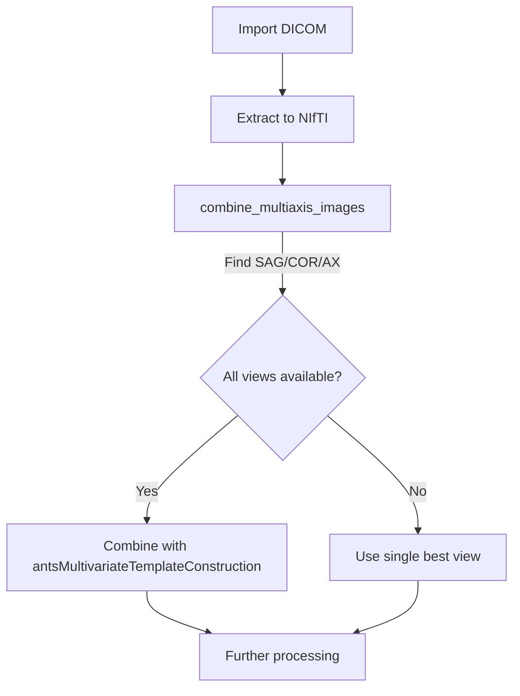
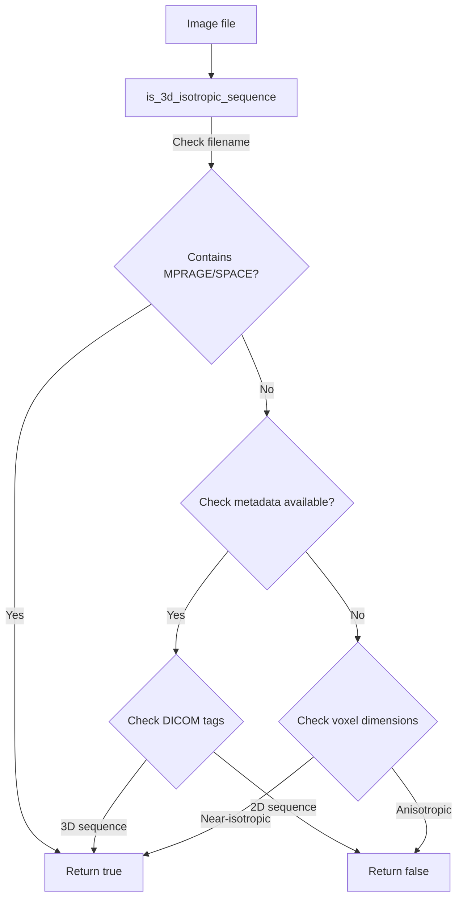
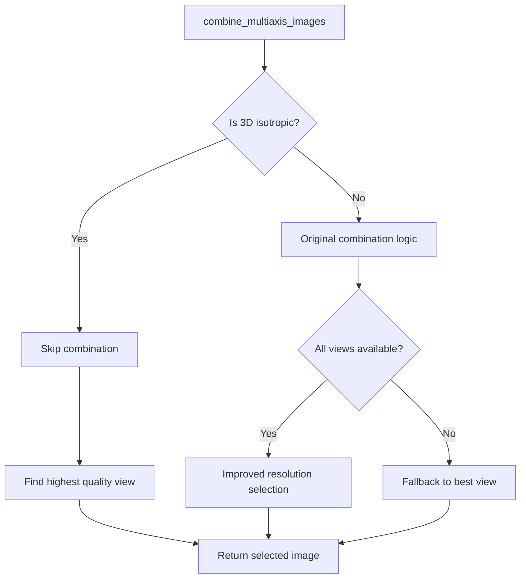
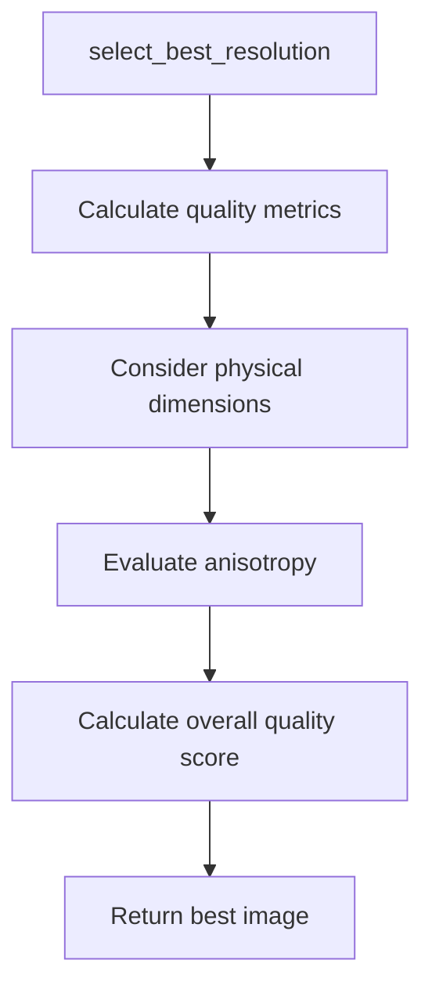
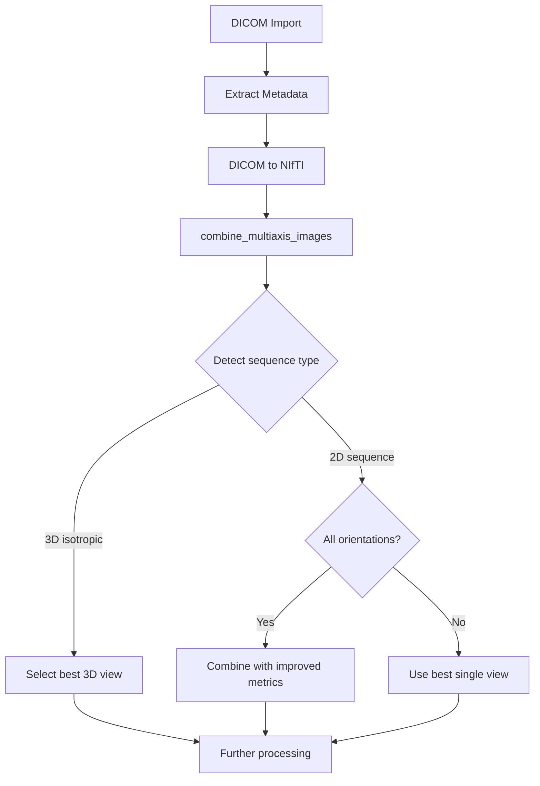

# Multiaxial Image Combination Improvements

## Overview

This document outlines a plan to improve the `combine_multiaxis_images` function to:

1. Automatically detect and handle 3D isotropic sequences appropriately (skip combination)
2. Implement better resolution selection logic for 2D sequences (considering anisotropy)
3. Enhance DICOM metadata extraction for accurate sequence identification
4. Refactor duplicated brain extraction code
5. Add comprehensive documentation

## Current Workflow and Issues



**Current Issues:**

- Uses total voxel count (d1×d2×d3) for "best" selection, which doesn't account for anisotropy
- Doesn't distinguish 3D isotropic sequences from 2D multi-slice acquisitions
- Potentially degrades quality for 3D sequences by combining reformatted views
- Contains duplicated brain extraction code across modules
- Lacks documentation on when multi-axial combination is beneficial

## Proposed Changes

### 1. Sequence Type Detection

Implement a function to detect 3D isotropic sequences:



### 2. Improved Sequence Handling

Modify `combine_multiaxis_images` to handle sequences differently:



### 3. Enhanced Resolution Selection

For 2D sequences, implement a better "best resolution" selection:



## Implementation Details

### 1. DICOM Metadata Enhancement

Update `extract_dicom_metadata.py` to extract sequence-specific information:

```python
# New fields to extract
if hasattr(dcm, 'ImageType'):
    metadata['imageType'] = safe_value(dcm.ImageType)
if hasattr(dcm, 'MRAcquisitionType'):
    metadata['acquisitionType'] = safe_value(dcm.MRAcquisitionType)
if hasattr(dcm, 'Private_0019_10e0'): # Siemens 3D flag
    metadata['is3D'] = True
```

### 2. 3D Sequence Detection Function

Add a new function to detect 3D isotropic sequences:

```bash
# Function to detect 3D isotropic sequences
is_3d_isotropic_sequence() {
  local file="$1"
  local filename=$(basename "$file")
  
  # Check filename first (fast path)
  if [[ "$filename" == *"MPRAGE"* ]] || 
     [[ "$filename" == *"SPACE"* ]] || 
     [[ "$filename" == *"MP2RAGE"* ]]; then
    return 0  # true
  fi
  
  # Check metadata if available
  local metadata_file="${RESULTS_DIR}/metadata/siemens_params.json"
  if [ -f "$metadata_file" ]; then
    local acquisitionType=$(jq -r '.acquisitionType // ""' "$metadata_file")
    if [[ "$acquisitionType" == "3D" ]]; then
      return 0  # true
    fi
  fi
  
  # Check if voxels are approximately isotropic
  local pixdim1=$(fslval "$file" pixdim1)
  local pixdim2=$(fslval "$file" pixdim2)
  local pixdim3=$(fslval "$file" pixdim3)
  
  # Calculate max difference between dimensions
  local max_diff=$(echo "scale=3; m=($pixdim1-$pixdim2); if(m<0) m=-m; 
                    n=($pixdim1-$pixdim3); if(n<0) n=-m;
                    if(m>n) m else n" | bc -l)
  
  # Check if approximately isotropic (within 15%)
  local max_dim=$(echo "scale=3; m=$pixdim1; 
                   if(m<$pixdim2) m=$pixdim2; 
                   if(m<$pixdim3) m=$pixdim3; m" | bc -l)
  
  local threshold=$(echo "scale=3; $max_dim * 0.15" | bc -l)
  
  if (( $(echo "$max_diff <= $threshold" | bc -l) )); then
    return 0  # true
  fi
  
  return 1  # false
}
```

### 3. Enhanced Resolution Selection

```bash
# Function to calculate a resolution quality metric
calculate_resolution_quality() {
  local file="$1"
  
  # Get dimensions in voxels
  local d1=$(fslval "$file" dim1)
  local d2=$(fslval "$file" dim2)
  local d3=$(fslval "$file" dim3)
  
  # Get physical dimensions in mm
  local p1=$(fslval "$file" pixdim1)
  local p2=$(fslval "$file" pixdim2)
  local p3=$(fslval "$file" pixdim3)
  
  # Calculate in-plane resolution (average of x and y)
  local inplane_res=$(echo "scale=3; ($p1 + $p2) / 2" | bc -l)
  
  # Calculate anisotropy factor (penalizes highly anisotropic voxels)
  local anisotropy=$(echo "scale=3; $p3 / $inplane_res" | bc -l)
  
  # Calculate quality metric:
  # Higher for more voxels, lower for more anisotropy
  # Prioritizes in-plane resolution for 2D sequences
  local quality=$(echo "scale=3; ($d1 * $d2 * $d3) / ($inplane_res * $inplane_res * $p3 * sqrt($anisotropy))" | bc -l)
  
  echo "$quality"
}
```

### 4. Modified combine_multiaxis_images Function

```bash
# Updated function to combine multi-axial images
combine_multiaxis_images() {
  local sequence_type="$1"
  local output_dir="$2"
  
  # [existing setup code...]
  
  # Find SAG, COR, AX files as before
  # [existing file finding code...]
  
  # Select best quality file from each orientation
  # [uses calculate_resolution_quality instead of just voxel count]
  
  # Check if sequence is 3D isotropic
  local is_3d=false
  for file in "${sag_files[@]}" "${cor_files[@]}" "${ax_files[@]}"; do
    if is_3d_isotropic_sequence "$file"; then
      is_3d=true
      log_message "Detected 3D isotropic sequence: $file"
      break
    fi
  done
  
  local out_file=$(get_output_path "combined" "${sequence_type}" "_combined_highres")
  
  if [ "$is_3d" = true ]; then
    # For 3D sequences, skip combination and use best single file
    log_message "3D isotropic sequence detected, skipping multi-axis combination"
    
    local best_file=""
    local best_quality=0
    
    # Find best quality 3D file
    for file in "${sag_files[@]}" "${cor_files[@]}" "${ax_files[@]}"; do
      if is_3d_isotropic_sequence "$file"; then
        local quality=$(calculate_resolution_quality "$file")
        if (( $(echo "$quality > $best_quality" | bc -l) )); then
          best_file="$file"
          best_quality="$quality"
        fi
      fi
    done
    
    if [ -n "$best_file" ]; then
      log_message "Using highest quality 3D volume: $best_file"
      cp "$best_file" "$out_file"
      standardize_datatype "$out_file" "$out_file" "$OUTPUT_DATATYPE"
      return 0
    fi
    
    # Fallback to standard method if no 3D file found despite detection
    log_message "Warning: 3D sequence detected but no suitable file found, falling back to standard method"
  fi
  
  # Original logic for 2D sequences
  if [ -n "$best_sag" ] && [ -n "$best_cor" ] && [ -n "$best_ax" ]; then
    # [existing combination code...]
  else
    # [existing fallback code...]
  fi
}
```

### 5. Brain Extraction Refactoring

Extract the duplicated brain extraction code into a common function:

```bash
# Common brain extraction function to remove duplication
perform_brain_extraction() {
  local input_file="$1"
  local output_prefix="$2"
  
  # Validate input file
  if ! validate_nifti "$input_file" "Input file for brain extraction"; then
    log_error "Invalid input file for brain extraction: $input_file" $ERR_DATA_CORRUPT
    return $ERR_DATA_CORRUPT
  fi
  
  log_message "Running brain extraction on: $(basename "$input_file")"
  
  # Run ANTs brain extraction
  antsBrainExtraction.sh -d 3 \
    -a "$input_file" \
    -k 1 \
    -o "$output_prefix" \
    -e "$TEMPLATE_DIR/$EXTRACTION_TEMPLATE" \
    -m "$TEMPLATE_DIR/$PROBABILITY_MASK" \
    -f "$TEMPLATE_DIR/$REGISTRATION_MASK"
    
  # Validate output files
  local brain_file="${output_prefix}BrainExtractionBrain.nii.gz"
  local mask_file="${output_prefix}BrainExtractionMask.nii.gz"
  
  if [ ! -f "$brain_file" ] || [ ! -f "$mask_file" ]; then
    log_error "Brain extraction failed to produce output files" $ERR_PREPROC
    return $ERR_PREPROC
  fi
  
  return 0
}
```

## Documentation Updates

Add documentation in the form of comments at the beginning of the `combine_multiaxis_images` function:

```bash
# Function to combine multi-axial images
# 
# This function detects and handles different types of MRI sequences:
# 
# 1. 3D Isotropic Sequences (e.g., T1-MPRAGE, T2-SPACE-FLAIR):
#    - Automatically detected via filename or metadata
#    - Skips multi-axis combination (which would degrade quality)
#    - Uses the highest quality single view
# 
# 2. 2D Sequences (e.g., conventional T2-FLAIR, T2-TSE):
#    - Combines views from different orientations when available
#    - Uses enhanced resolution selection that considers anisotropy
#    - Falls back to best single orientation when needed
# 
# Resolution selection considers:
#    - Physical dimensions (in mm)
#    - Anisotropy (penalizes highly anisotropic voxels)
#    - Total voxel count
```

## Testing Plan

1. Test with different 3D isotropic sequences (T1-MPRAGE, T2-SPACE-FLAIR)
2. Test with conventional 2D sequences
3. Verify that 3D detection works in different scenarios:
   - When sequence name contains 3D keywords
   - When metadata indicates 3D acquisition
   - When voxels are approximately isotropic
4. Verify improved resolution selection logic with anisotropic acquisitions
5. Check that the output file naming and paths remain consistent

## Integration and Downstream Effects

The updated implementation maintains the same interface and output paths, ensuring compatible integration with downstream processing. Key considerations:

1. **Output Consistency**: The function will still produce a file with the same naming convention and location, ensuring pipeline compatibility.

2. **Path Management**: All paths will continue to use the established directory structure and naming conventions.

3. **Downstream Processing**: Since output file names remain consistent, modules that depend on the combined images (like N4 bias correction and registration) will work without modification.

4. **Fallback Mechanisms**: If 3D detection fails or no suitable 3D file is found, the system will fall back to the original behavior, ensuring robustness.

5. **Logging**: Enhanced logging will provide visibility into decision-making for quality control and troubleshooting.

## Improved Workflow Diagram



## Summary of Changes

This implementation will:

1. Improve image quality by avoiding unnecessary combination of 3D acquisitions
2. Provide a more sophisticated selection process for 2D sequences
3. Reduce processing time for 3D sequences (by skipping combination)
4. Eliminate duplicate code, making maintenance easier
5. Document the approach and decisions clearly