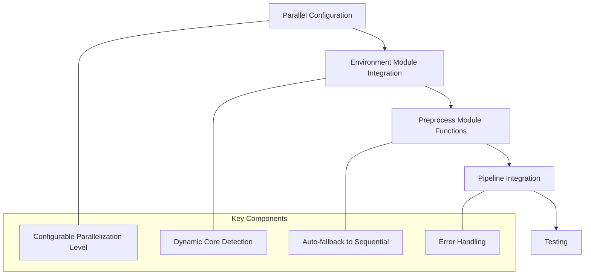

# Parallel Processing Implementation

This document summarizes the implementation of parallel processing in the brain MRI pipeline. It covers the changes made to restore parallelization capabilities that were present in the original `processing_script.sh` but lost during modularization.

## 1. Implementation Overview

## 2. Configuration System

A dedicated configuration file (`config/parallel_config.sh`) was created to control parallel processing behavior. This configuration includes:

- `PARALLEL_JOBS`: Number of parallel jobs (configurable)
- `MAX_CPU_INTENSIVE_JOBS`: Limit for CPU-intensive operations
- `PARALLEL_TIMEOUT`: Optional timeout for operations
- `PARALLEL_HALT_MODE`: How to handle failures
- `AUTO_DETECT_CORES`: Option to automatically configure based on available CPU cores

This approach allows easy customization without modifying the core code.

## 3. Environment Module Enhancements

The `environment.sh` module was enhanced with several key functions:

- `check_parallel`: Verifies GNU parallel is available
- `load_parallel_config`: Loads configuration from the config file
- `run_parallel`: Generic framework for running functions in parallel across multiple files

These functions provide a consistent interface for parallel operations throughout the pipeline.

## 4. Parallel Processing Functions

The `preprocess.sh` module was updated with parallel versions of key CPU-intensive functions:

- `run_parallel_n4_correction`: Runs N4 bias correction in parallel
- `run_parallel_standardize_dimensions`: Runs dimension standardization in parallel
- `run_parallel_brain_extraction`: Runs brain extraction in parallel

Each function includes proper error handling and validation, and will automatically fall back to sequential processing if parallel execution is not available.

## 5. Pipeline Integration

The `pipeline.sh` script was updated to:

- Load parallel configuration at startup
- Use parallel processing for key bottleneck operations when available
- Support parallel batch processing for multiple subjects
- Include robust error handling for parallel operations

## 6. Testing

A test script (`test_parallel.sh`) was created to:

- Verify the parallel processing implementation
- Measure performance improvements
- Compare sequential and parallel execution times
- Calculate speedup factors and efficiency

## 7. Compatibility Considerations

- **OS Compatibility**: Works on both macOS and Linux
- **Fallback Mechanism**: Gracefully falls back to sequential processing when:
  - GNU parallel is not installed
  - Parallelization is disabled in config
  - The system has limited resources
  
- **Error Handling**: Robust error handling for parallel operations

## 8. Performance Impact

The implementation is expected to provide significant performance improvements, especially for:

1. **N4 Bias Correction**: CPU-intensive operation that benefits greatly from parallelization
2. **Image Standardization**: Memory-intensive operation that can be parallelized
3. **Brain Extraction**: Very CPU-intensive, limited to a subset of cores to prevent system overload
4. **Batch Processing**: Processing multiple subjects in parallel

## 9. Comparison with Original Implementation

The implementation restores the parallelization from the original `processing_script.sh` but with several improvements:

1. **Configurability**: More configurable than the original hardcoded implementation
2. **Robustness**: Better error handling and reporting
3. **CPU Usage Control**: More granular control over CPU usage
4. **Integration**: Better integration with the modular architecture

## 10. Future Enhancements

Potential future enhancements include:

1. **GPU Acceleration**: Leverage GPU for compatible operations (particularly for Apple Silicon)
2. **Distributed Processing**: Extend to support processing across multiple machines
3. **Parameter Optimization**: Auto-tune parameters based on workload characteristics
4. **Resource Monitoring**: Add real-time monitoring of CPU/memory usage