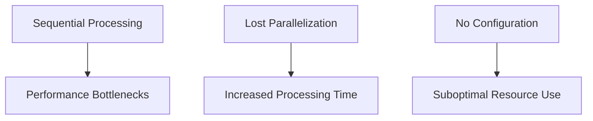

# Parallel Processing Restoration

This document outlines the detailed plan for restoring parallel processing capabilities in the brain MRI ANTs E2E pipeline, which were present in the original `processing_script.sh` but lost during modularization.

## 1. Current Issues



The current implementation has several parallelization issues:

1. **Lost Parallelization**: The GNU parallel implementation present in the original script is missing
2. **Sequential Processing**: CPU-intensive operations now run sequentially
3. **No Configuration**: Lack of configurable parallelization level
4. **Inefficient Resource Use**: Full CPU capability is not utilized

## 2. Original Parallelization Analysis

The original script used GNU parallel in several key areas:

```bash
# Example from processing_script.sh (line 3664)
find "${RESULTS_DIR}/combined" -name "*.nii.gz" -print0 | parallel -0 -j 11 process_all_nifti_files_in_dir {}
```

```bash
# Example from processing_script.sh (bias correction)
find "$COMBINED_DIR" -name "*.nii.gz" -maxdepth 1 -type f -print0 | \
parallel -0 -j 11 process_n4_correction {}
```

```bash
# Example from processing_script.sh (standardization)
find "$RESULTS_DIR/bias_corrected" -name "*n4.nii.gz" -print0 | \
parallel -0 -j 11 standardize_dimensions {}
```

### 2.1 Identified Parallelizable Operations

| Module | Function | Process Type | Parallelization Pattern |
|--------|----------|--------------|-------------------------|
| Preprocessing | `process_all_nifti_files_in_dir` | File processing | Per-file parallelism |
| Preprocessing | `process_n4_correction` | Bias correction | Per-file parallelism |
| Preprocessing | `standardize_dimensions` | Image resampling | Per-file parallelism |
| Analysis | `detect_hyperintensities` | Analysis | Per-threshold parallelism |
| Batch Processing | `run_pipeline_batch` | Multi-subject | Per-subject parallelism |

## 3. Implementation Plan

### 3.1 Parallelization Configuration

Instead of auto-detecting CPU cores, we'll implement a configurable parallelization level through configuration settings:

```bash
# Add to config/default_config.sh

# Default parallelization settings
# Set to 0 to disable parallel processing
# Set to a positive number to specify the number of parallel jobs
# Recommended: Number of CPU cores - 1
PARALLEL_JOBS=4
```

Tasks:
- [ ] Add `PARALLEL_JOBS` parameter to config/default_config.sh
- [ ] Add parameter validation in environment.sh
- [ ] Add GNU parallel detection and fallback mechanism
- [ ] Document recommended settings for different hardware

### 3.2 Parallel Processing Framework

Create a common parallel execution function in environment.sh:

```bash
# Function for parallel execution with proper error handling
run_parallel() {
    local func_name="$1"        # Function to run in parallel
    local find_pattern="$2"     # Find pattern for input files
    local find_path="$3"        # Path to search for files
    local max_depth="${4:-}"    # Optional: max depth for find
    
    # Check if parallel processing is enabled
    if [ "$PARALLEL_JOBS" -le 0 ]; then
        log_formatted "INFO" "Parallel processing disabled. Running in sequential mode."
        # Run sequentially
        local find_cmd="find \"$find_path\" -name \"$find_pattern\""
        [ -n "$max_depth" ] && find_cmd="$find_cmd -maxdepth $max_depth"
        
        while IFS= read -r file; do
            "$func_name" "$file"
        done < <(eval "$find_cmd")
        return $?
    fi
    
    # Check if GNU parallel is installed
    if ! command -v parallel &> /dev/null; then
        log_formatted "WARNING" "GNU parallel not installed. Running in sequential mode."
        # Run sequentially
        local find_cmd="find \"$find_path\" -name \"$find_pattern\""
        [ -n "$max_depth" ] && find_cmd="$find_cmd -maxdepth $max_depth"
        
        while IFS= read -r file; do
            "$func_name" "$file"
        done < <(eval "$find_cmd")
        return $?
    fi
    
    # Build the find command
    local find_cmd="find \"$find_path\" -name \"$find_pattern\""
    [ -n "$max_depth" ] && find_cmd="$find_cmd -maxdepth $max_depth"
    
    # Run in parallel
    log_formatted "INFO" "Running $func_name in parallel with $PARALLEL_JOBS jobs"
    local parallel_cmd="$find_cmd -print0 | parallel -0 -j $PARALLEL_JOBS --halt soon,fail=1 $func_name {}"
    
    # Execute and capture exit code
    eval "$parallel_cmd"
    local exit_code=$?
    
    if [ $exit_code -ne 0 ]; then
        log_formatted "ERROR" "Parallel execution of $func_name failed with exit code $exit_code"
        return $exit_code
    fi
    
    log_formatted "SUCCESS" "Parallel execution of $func_name completed successfully"
    return 0
}
```

Tasks:
- [ ] Implement the `run_parallel` function in environment.sh
- [ ] Add proper documentation for the function
- [ ] Test the function with both parallel and sequential execution

### 3.3 Function Adaptations for Parallel Use

Update existing functions to ensure they work correctly when called in parallel:

```bash
# Example adaptation of process_n4_correction
process_n4_correction() {
    local file="$1"
    # Ensure function uses only the provided argument and doesn't rely on global state that would change in parallel execution
    
    # Capture and log errors properly
    log_message "Processing $file"
    
    # Function implementation...
    
    # Return meaningful exit code
    return $?
}

# Function to run N4 bias correction in parallel
run_parallel_n4_correction() {
    # Export required functions for parallel execution
    export -f process_n4_correction get_n4_parameters log_message log_formatted
    
    # Use common parallel framework
    run_parallel "process_n4_correction" "*.nii.gz" "$COMBINED_DIR" 1
    return $?
}
```

Tasks:
- [ ] Identify all functions to parallelize
- [ ] Update functions to be parallel-safe (no shared state issues)
- [ ] Create wrapper functions for parallel execution
- [ ] Add proper error logging and exit codes

### 3.4 Integration with Pipeline

Update pipeline.sh to use parallel functions:

```bash
# Current sequential code:
# for file in $(find "$COMBINED_DIR" -name "*.nii.gz"); do
#     process_n4_correction "$file"
# done

# Replace with:
run_parallel_n4_correction
if [ $? -ne 0 ]; then
    log_formatted "ERROR" "N4 bias correction failed"
    exit 1
fi
```

Tasks:
- [ ] Update pipeline.sh to use parallel wrappers
- [ ] Implement proper error handling for parallel execution
- [ ] Add parallelization status in pipeline logs

### 3.5 Specific Modules to Update

#### 3.5.1 Preprocess Module

Tasks:
- [ ] Parallelize `process_n4_correction` in preprocess.sh
- [ ] Parallelize `standardize_dimensions` in preprocess.sh
- [ ] Parallelize `process_all_nifti_files_in_dir` in preprocess.sh

#### 3.5.2 Analysis Module

Tasks:
- [ ] Parallelize threshold processing in `detect_hyperintensities`
- [ ] Ensure threshold results are properly combined

#### 3.5.3 Batch Processing

Tasks:
- [ ] Implement parallel subject processing in `run_pipeline_batch`
- [ ] Add proper synchronization for summary generation

## 4. Testing and Validation

### 4.1 Functionality Testing

Tasks:
- [ ] Test each parallelized function individually
- [ ] Verify outputs match sequential execution
- [ ] Test with different parallelization levels

### 4.2 Performance Testing

Tasks:
- [ ] Benchmark processing times with parallelization disabled
- [ ] Benchmark with different parallelization levels
- [ ] Document optimal settings for different hardware

### 4.3 Error Handling Testing

Tasks:
- [ ] Simulate errors in parallel execution
- [ ] Verify proper error propagation
- [ ] Confirm cleanup after parallel failures

### 4.4 Cross-Platform Testing

Tasks:
- [ ] Test on macOS 15
- [ ] Test on Linux (if possible)
- [ ] Document any platform-specific considerations