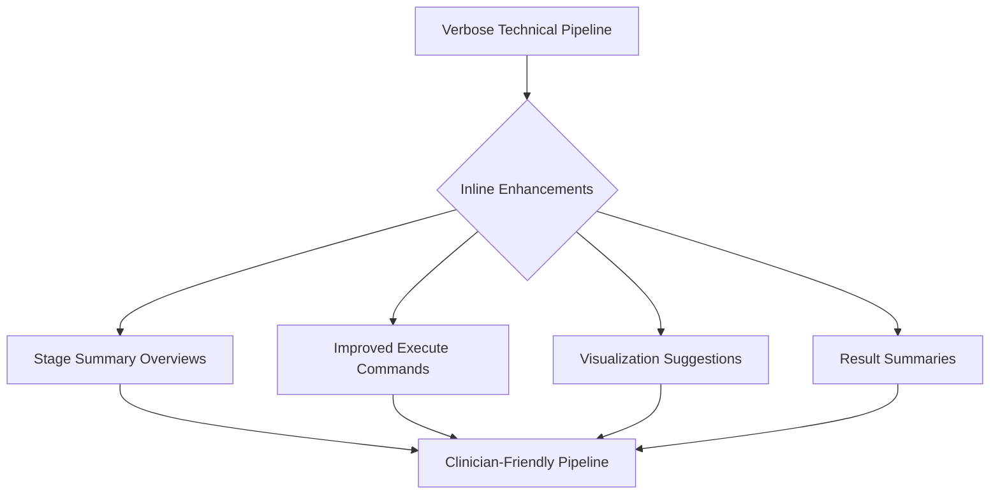

# Pipeline Explanatory Output Enhancement Plan (Revised)

## Overview

This plan outlines improvements to enhance the explanatory value and usability of the neuroimaging pipeline's output by modifying existing functions rather than creating new frameworks. The goal is to make the pipeline more accessible to clinicians who understand neuroimaging fundamentals but may not be familiar with specific technical tools.

## Current Challenges

1. **Excessive Technical Output**: Commands produce verbose diagnostic information that obscures meaningful progress
2. **Lack of Context**: Commands run without explaining their purpose or expected outcomes
3. **Missing Stage Summaries**: No overview of what steps will occur in each processing stage
4. **Limited Visualization Guidance**: No suggestions for how to visualize results at key points

## Improvement Strategy



## 1. Enhance Existing Command Execution Functions

Modify the existing `execute_ants_command` and similar functions in environment.sh rather than creating a new framework:

```bash
# Updated version of execute_ants_command with better explanation and progress
execute_ants_command() {
  local log_prefix="${1:-ants_cmd}"
  local step_description="${2:-ANTs processing step}"  # New parameter for step description
  local diagnostic_log="${LOG_DIR}/${log_prefix}_diagnostic.log"
  local cmd=("${@:3}") # Shift parameters to accommodate the new description parameter
  
  # Create diagnostic log directory if needed
  mkdir -p "$LOG_DIR"
  
  # IMPROVEMENT: Better description of the command being executed
  log_formatted "INFO" "==== $step_description ===="
  log_message "Running ANTs command: ${cmd[0]} (other parameters hidden for clarity)"
  log_message "Full diagnostic output will be saved to: $diagnostic_log"
  
  # Progress indicator with named pipes (keep existing code structure)
  local stdout_pipe=$(mktemp -u)
  local stderr_pipe=$(mktemp -u)
  mkfifo "$stdout_pipe"
  mkfifo "$stderr_pipe"
  
  # Start background processes to handle output with improved filtering
  (
    # Progress indicator counter
    local line_count=0
    
    while IFS= read -r line; do
      # Filter out diagnostic and verbose registration messages
      if ! echo "$line" | grep -qE "^(2)?DIAGNOSTIC|^XXDIAGNOSTIC|convergenceValue|metricValue|ITERATION_TIME|Running.*Transform registration|DIAGNOSTIC|CurrentIteration"; then
        echo "$line" | tee -a "$LOG_FILE"
      else
        # Print a dot to show progress without the verbose output
        line_count=$((line_count + 1))
        if [ $((line_count % 10)) -eq 0 ]; then
          echo -n "." >&2
        fi
        # Still save the diagnostic info to the log file
        echo "$line" >> "$diagnostic_log"
      fi
    done
  ) < "$stdout_pipe" &
  local stdout_pid=$!
  
  tee -a "$diagnostic_log" < "$stderr_pipe" >&2 &
  local stderr_pid=$!
  
  # Execute command directly
  "${cmd[@]}" > "$stdout_pipe" 2> "$stderr_pipe"
  local status=$?
  
  # Wait for output handling processes to complete
  wait $stdout_pid
  wait $stderr_pid
  
  # Remove named pipes
  rm -f "$stdout_pipe" "$stderr_pipe"
  
  # IMPROVEMENT: Better status reporting with time elapsed
  if [ $status -eq 0 ]; then
    log_formatted "SUCCESS" "$step_description completed successfully"
  else
    log_formatted "ERROR" "$step_description failed with status $status"
    # Extract important error lines from the diagnostic log
    tail -n 10 "$diagnostic_log" | grep -v -E "^(2)?DIAGNOSTIC|^XXDIAGNOSTIC|convergenceValue" | tail -n 3
  fi
  
  return $status
}
```

Similarly, update other command execution functions with the same approach.

## 2. Add Stage Summary Functions

Create functions that outline all steps in a stage before the stage begins:

```bash
# Add to the modules (e.g., registration.sh, segmentation.sh)

# Function to show registration stage summary
summarize_registration_stage() {
  local t1_file="$1"
  local flair_file="$2"
  
  log_formatted "INFO" "========================================================"
  log_formatted "INFO" "BEGINNING REGISTRATION STAGE"
  log_formatted "INFO" "========================================================"
  log_message "This stage will align the patient's brain images to standard space"
  log_message "and ensure all modalities are in the same coordinate system."
  log_message ""
  log_message "The following steps will be performed:"
  log_message " 1. Compute initial affine alignment to MNI template"
  log_message " 2. Perform deformable SyN registration for precise alignment"
  log_message " 3. Generate transformation matrices for coordinate conversion"
  log_message " 4. Align FLAIR image to registered T1 for multimodal analysis"
  log_message ""
  log_message "Input files:"
  log_message " - T1: $t1_file"
  log_message " - FLAIR: $flair_file"
  log_message ""
  log_message "Expected output directories:"
  log_message " - ${RESULTS_DIR}/registered/ (containing aligned images)"
  log_message " - ${RESULTS_DIR}/transforms/ (containing transformation matrices)"
  log_message ""
  log_message "This stage typically takes 15-30 minutes depending on image complexity."
  log_formatted "INFO" "========================================================"
}

# Function to show segmentation stage summary
summarize_segmentation_stage() {
  local input_file="$1"
  
  log_formatted "INFO" "========================================================"
  log_formatted "INFO" "BEGINNING SEGMENTATION STAGE"
  log_formatted "INFO" "========================================================"
  log_message "This stage will identify and label different tissue types and"
  log_message "anatomical structures in the brain."
  log_message ""
  log_message "The following steps will be performed:"
  log_message " 1. Tissue classification (white matter, gray matter, CSF)"
  log_message " 2. Brainstem segmentation (midbrain, pons, medulla)"
  log_message " 3. Ventricle segmentation"
  log_message " 4. Generate probability maps for each tissue type"
  log_message ""
  log_message "Input file: $input_file"
  log_message ""
  log_message "Expected output directories:"
  log_message " - ${RESULTS_DIR}/segmentation/tissue/ (tissue classes)"
  log_message " - ${RESULTS_DIR}/segmentation/structures/ (anatomical structures)"
  log_message ""
  log_message "This stage typically takes 10-20 minutes."
  log_formatted "INFO" "========================================================"
}
```

Add similar summary functions for other major stages (brain extraction, bias correction, etc.)

## 3. Add Visualization Suggestions at Key Points

Add visualization suggestions after key processing steps:

```bash
# Function to suggest visualization at appropriate points
suggest_visualization() {
  local primary_file="$1"
  local overlay_file="${2:-}"
  local description="$3"
  
  log_formatted "INFO" "--------------------------------------------------------"
  log_formatted "INFO" "VISUALIZATION SUGGESTION"
  log_message "To view the results of the $description, run:"
  
  if [ -n "$overlay_file" ]; then
    log_message "  freeview $primary_file $overlay_file"
    log_message "  (The second file will be displayed as an overlay on the first)"
  else
    log_message "  freeview $primary_file"
  fi
  
  log_formatted "INFO" "--------------------------------------------------------"
}
```

Then call this function at appropriate points in the pipeline, for example:

```bash
# After brain extraction
extract_brain "$input_file" "$output_prefix"
suggest_visualization "${output_prefix}BrainExtractionBrain.nii.gz" "${output_prefix}BrainExtractionMask.nii.gz" "brain extraction"

# After registration
register_to_standard "$input_file" "$standard_template" "$output_prefix"
suggest_visualization "$output_prefix" "$standard_template" "registration to standard space"

# After segmentation
segment_tissues "$input_file" "$output_prefix"
suggest_visualization "$input_file" "${output_prefix}_seg.nii.gz" "tissue segmentation"
```

## 4. Add Log Section Headers for Major Steps

Make the log output more readable with clear section headers:

```bash
log_section_header() {
  local section_name="$1"
  local char="${2:-=}"
  local length=${#section_name}
  local padding=$((40 - length/2))
  
  local header=""
  for ((i=0; i<padding; i++)); do
    header="${header}${char}"
  done
  
  header="${header} ${section_name} "
  
  for ((i=0; i<padding; i++)); do
    header="${header}${char}"
  done
  
  log_message ""
  log_message "$header"
  log_message ""
}
```

Use this in the pipeline scripts:

```bash
log_section_header "STARTING BRAIN EXTRACTION"
# Brain extraction code...

log_section_header "STARTING BIAS FIELD CORRECTION"
# Bias correction code...
```

## 5. Implementation Approach

Rather than creating a completely new framework, we'll modify the existing code inline:

1. First update the `environment.sh` file with enhanced versions of `execute_ants_command` and similar functions, adding the step description parameter

2. Add the stage summary functions to each major module (registration.sh, segmentation.sh, etc.)

3. Add the visualization suggestion function to environment.sh and call it at key points throughout the pipeline

4. Add log section headers to clearly delineate different processing steps

This approach maintains the existing code structure while making it more informative and user-friendly.

## Implementation Priority Order

1. Update `execute_ants_command` function in environment.sh first (since ANTs has the most verbose output)
2. Add stage summary functions to major modules
3. Add visualization suggestion function and integrate at key points
4. Add log section headers throughout the pipeline

## Example Before/After Output

### Before:

```
[2025-05-08 08:21:02] Executing ANTs command: antsRegistrationSyN.sh -d 3 -f /path/to/template.nii.gz -m /path/to/subject.nii.gz -o /path/to/output -t s (diagnostic output redirected to /path/to/logs/ants_cmd_diagnostic.log)
*** Running AffineTransform registration ***
[hundreds of lines of technical output...]
[2025-05-08 08:31:45] ANTs command completed successfully
```

### After:

```
=================================================================
                  BEGINNING REGISTRATION STAGE
=================================================================
This stage will align the patient's brain images to standard space
and ensure all modalities are in the same coordinate system.

The following steps will be performed:
 1. Compute initial affine alignment to MNI template
 2. Perform deformable SyN registration for precise alignment
 3. Generate transformation matrices for coordinate conversion
 4. Align FLAIR image to registered T1 for multimodal analysis

Input files:
 - T1: /path/to/subject_t1.nii.gz
 - FLAIR: /path/to/subject_flair.nii.gz

Expected output directories:
 - ../mri_results/registered/ (containing aligned images)
 - ../mri_results/transforms/ (containing transformation matrices)

This stage typically takes 15-30 minutes depending on image complexity.
=================================================================

[INFO] ==== Registration to Standard Template ====
[2025-05-08 08:21:02] Running ANTs command: antsRegistrationSyN.sh (other parameters hidden for clarity)
[2025-05-08 08:21:02] Full diagnostic output will be saved to: ../mri_results/logs/ants_reg_diagnostic.log
........................................ 
[SUCCESS] Registration to Standard Template completed successfully

--------------------------------------------------------
VISUALIZATION SUGGESTION
To view the results of the registration to standard space, run:
  freeview /path/to/output_Warped.nii.gz /path/to/template.nii.gz
  (The second file will be displayed as an overlay on the first)
--------------------------------------------------------
```

## Conclusion

This revised plan focuses on enhancing the existing code rather than creating new frameworks. It adds clear stage summaries, improves command execution functions to provide better explanations, adds visualization suggestions, and uses section headers to make the output more readable.

These changes will make the pipeline output more accessible to clinical users while leveraging the existing code structure.