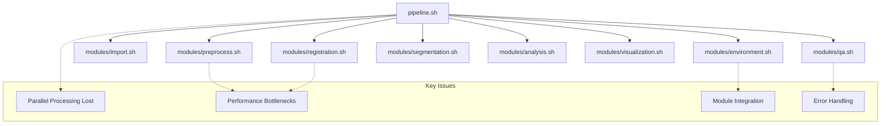
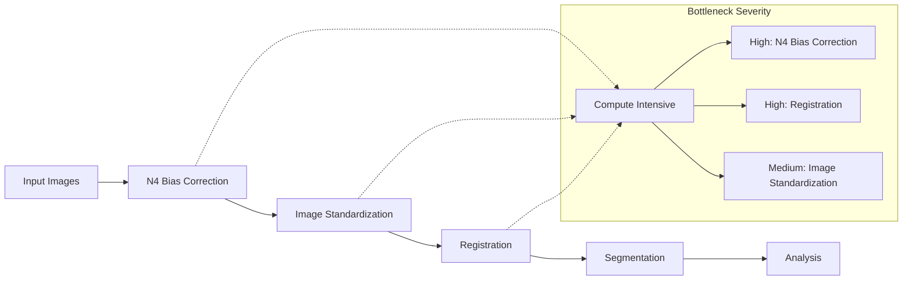

# Brain MRI Pipeline: Architecture and Integration Review Plan

This document outlines a comprehensive plan for reviewing and improving the architecture and integration of the brain MRI ANTs E2E pipeline, with a focus on module integration and parallel processing.

## 1. Current Architecture Analysis

## 2. Implementation Phases

### 2.1 Phase 1: Module Integration Improvements

See detailed plan in [module_integration_plan.md](./module_integration_improvements.md)

Key objectives:
- Implement centralized path handling in environment.sh
- Add proper error propagation
- Add validation checkpoints between processing steps
- Test and validate integration improvements

### 2.2 Phase 2: Parallel Processing Restoration

See detailed plan in [parallel_processing_restoration.md](./parallel_processing_restoration.md)

Key objectives:
- Implement parallelization configuration in environment.sh
- Restore parallelization in preprocessing module
- Restore parallelization in bias correction
- Restore parallelization in image standardization
- Test and validate parallel processing improvements

## 3. Performance Bottleneck Analysis

### 3.1 Detailed Bottleneck Assessment

1. **N4 Bias Correction**
   - Uses ANTs' `N4BiasFieldCorrection` tool
   - CPU intensive due to complex bias field modeling
   - Sequential execution in current modularized version
   - **Solution**: Restore parallel processing and optimize parameters

2. **Registration**
   - Uses ANTs' `antsRegistrationSyN.sh` for image alignment
   - High memory usage and computation
   - **Solution**: Restore parallel processing where appropriate, optimize parameters

3. **Image Standardization**
   - Uses `c3d` and ANTs' `ResampleImage`
   - Resolution adjustment is computation-heavy
   - **Solution**: Restore parallel processing, consider selective processing

## 4. Parallelization Assessment

I've identified the following areas where GNU parallel was implemented but lost in the modularization:

| Module | Original Parallelized Functions | Implementation Pattern |
|--------|--------------------------------|------------------------|
| Preprocessing | `process_all_nifti_files_in_dir` | `find ... -print0 \| parallel -0 -j 11 process_all_nifti_files_in_dir {}` |
| Bias Correction | `process_n4_correction` | `find ... -name "*.nii.gz" -type f -print0 \| parallel -0 -j 11 process_n4_correction {}` |
| Standardization | `standardize_dimensions` | `find ... -name "*n4.nii.gz" -print0 \| parallel -0 -j 11 standardize_dimensions {}` |

## 5. FreeSurfer 8 Compatibility Assessment

Brief assessment of potential compatibility issues:
1. Check if any FreeSurfer command-line tools have changed parameters
2. Verify if output formats or default behaviors have changed
3. Test for performance differences requiring parameter adjustments