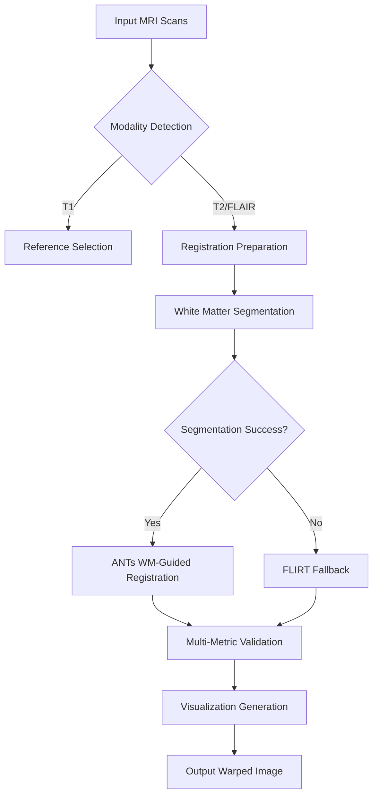

# Registration Module Enhancement Plan

## Current Architecture Overview

## Key Findings from Code Review
1. **Robust Registration Pipeline**:
   - Primary: ANTs SyN with white matter guidance
   - Fallback: FLIRT boundary-based registration
   - Emergency: Multiple SyNQuick variants

2. **Validation System**:
   - Metrics: Cross-correlation, Mutual Information, Normalized CC
   - Visualizations: Checkerboard, Overlay, Difference maps

3. **Error Handling**:
   - Multiple emergency registration methods
   - Orientation distortion correction
   - File integrity checks

## Enhancement Opportunities
1. **Modality Support Expansion**:
   - Add support for DWI/ADC sequences
   - Implement PET registration capabilities

2. **Performance Optimization**:
   - GPU acceleration for ANTs operations
   - Parallel processing of independent registration steps

3. **Validation Enhancement**:
   - Add cortical thickness measurement consistency
   - Implement automated quality scoring system
   - Add 3D rendering capabilities

4. **User Experience**:
   - Interactive registration quality assessment
   - Automated parameter tuning
   - Better progress tracking

## Implementation Roadmap
1. **Phase 1: Validation System Enhancement**
   - Add cortical thickness consistency metrics
   - Implement automated quality scoring
   - Enhance visualization options

2. **Phase 2: Modality Expansion**
   - Add DWI/ADC registration pipeline
   - Implement PET-CT registration support
   - Add diffusion tensor imaging (DTI) handling

3. **Phase 3: Performance Optimization**
   - GPU acceleration integration
   - Parallel processing implementation
   - Memory usage optimization

4. **Phase 4: User Interface**
   - Web-based registration viewer
   - Interactive parameter tuning
   - Automated report generation