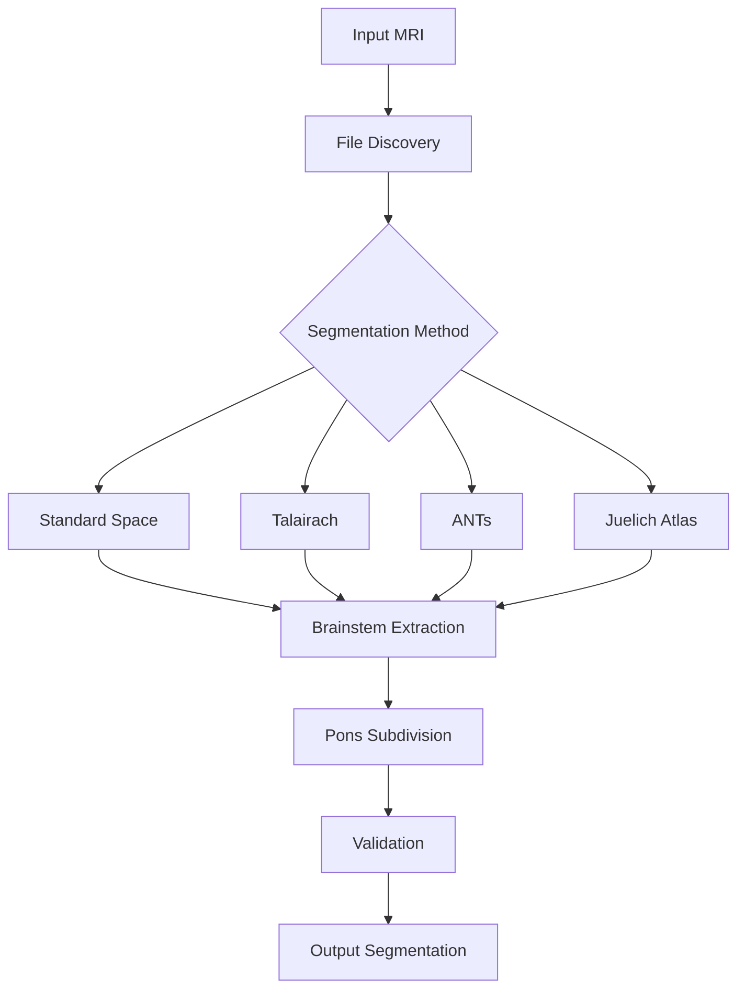
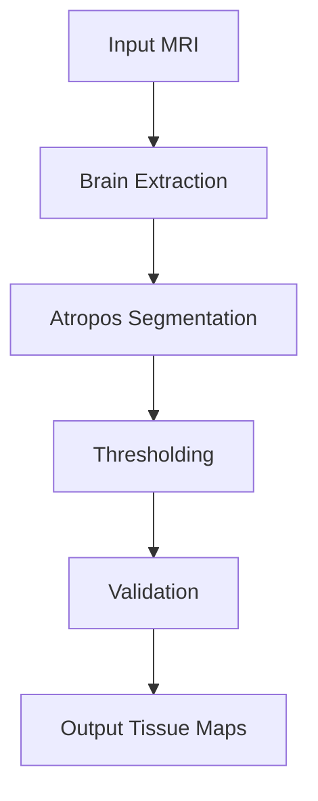

# Brain MRI Segmentation Analysis

## Overview
This document provides a detailed analysis of the segmentation.sh script, which implements a comprehensive brain MRI segmentation pipeline.

## Architecture


## Key Components

### 1. File Discovery & Mapping
- Scans directories for segmentation outputs
- Creates standardized symbolic links
- Handles compatibility with different atlas outputs
- Creates placeholder files for missing subdivisions

### 2. Standard Space Segmentation
- Uses Harvard-Oxford subcortical atlas
- Implements multiple brainstem index detection strategies
- Creates brainstem mask using FSL tools
- Transforms mask back to native space

### 3. Talairach Space Segmentation
- Uses FSL/FIRST for Talairach-based segmentation
- Creates approximate brainstem masks when templates are missing
- Implements brain extraction and registration workflow

### 4. ANTs Segmentation
- Uses ANTs for brain extraction and registration
- Creates brainstem prior based on anatomical location
- Applies prior to original image space

### 5. Final Segmentation Workflow
- Tries multiple methods in priority order (ANTs > Standard > Talairach)
- Falls back to primitive approximation if all methods fail
- Creates comprehensive pons subdivisions
- Validates results across all methods

### 6. Pons Subdivision
- Creates dorsal/ventral pons subdivisions
- Uses empty masks when atlas doesn't support subdivisions
- Maintains pipeline compatibility with placeholder files

### 7. Validation System
- Calculates volumes for all structures
- Checks volume ratios against expected ranges
- Generates visualization overlays for manual inspection

### 8. Tissue Segmentation (Atropos)


#### Implementation Details
- **Brain Extraction**: Uses previously created brain mask
- **Atropos Segmentation**: 
  ```bash
  Atropos -d 3 \
    -a "[input]" \
    -x "[brain_mask]" \
    -o "[output_seg.nii.gz, output_prob%02d.nii.gz]" \
    -c "[${ATROPOS_CONVERGENCE}]" \
    -m "${ATROPOS_MRF}" \
    -i "${ATROPOS_INIT_METHOD}[${ATROPOS_T1_CLASSES}]" \
    -k Gaussian
  ```
- **Thresholding**: Converts probabilistic segmentation to binary masks
- **Validation**: 
  - Calculates absolute volumes (mm³) for each tissue type
  - Compares against expected anatomical ranges:
    - CSF: 10-20%
    - GM: 40-50%
    - WM: 30-40%

#### Output Structure
```
segmentation/
└── tissue/
    ├── [basename]_seg.nii.gz        # Combined segmentation
    ├── [basename]_prob01.nii.gz    # CSF probability map
    ├── [basename]_prob02.nii.gz    # GM probability map
    ├── [basename]_prob03.nii.gz    # WM probability map
    ├── [basename]_csf.nii.gz       # Binary CSF mask
    ├── [basename]_gm.nii.gz        # Binary GM mask
    ├── [basename]_wm.nii.gz        # Binary WM mask
    └── [basename]_segmentation_report.txt  # Validation metrics
```

## Key Features
- **Multiple Atlas Support**: Integrates Harvard-Oxford, Talairach, Juelich, and ANTs approaches
- **Robust Error Handling**: Comprehensive validation at each step
- **QA Integration**: Automated validation reports with volume statistics
- **Backward Compatibility**: Creates symbolic links with expected filenames
- **Adaptive Processing**: Multiple brainstem index detection strategies