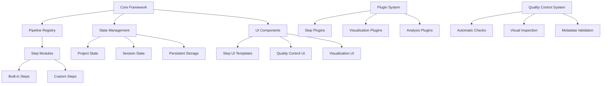
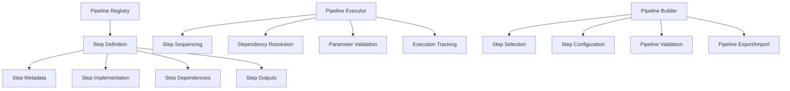
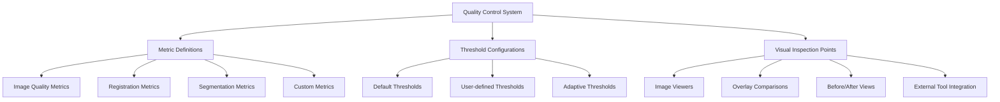
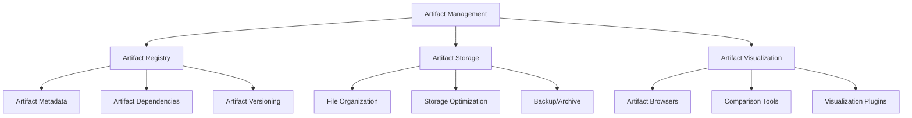
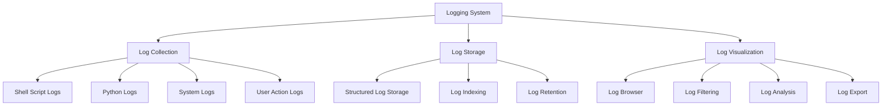
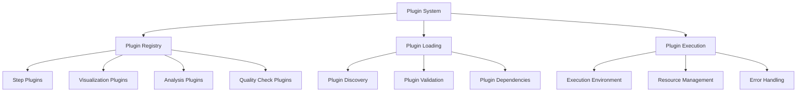
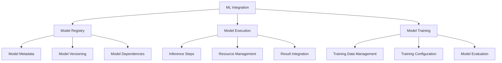
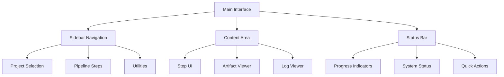

# Brain MRI Processing Pipeline: Streamlit Integration Plan

## Overview

This document outlines the plan for integrating the shell script functionality from `00_environment_functions.sh` and `processing_script.sh` into a comprehensive, modular Streamlit UI. The goal is to create a flexible, extensible interface that guides users through the entire workflow from DiCOM import to visualization, with robust quality control and the ability to customize the pipeline.

## Core Design Principles

1. **Modularity**: Each pipeline step is implemented as an independent module that can be added, removed, or reordered
2. **Extensibility**: The system supports adding new custom steps without modifying existing code
3. **Visibility**: Comprehensive logging and artifact visualization at each step
4. **Quality Control**: Integrated visual and mathematical/metadata sanity checks
5. **Configurability**: Flexible parameter configuration and adjustment
6. **Documentation**: Clear documentation for users and developers

## System Architecture



## Modular Pipeline System

The core of the design is a modular pipeline system that allows steps to be defined, registered, and executed independently:



### Step Definition

Each pipeline step is defined by:

1. **Metadata**:
   - Unique identifier
   - Display name
   - Description
   - Category (e.g., preprocessing, registration)
   - Version

2. **Dependencies**:
   - Required previous steps
   - Required input artifacts
   - Required external tools

3. **Parameters**:
   - Parameter definitions (name, type, default, constraints)
   - Parameter validation rules
   - Parameter dependencies

4. **Implementation**:
   - Execution function
   - Quality check function
   - Visualization function

5. **Outputs**:
   - Output artifact definitions
   - Output metadata

### Step Registration

Steps are registered with the pipeline registry, which:

1. Validates step definitions
2. Manages dependencies between steps
3. Provides discovery mechanisms for the UI
4. Supports dynamic loading of custom steps

### Pipeline Configuration

Users can:

1. Select which steps to include in their pipeline
2. Configure the order of steps (respecting dependencies)
3. Set parameters for each step
4. Save and load pipeline configurations
5. Share pipeline configurations with others

## Quality Control System

The quality control system is integrated throughout the pipeline:



### Automatic Quality Checks

Each step includes automatic quality checks that:

1. Calculate relevant metrics for the step's outputs
2. Compare metrics to configurable thresholds
3. Generate quality reports with visualizations
4. Flag potential issues for user review

### Visual Inspection

The UI provides visual inspection tools:

1. Integrated 2D slice viewers for quick checks
2. Side-by-side comparisons of before/after results
3. Overlay views for registration and segmentation
4. One-click launching of external tools (Freeview, FSLeyes) with appropriate parameters

### Metadata Validation

The system validates metadata at each step:

1. Checks for completeness and consistency
2. Verifies that parameters are within expected ranges
3. Compares metadata across processing stages
4. Flags unexpected changes or anomalies

## Artifact Management

The system provides comprehensive artifact management:



### Artifact Registry

The artifact registry tracks:

1. All artifacts produced by the pipeline
2. Metadata for each artifact
3. Relationships between artifacts
4. Processing history for each artifact

### Artifact Visualization

The UI provides:

1. Browsing and searching of artifacts
2. Visualization of artifact relationships
3. Comparison of related artifacts
4. Access to artifact metadata and quality metrics

## Logging and Monitoring

The system includes comprehensive logging and monitoring:



### Log Collection

The system collects logs from:

1. Shell script execution
2. Python code execution
3. External tool execution
4. User actions in the UI

### Log Visualization

The UI provides:

1. Real-time log viewing during processing
2. Filtering and searching of logs
3. Highlighting of errors and warnings
4. Correlation of logs with artifacts and processing steps

## Plugin System

The system includes a plugin architecture for extensibility:



### Plugin Types

The system supports various plugin types:

1. **Step Plugins**: Add new processing steps to the pipeline
2. **Visualization Plugins**: Add new visualization capabilities
3. **Analysis Plugins**: Add new analysis capabilities
4. **Quality Check Plugins**: Add new quality metrics and checks

### Plugin Integration

Plugins are integrated into the system:

1. Discovered automatically from plugin directories
2. Validated for compatibility with the current system
3. Registered with appropriate registries
4. Made available through the UI

## Machine Learning Integration

The system is designed to support integration of machine learning models:



### Model Registry

The model registry tracks:

1. Available machine learning models
2. Model metadata and capabilities
3. Model versions and training history
4. Model dependencies

### Model Integration

Models are integrated into the pipeline:

1. As standard pipeline steps
2. With appropriate parameter configuration
3. With quality checks for model outputs
4. With visualization of model results

## Implementation Plan

### Phase 1: Core Framework

1. **Pipeline Registry and Step Definition**
   - Implement the core pipeline registry
   - Define the step interface and base classes
   - Implement basic step discovery and registration

2. **Project Management**
   - Implement project creation and loading
   - Define project directory structure
   - Implement state persistence

3. **Basic UI Components**
   - Implement navigation system
   - Create reusable UI components for steps
   - Implement basic parameter configuration UI

### Phase 2: Basic Pipeline Steps

1. **DiCOM Import & Conversion**
   - Implement DiCOM import step
   - Implement NIfTI conversion step
   - Implement basic quality checks

2. **Preprocessing Steps**
   - Implement bias correction step
   - Implement brain extraction step
   - Implement intensity normalization step

3. **Registration & Segmentation**
   - Implement registration steps
   - Implement segmentation steps
   - Implement quality checks for registration and segmentation

### Phase 3: Advanced Features

1. **Quality Control System**
   - Implement comprehensive quality metrics
   - Create visual inspection interfaces
   - Implement metadata validation

2. **Artifact Management**
   - Implement artifact registry
   - Create artifact visualization tools
   - Implement artifact comparison tools

3. **Logging and Monitoring**
   - Implement comprehensive logging
   - Create log visualization tools
   - Implement log analysis features

### Phase 4: Extensibility

1. **Plugin System**
   - Implement plugin registry
   - Create plugin loading mechanism
   - Implement plugin execution environment

2. **Machine Learning Integration**
   - Implement model registry
   - Create model execution framework
   - Implement model result visualization

## UI Design

### Main Interface



### Step UI Template

Each step in the pipeline will have a consistent UI structure:

1. **Header**
   - Step title and description
   - Step status indicator
   - Navigation controls

2. **Input Artifacts**
   - List of input artifacts
   - Artifact previews
   - Artifact metadata

3. **Parameters**
   - Parameter configuration UI
   - Parameter validation feedback
   - Advanced options (expandable)

4. **Execution Controls**
   - Start/Stop buttons
   - Progress indicators
   - Real-time log display

5. **Quality Control**
   - Automatic quality check results
   - Visual inspection tools
   - Metadata validation results

6. **Output Artifacts**
   - List of output artifacts
   - Artifact previews
   - Artifact metadata
   - Visualization options

7. **Next Steps**
   - Continue to next step
   - Retry with different parameters
   - Jump to specific step

## Code Structure

```
streamlit_app/
├── Home.py                      # Main entry point
├── config/                      # Configuration files
│   ├── default_pipelines.json   # Default pipeline configurations
│   ├── default_parameters.json  # Default parameter values
│   └── quality_thresholds.json  # Quality check thresholds
├── core/                        # Core framework
│   ├── pipeline.py              # Pipeline registry and execution
│   ├── step.py                  # Step base classes and interfaces
│   ├── project.py               # Project management
│   ├── artifact.py              # Artifact management
│   ├── quality.py               # Quality control system
│   ├── logging.py               # Logging system
│   └── plugin.py                # Plugin system
├── steps/                       # Built-in pipeline steps
│   ├── dicom/                   # DiCOM-related steps
│   │   ├── import.py            # DiCOM import step
│   │   └── convert.py           # DiCOM to NIfTI conversion step
│   ├── preprocess/              # Preprocessing steps
│   │   ├── bias_correction.py   # Bias field correction step
│   │   ├── brain_extraction.py  # Brain extraction step
│   │   └── normalization.py     # Intensity normalization step
│   ├── register/                # Registration steps
│   │   ├── linear.py            # Linear registration step
│   │   └── nonlinear.py         # Non-linear registration step
│   ├── segment/                 # Segmentation steps
│   │   ├── tissue.py            # Tissue segmentation step
│   │   └── structure.py         # Structure segmentation step
│   └── analyze/                 # Analysis steps
│       ├── volumetric.py        # Volumetric analysis step
│       └── intensity.py         # Intensity analysis step
├── ui/                          # UI components
│   ├── components/              # Reusable UI components
│   │   ├── step_ui.py           # Step UI template
│   │   ├── parameter_ui.py      # Parameter configuration UI
│   │   ├── artifact_ui.py       # Artifact visualization UI
│   │   └── quality_ui.py        # Quality control UI
│   ├── pages/                   # Streamlit pages
│   │   ├── project.py           # Project management page
│   │   ├── pipeline.py          # Pipeline configuration page
│   │   ├── execute.py           # Pipeline execution page
│   │   ├── artifacts.py         # Artifact browser page
│   │   ├── logs.py              # Log browser page
│   │   └── settings.py          # Settings page
│   └── state.py                 # UI state management
├── utils/                       # Utility functions
│   ├── shell.py                 # Shell script integration
│   ├── nifti.py                 # NIfTI file utilities
│   ├── dicom.py                 # DiCOM utilities
│   └── visualization.py         # Visualization utilities
├── plugins/                     # Plugin directory
│   ├── steps/                   # Step plugins
│   ├── visualizations/          # Visualization plugins
│   └── analyses/                # Analysis plugins
└── models/                      # Machine learning models
    ├── registry.py              # Model registry
    ├── inference.py             # Model inference utilities
    └── training.py              # Model training utilities
```

## Example Step Implementation

Here's an example of how a pipeline step would be implemented:

```python
from core.step import PipelineStep, StepParameter, ArtifactType
from core.quality import QualityCheck, QualityMetric
import nibabel as nib
import numpy as np
import os
import subprocess

class BiasFieldCorrectionStep(PipelineStep):
    """
    Bias field correction step using N4 algorithm from ANTs
    """
    
    # Step metadata
    id = "bias_correction"
    name = "Bias Field Correction"
    description = "Correct intensity non-uniformity using N4 algorithm"
    category = "preprocessing"
    version = "1.0.0"
    
    # Step parameters
    parameters = [
        StepParameter(
            name="iterations",
            display_name="Iterations",
            description="Number of iterations for each resolution level",
            type="string",
            default="50x50x50x50",
            advanced=False
        ),
        StepParameter(
            name="convergence",
            display_name="Convergence Threshold",
            description="Convergence threshold for the optimization",
            type="float",
            default=0.0001,
            min_value=0.000001,
            max_value=0.01,
            advanced=True
        ),
        StepParameter(
            name="bspline_fitting",
            display_name="B-spline Fitting",
            description="B-spline fitting parameter",
            type="int",
            default=200,
            min_value=50,
            max_value=500,
            advanced=True
        ),
        StepParameter(
            name="shrink_factor",
            display_name="Shrink Factor",
            description="Image shrink factor",
            type="int",
            default=4,
            min_value=1,
            max_value=8,
            advanced=True
        )
    ]
    
    # Input/output artifact definitions
    input_artifacts = [
        {
            "name": "input_image",
            "display_name": "Input Image",
            "description": "Input NIfTI image to correct",
            "type": ArtifactType.NIFTI,
            "required": True
        }
    ]
    
    output_artifacts = [
        {
            "name": "corrected_image",
            "display_name": "Corrected Image",
            "description": "Bias-corrected output image",
            "type": ArtifactType.NIFTI
        },
        {
            "name": "bias_field",
            "display_name": "Bias Field",
            "description": "Estimated bias field",
            "type": ArtifactType.NIFTI
        }
    ]
    
    # Dependencies
    dependencies = []
    
    # Required external tools
    required_tools = ["N4BiasFieldCorrection"]
    
    def execute(self, context):
        """
        Execute the bias field correction step
        
        Args:
            context: Execution context containing input artifacts and parameters
            
        Returns:
            Dictionary of output artifacts
        """
        # Get input artifacts
        input_image = context.get_input_artifact("input_image")
        
        # Get parameters
        iterations = context.get_parameter("iterations")
        convergence = context.get_parameter("convergence")
        bspline = context.get_parameter("bspline_fitting")
        shrink = context.get_parameter("shrink_factor")
        
        # Prepare output paths
        output_dir = context.get_output_directory()
        corrected_image_path = os.path.join(output_dir, "corrected.nii.gz")
        bias_field_path = os.path.join(output_dir, "bias_field.nii.gz")
        
        # Log the command
        context.log_info(f"Running N4 bias field correction on {input_image}")
        context.log_info(f"Parameters: iterations={iterations}, convergence={convergence}, bspline={bspline}, shrink={shrink}")
        
        # Build the command
        cmd = [
            "N4BiasFieldCorrection",
            "-d", "3",
            "-i", input_image,
            "-o", f"[{corrected_image_path},{bias_field_path}]",
            "-s", str(shrink),
            "-b", f"[{bspline}]",
            "-c", f"[{iterations},{convergence}]"
        ]
        
        # Execute the command
        try:
            result = subprocess.run(cmd, capture_output=True, text=True, check=True)
            context.log_info("N4 bias field correction completed successfully")
            context.log_debug(result.stdout)
        except subprocess.CalledProcessError as e:
            context.log_error(f"N4 bias field correction failed: {e}")
            context.log_error(e.stderr)
            raise RuntimeError(f"N4 bias field correction failed: {e}")
        
        # Return output artifacts
        return {
            "corrected_image": corrected_image_path,
            "bias_field": bias_field_path
        }
    
    def quality_check(self, context, outputs):
        """
        Perform quality checks on the output artifacts
        
        Args:
            context: Execution context
            outputs: Dictionary of output artifacts
            
        Returns:
            Dictionary of quality check results
        """
        # Get output artifacts
        corrected_image_path = outputs["corrected_image"]
        bias_field_path = outputs["bias_field"]
        
        # Load images
        corrected_img = nib.load(corrected_image_path)
        bias_field_img = nib.load(bias_field_path)
        
        # Get data
        corrected_data = corrected_img.get_fdata()
        bias_field_data = bias_field_img.get_fdata()
        
        # Calculate quality metrics
        
        # 1. Coefficient of variation (lower is better after correction)
        mask = corrected_data > np.percentile(corrected_data, 10)
        cv = np.std(corrected_data[mask]) / np.mean(corrected_data[mask])
        
        # 2. Bias field statistics
        bias_mean = np.mean(bias_field_data)
        bias_std = np.std(bias_field_data)
        bias_max = np.max(bias_field_data)
        bias_min = np.min(bias_field_data)
        
        # 3. Bias field range (should be close to 1.0 for well-corrected images)
        bias_range = bias_max / bias_min if bias_min > 0 else float('inf')
        
        # Return quality metrics
        return {
            "coefficient_of_variation": {
                "value": cv,
                "threshold": 0.2,  # Example threshold
                "status": "success" if cv < 0.2 else "warning"
            },
            "bias_field_mean": {
                "value": bias_mean,
                "threshold": None,
                "status": "info"
            },
            "bias_field_std": {
                "value": bias_std,
                "threshold": None,
                "status": "info"
            },
            "bias_field_range": {
                "value": bias_range,
                "threshold": 2.0,  # Example threshold
                "status": "success" if bias_range < 2.0 else "warning"
            }
        }
    
    def visualize(self, context, outputs):
        """
        Generate visualizations for the output artifacts
        
        Args:
            context: Execution context
            outputs: Dictionary of output artifacts
            
        Returns:
            Dictionary of visualization data
        """
        # Get output artifacts
        corrected_image_path = outputs["corrected_image"]
        bias_field_path = outputs["bias_field"]
        
        # Generate Freeview command for external visualization
        freeview_cmd = f"freeview {corrected_image_path} {bias_field_path}:colormap=heat:opacity=0.5"
        
        # Return visualization data
        return {
            "freeview_command": freeview_cmd,
            "comparison_views": [
                {
                    "title": "Before/After Comparison",
                    "type": "side_by_side",
                    "images": [
                        context.get_input_artifact("input_image"),
                        corrected_image_path
                    ]
                },
                {
                    "title": "Bias Field Overlay",
                    "type": "overlay",
                    "base_image": corrected_image_path,
                    "overlay_image": bias_field_path,
                    "colormap": "heat",
                    "opacity": 0.5
                }
            ]
        }
