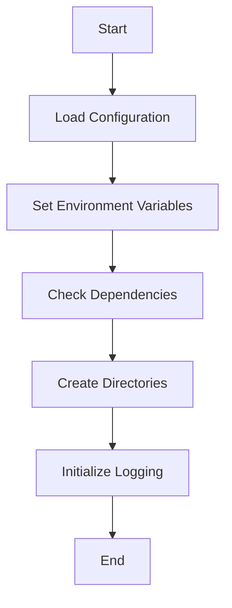
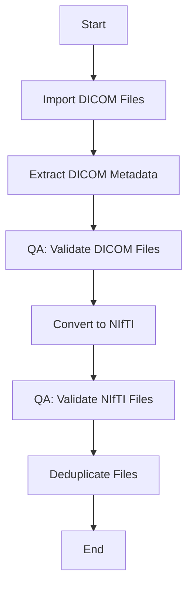
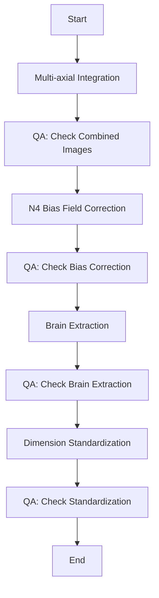
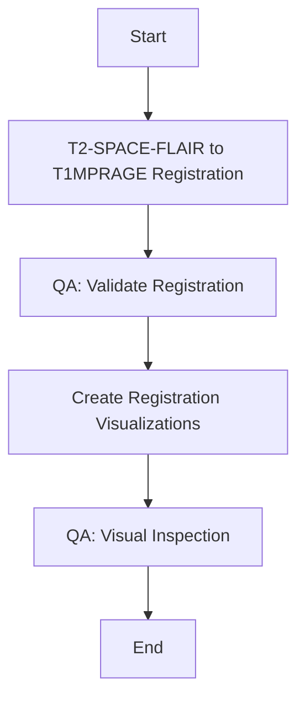
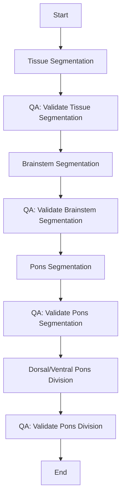
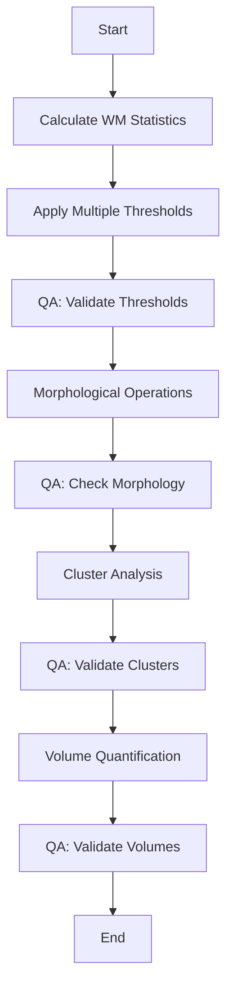
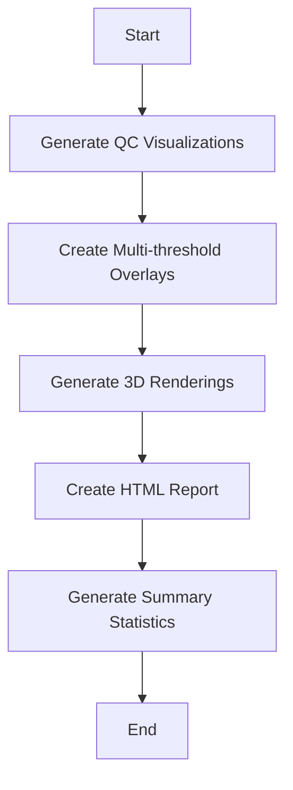

# Brain MRI Processing Pipeline: End-to-End Workflow

This document outlines the complete end-to-end workflow for the brain MRI processing pipeline, with integrated QA/validation steps at each stage.

## Overview

The pipeline processes brain MRI data through the following main stages:

1. Environment Setup and Configuration
2. Data Import and Conversion
3. Preprocessing
4. Registration
5. Segmentation
6. Hyperintensity Detection and Analysis
7. Visualization and Reporting

Each stage includes integrated QA/validation steps to ensure data quality and processing accuracy.

## Detailed Workflow

### 1. Environment Setup and Configuration



**Key Steps:**
- Load configuration parameters from config files
- Set environment variables (paths, directories)
- Check for required dependencies (ANTs, FSL, FreeSurfer, etc.)
- Create necessary directories
- Initialize logging system

**QA/Validation:**
- Verify all required tools are available
- Validate configuration parameters
- Check directory permissions

### 2. Data Import and Conversion



**Key Steps:**
- Import DICOM files from source directory
- Extract metadata from DICOM headers
- Convert DICOM to NIfTI format using dcm2niix
- Deduplicate identical files

**QA/Validation:**
- Verify DICOM files contain expected sequences
- Check DICOM metadata for completeness
- Validate NIfTI conversion success
- Verify image dimensions and orientation

### 3. Preprocessing



**Key Steps:**
- Combine multi-axial images (sagittal, coronal, axial) for enhanced resolution
- Apply N4 bias field correction to all modalities
- Extract brain using ANTs brain extraction
- Standardize image dimensions

**QA/Validation:**
- Verify multi-axial integration quality
- Check bias field correction effectiveness
- Validate brain extraction accuracy
- Ensure dimension standardization preserves anatomical features

### 4. Registration



**Key Steps:**
- Register T2-SPACE-FLAIR to T1MPRAGE using ANTs exclusively
- Generate transformation matrices
- Create registration visualizations (checkerboard, edge overlays)

**QA/Validation:**
- Calculate registration quality metrics (cross-correlation, mutual information)
- Validate transformation parameters
- Visual inspection of registration results
- Check for alignment errors

### 5. Segmentation



**Key Steps:**
- Perform tissue segmentation (GM, WM, CSF)
- Extract brainstem using ANTs
- Segment pons from brainstem
- Divide pons into dorsal and ventral regions

**QA/Validation:**
- Verify tissue segmentation accuracy
- Validate brainstem extraction
- Check pons segmentation
- Ensure proper dorsal/ventral division

### 6. Hyperintensity Detection and Analysis



**Key Steps:**
- Calculate white matter statistics in normal-appearing tissue
- Apply multiple thresholds (1.5, 2.0, 2.5, 3.0 SD)
- Perform morphological operations to clean up hyperintensity masks
- Conduct cluster analysis
- Quantify hyperintensity volumes

**QA/Validation:**
- Verify threshold selection
- Validate morphological operations
- Check cluster size distribution
- Compare volumes across thresholds

### 7. Visualization and Reporting



**Key Steps:**
- Generate quality control visualizations
- Create multi-threshold overlays
- Generate 3D renderings of hyperintensities
- Create comprehensive HTML report
- Generate summary statistics

**QA/Validation:**
- Verify visualization quality
- Check overlay accuracy
- Validate HTML report completeness
- Ensure summary statistics accuracy

## Integration of QA/Validation Functions

QA/validation functions are integrated throughout the pipeline as mandatory steps. Each processing stage includes specific QA checks:

### Image Quality Checks

```bash
# After each image processing step
qa_check_image "$output_file"

# After registration
qa_check_registration_dims "$warped_file" "$reference_file"
qa_check_image_correlation "$warped_file" "$reference_file"

# After segmentation
qa_check_mask "$mask_file"
```

### Registration Validation

```bash
# After T2-SPACE-FLAIR to T1MPRAGE registration
validate_transformation "$t1_file" "$flair_file" "$transform" \
                       "$t1_mask" "$flair_mask" \
                       "$validation_dir" "$threshold"
```

### Segmentation Validation

```bash
# After segmentation
calculate_dice "$reference_mask" "$segmented_mask"
calculate_jaccard "$reference_mask" "$segmented_mask"
calculate_hausdorff "$reference_mask" "$segmented_mask"
```

### Hyperintensity Validation

```bash
# After hyperintensity detection
# Validate using multiple thresholds
for mult in 1.5 2.0 2.5 3.0; do
    # Check hyperintensity volume
    volume=$(fslstats "${output_prefix}_thresh${mult}.nii.gz" -V | awk '{print $1}')
    
    # Check cluster statistics
    cluster --in="${output_prefix}_thresh${mult}_bin.nii.gz" \
            --thresh=0.5 \
            --oindex="${output_prefix}_thresh${mult}_clusters" \
            --connectivity=26 \
            --mm > "${output_prefix}_thresh${mult}_clusters.txt"
done
```

### Pipeline Progress Tracking

```bash
# At the end of each major step
track_pipeline_progress "$subject_id" "$output_dir"
```

## Output Structure

The pipeline generates a structured output directory:

```
mri_results/
├── logs/                         # Log files
├── metadata/                     # Extracted metadata
├── combined/                     # Multi-axial combined images
├── bias_corrected/               # N4 bias-corrected images
├── brain_extraction/             # Brain-extracted images
├── standardized/                 # Dimension-standardized images
├── registered/                   # Registered images
├── segmentation/                 # Segmentation results
│   ├── tissue/                   # Tissue segmentation
│   ├── brainstem/                # Brainstem segmentation
│   └── pons/                     # Pons segmentation
├── hyperintensities/             # Hyperintensity detection results
│   ├── thresholds/               # Multiple threshold results
│   └── clusters/                 # Cluster analysis results
├── validation/                   # Validation results
│   ├── registration/             # Registration validation
│   ├── segmentation/             # Segmentation validation
│   └── hyperintensities/         # Hyperintensity validation
├── qc_visualizations/            # Quality control visualizations
├── reports/                      # HTML reports
└── summary/                      # Summary statistics
```

## Conclusion

This end-to-end workflow provides a comprehensive approach to brain MRI processing, with integrated QA/validation at each stage. The modular design allows for flexibility while maintaining a consistent and reliable processing pipeline.