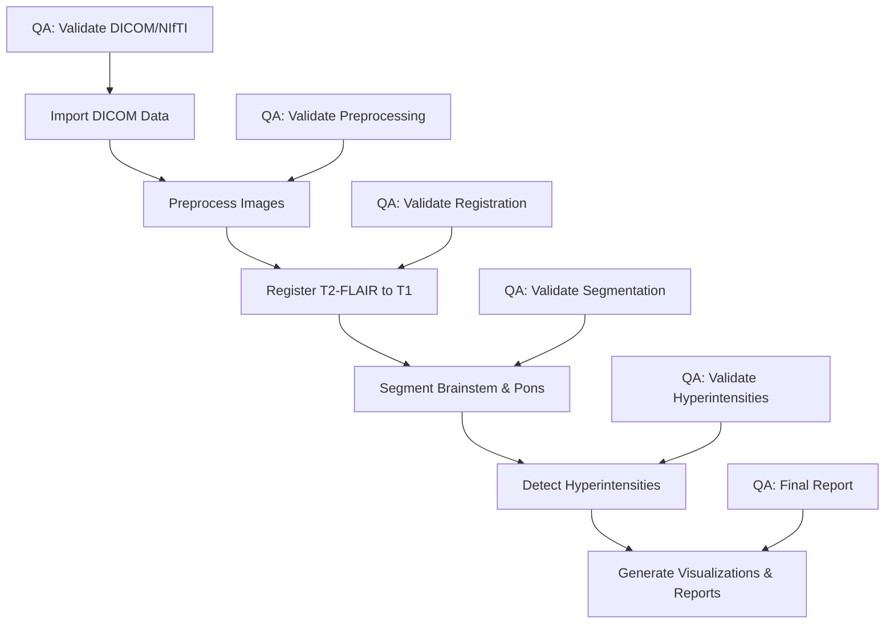

# Brain MRI Processing Pipeline: End-to-End Workflow

This document outlines the complete end-to-end workflow of the brain MRI processing pipeline, including all QA/validation steps.

## Overview

The pipeline processes T1-weighted and T2-FLAIR MRI images to extract and segment the brainstem and pons, detect hyperintensities in the dorsal pons, and generate comprehensive QA visualizations and reports.

## Workflow Diagram



## Detailed Workflow

### 1. Import DICOM Data

**Steps:**
1. Import DICOM files from source directory
2. Extract metadata using Python script
3. Convert DICOM to NIfTI using dcm2niix
4. Deduplicate identical files

**QA/Validation:**
- Validate DICOM files (check headers, count files)
- Validate NIfTI files (check dimensions, data type)
- Verify metadata extraction

**Outputs:**
- NIfTI files (.nii.gz)
- Metadata JSON files
- Validation reports

### 2. Preprocess Images

**Steps:**
1. Combine multi-axial images if available
2. Apply N4 bias field correction
3. Extract brain
4. Standardize dimensions
5. Crop with padding

**QA/Validation:**
- Check image quality (dimensions, intensity range)
- Validate brain extraction
- Verify bias correction

**Outputs:**
- Combined high-resolution images
- Bias-corrected images
- Brain-extracted images
- Standardized images

### 3. Register T2-FLAIR to T1

**Steps:**
1. Register T2-FLAIR to T1-MPRAGE using ANTs
2. Create registration visualizations
3. Validate registration quality

**QA/Validation:**
- Calculate registration metrics (cross-correlation, mutual information)
- Create checkerboard visualization
- Create difference map
- Assess registration quality (EXCELLENT, GOOD, ACCEPTABLE, POOR)

**Outputs:**
- Registered T2-FLAIR image
- Registration transforms
- Registration QC visualizations
- Registration validation report

### 4. Segment Brainstem & Pons

**Steps:**
1. Extract brainstem using ANTs
2. Extract pons from brainstem
3. Divide pons into dorsal and ventral regions
4. Validate segmentation

**QA/Validation:**
- Calculate volumes (brainstem, pons, dorsal pons, ventral pons)
- Check volume ratios (pons/brainstem, dorsal/pons, ventral/pons)
- Create edge overlays for visual inspection
- Validate against expected ranges

**Outputs:**
- Brainstem mask
- Pons mask
- Dorsal pons mask
- Ventral pons mask
- Segmentation validation report

### 5. Detect Hyperintensities

**Steps:**
1. Register FLAIR to dorsal pons
2. Segment tissue classes (WM, GM, CSF)
3. Calculate WM statistics
4. Apply multiple thresholds (1.5, 2.0, 2.5, 3.0 × SD)
5. Perform morphological operations
6. Remove small clusters
7. Analyze clusters

**QA/Validation:**
- Validate tissue segmentation
- Check hyperintensity volumes at different thresholds
- Analyze cluster sizes and distributions
- Create multi-threshold comparison
- Validate against expected ranges

**Outputs:**
- Hyperintensity masks at multiple thresholds
- Cluster analysis results
- Hyperintensity validation report

### 6. Generate Visualizations & Reports

**Steps:**
1. Generate QC visualizations
2. Create multi-threshold overlays
3. Create 3D renderings (if FreeSurfer available)
4. Generate HTML report
5. Track pipeline progress

**QA/Validation:**
- Verify all visualizations are created
- Check HTML report completeness
- Validate final outputs against expected files

**Outputs:**
- QC visualizations
- Multi-threshold overlays
- 3D renderings
- HTML report
- Pipeline progress log

## QA/Validation Integration

QA/validation is integrated throughout the pipeline as mandatory steps:

### 1. After DICOM Import and Conversion

```bash
validate_dicom_files "$SRC_DIR"
validate_nifti_files "$EXTRACT_DIR"
```

### 2. After Each Image Processing Step

```bash
qa_check_image "$output_file"
```

### 3. After Registration

```bash
qa_check_registration_dims "$warped_file" "$reference_file"
qa_check_image_correlation "$warped_file" "$reference_file"
validate_transformation "$t1_file" "$flair_file" "$transform" \
                       "$t1_mask" "$flair_mask" \
                       "$validation_dir" "$threshold"
```

### 4. After Segmentation

```bash
qa_check_mask "$mask_file"
calculate_dice "$reference_mask" "$segmented_mask"
calculate_jaccard "$reference_mask" "$segmented_mask"
```

### 5. After Hyperintensity Detection

```bash
# Validate using multiple thresholds
for mult in 1.5 2.0 2.5 3.0; do
    # Check hyperintensity volume
    volume=$(fslstats "${output_prefix}_thresh${mult}.nii.gz" -V | awk '{print $1}')
    
    # Check cluster statistics
    cluster --in="${output_prefix}_thresh${mult}_bin.nii.gz" \
            --thresh=0.5 \
            --oindex="${output_prefix}_thresh${mult}_clusters" \
            --connectivity=26 \
            --mm > "${output_prefix}_thresh${mult}_clusters.txt"
done
```

### 6. At the End of Each Major Step

```bash
track_pipeline_progress "$subject_id" "$output_dir"
```

## Error Handling

The pipeline includes comprehensive error handling:

1. **Early Detection**: QA checks are performed early in each step to detect issues before proceeding
2. **Graceful Degradation**: If a step fails, the pipeline attempts to continue with fallback options
3. **Detailed Logging**: All errors are logged with detailed information
4. **Progress Tracking**: Pipeline progress is tracked and reported

## Conclusion

This end-to-end workflow provides a comprehensive approach to brain MRI processing, with a focus on brainstem segmentation and hyperintensity detection. The integrated QA/validation steps ensure data quality and processing accuracy throughout the pipeline.